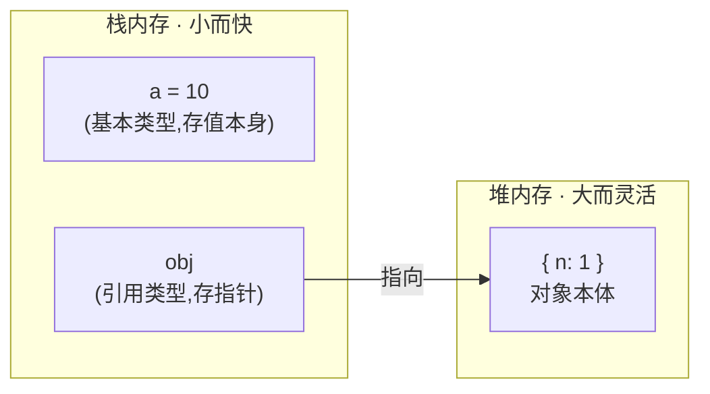

# 内存管理

JavaScript 的内存由引擎自动分配和回收,开发者不用手动 `malloc` / `free`。但「自动」不等于「不用管」——理解值怎么存、活多久、为什么漏,才能写出不卡顿、不泄漏的代码。

内存管理说到底就三件事:**值存在哪 (栈 / 堆)、活多久 (生命周期)、为什么该死没死 (泄漏)**。GC 的具体算法见 [垃圾回收机制](./garbage-collection),本篇讲前两件 + 泄漏排查。

## 栈与堆:值存在哪

JS 的值按类型分两处存放:

- **基本类型** (`string`、`number`、`boolean`、`null`、`undefined`、`symbol`、`bigint`):直接存在**栈**里,大小固定。
- **引用类型** (`object`、`array`、`function`):数据本体存在**堆**里,栈里只放一个指向它的**指针**。



形象例子:栈像**酒店前台的钥匙柜**——格子小、数量固定,小东西 (基本类型) 直接塞格子里,大件就放一张「房卡」(指针);堆像**酒店客房**——空间大,大件行李 (对象) 放房间里,前台只攥着房卡。

### 赋值语义:拷值还是拷指针

栈/堆的区别,最直接的后果就是赋值行为不同:

```js
// 基本类型:拷的是值,两个变量各存一份,互不影响
let a = 10;
let b = a; // 栈里新开一格,把 10 复制进去
b = 20;
console.log(a); // 10——a 纹丝不动

// 引用类型:拷的是指针,两个变量指向同一个堆对象
let obj1 = { n: 1 };
let obj2 = obj1; // 复制的是指针,不是对象
obj2.n = 99;
console.log(obj1.n); // 99——改的是同一个对象
```

形象例子:基本类型赋值像**复印一张纸**,各拿各的,你涂改你的不影响我;引用类型赋值像**多配一把同一个房间的钥匙**,谁进去搬动家具,另一个人推门看到的也是搬动后的样子。

:::tip
这正是「深拷贝 vs 浅拷贝」的根源:浅拷贝只复制栈里的指针,两者仍共享同一个堆对象;深拷贝才会在堆里真正复制一份新对象,从此互不相干。
:::

## 内存生命周期

任何语言的内存都走三步,JS 只是把最后一步自动化了:


1. **分配**:声明变量、创建对象/数组/函数、拼接字符串时,引擎自动分配内存。
2. **使用**:读写这块内存。
3. **释放**:不再需要时由 GC 自动回收,依据是「可达性」——从根还能访问到的就留着,访问不到的才回收 (详见 [垃圾回收机制](./garbage-collection))。

关键认知:**释放的时机你控制不了,但能不能释放你决定得了**。只要还有引用指着一块内存,GC 就不敢回收——这就引出了内存泄漏。

## 内存泄漏:该释放却没释放

内存泄漏 = 逻辑上已经用不到、但**仍然可达**,导致 GC 不能回收的内存。漏得多了,页面越用越卡,最终崩溃。四个经典场景:

### 1. 意外的全局变量

```js
function foo() {
  bar = 'oops'; // 忘了 let/const,bar 自动挂到 window 上,成了全局变量
}
```

全局变量挂在根对象 (`window`) 上,**整页生命周期都可达**,从头到尾不回收。开启 `'use strict'` 严格模式能让这种漏写直接抛错,从源头堵住。

### 2. 被遗忘的定时器 / 回调

```js
const data = getBigData(); // 一大块数据
setInterval(() => {
  doSomething(data); // 回调闭包一直引用 data
}, 1000);
// 组件卸载 / 页面切走时忘了 clearInterval → 定时器不停,data 永远活着
```

对策很简单:**谁开的定时器、监听,谁负责在不用时 `clearInterval` / `removeEventListener`**。

### 3. 游离的 DOM 引用

```js
let btn = document.getElementById('btn');
document.body.removeChild(btn); // 从页面移除了这个节点
// 但 JS 里 btn 变量还指着它,这个 DOM 节点回收不掉
btn = null; // 手动断开引用,才能让它被回收
```

形象例子:你把家具搬出了房间 (从 DOM 树移除),但手里还攥着它的遥控器 (JS 引用),清洁工 (GC) 看你还拿着,就不敢当垃圾扔掉。

### 4. 不当的闭包

```js
function outer() {
  const huge = new Array(1000000).fill('*'); // 占一大块内存
  return function inner() {
    console.log(huge.length); // inner 闭包引用了 huge
  };
}
const fn = outer(); // 只要 fn 还在,huge 就被闭包拴住,回收不了
```

闭包本身不是泄漏,**长期持有不再需要的大对象**才是。用完把 `fn = null` 断开即可。闭包的原理见 [作用域与闭包](../syntax/scope.md)。

### 用 DevTools 排查

定位泄漏靠工具,不靠猜:

- **Memory 面板 → Heap Snapshot (堆快照)**:在操作前后各拍一张快照,对比看哪些对象数量只增不减、迟迟不回收。
- **Performance 面板**:录一段反复操作,看 `JS Heap` 曲线。健康的曲线是**锯齿状** (分配→GC 拉回→再分配);如果是**只升不降的台阶式爬坡**,就是泄漏信号。

形象例子:内存曲线像**心电图**——规律的锯齿 (涨了又被回收) 是健康的,一路只爬不降的坡就是病。

## 参考

- [内存管理 - JavaScript | MDN](https://developer.mozilla.org/zh-CN/docs/Web/JavaScript/Memory_Management)
- [Fix memory problems - Chrome DevTools](https://developer.chrome.com/docs/devtools/memory-problems)
