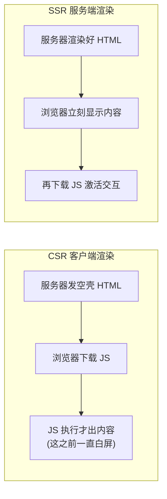
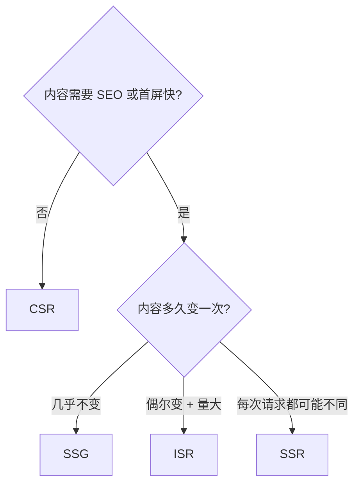

# 服务端渲染

服务端渲染(SSR)就是把页面的 HTML **在服务器上先渲染好**再发给浏览器,而不是发一个空壳 HTML 让浏览器跑 JS 现拼。它主要解决两个痛点:**首屏白屏**和 **SEO**。

形象例子:CSR 像**给你一套宜家家具的板材和说明书**,你得自己在家组装好才能用(组装期间屋里空荡荡);SSR 像**送来一套组装好的成品家具**,进门就能用,事后才接通电源插上插线板(激活交互)。

## 解决什么问题

- **首屏白屏 / 首屏速度**:CSR 要等 JS 下载并执行完才有内容,这之前是白屏;SSR 让 HTML 随首个响应就到,**FP / FCP 大幅提前**。代价是服务器要现渲染,**TTFB 会比发静态空壳略高**——用「白屏时间」换「首字节稍慢」,通常划算。
- **SEO**:很多爬虫不执行(或不完整执行)JS,CSR 的空壳页在它们眼里没内容;SSR 直接给出带内容的 HTML,利于收录。

## 四种渲染模式

| 模式 | HTML 何时生成 | 适用场景 |
| --- | --- | --- |
| **CSR**(客户端渲染) | 浏览器运行时拼 | 强交互、登录后的后台应用,SEO 不重要 |
| **SSR**(服务端渲染) | **每次请求**时在服务器现渲染 | 内容随请求/用户变化,又要 SEO 和首屏快(电商详情、资讯) |
| **SSG**(静态生成) | **构建时**预先渲染成静态 HTML | 内容相对固定(博客、文档、营销页),最快最省 |
| **ISR**(增量静态再生) | 构建时先生成,过期后**后台按需重新生成** | 内容偶尔变、量又大,想要 SSG 的快 + 一定的新鲜度 |

## 水合(Hydration)

SSR 发出的 HTML 是**静态的**——能看,但按钮还不能点,因为事件还没绑上。**水合**就是客户端 JS 加载后,React/Vue 在这套已有 HTML 上「**激活**」:复用服务端出的 DOM,把事件监听、状态挂回去,让页面变得可交互。

水合的代价不小:

- **重复执行**:服务端渲染过一遍的组件逻辑,客户端水合时**再跑一遍**(为了对齐虚拟 DOM)。
- **TBT 升高**:水合是一段集中的 JS 工作,占住主线程,这期间页面**看得见但点不动**——可交互时间(TTI)被推后,这正是 SSR 容易引入的主线程卡顿。

缓解方向:

- **选择性水合**(Selective Hydration,React 18):优先水合用户正在交互的部分,其余延后。
- **streaming SSR**:服务器**边渲染边把 HTML 流式发出**,不必等整页渲染完,首字节更快、可分块水合。
- **RSC**(React Server Components):服务端组件**根本不发到客户端、不参与水合**,只有真正需要交互的客户端组件才水合,从根上减少水合量。

:::warning
SSR 改善了首屏「看得到」的速度,但水合若太重,会让首屏「点不动」——**FCP 早了,TTI 反而晚了**。优化 SSR 很大程度就是在优化水合的成本。卡顿成因与解法见 [卡顿的原因和解决](./jank-causes-and-solutions.md)。
:::

## SSR 的成本

SSR 不是免费的快:

- **服务器算力**:每次请求都要现渲染,CPU 开销和并发压力远高于发静态文件。
- **运维复杂度**:得有个长期运行的 Node 服务,部署、监控、扩容都比纯静态站复杂。
- **缓存策略**:为扛住流量,常要加页面级 / 片段级缓存(CDN 缓存整页、按用户分桶缓存),又带来缓存一致性问题。

## 何时该用

- **该上 SSR**:内容动态且因人/因请求而异、又要 SEO 和快首屏——电商详情页、新闻资讯、带搜索的内容站。
- **CSR 更合适**:登录后的管理后台、SaaS 控制台——SEO 不重要,交互极重,空壳 + CSR 反而简单。
- **SSG / ISR 更合适**:内容基本固定或更新不频繁——博客、文档、落地页。能静态就别动态,**最快、最省、最稳**。

## 参考

- [Rendering on the Web - web.dev](https://web.dev/articles/rendering-on-the-web)
- [renderToString - React](https://react.dev/reference/react-dom/server/renderToString)
- [Hydration - React](https://react.dev/reference/react-dom/client/hydrateRoot)
- [Rendering: SSR / SSG / ISR - Next.js](https://nextjs.org/docs/app/building-your-application/rendering)
