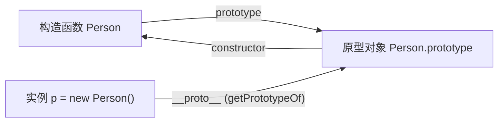
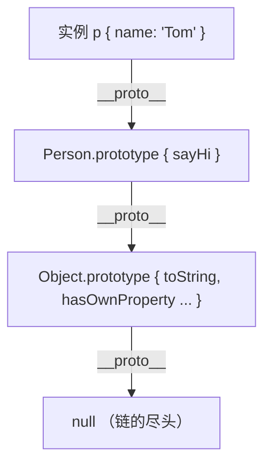

# 原型与原型链

JavaScript 没有「类」的底层机制，对象之间靠 **原型** 共享属性和方法。每个对象都有一个内部链接 `[[Prototype]]`，指向它的原型对象；这些链接串成一条 **原型链**，决定了属性查找的路径。

## 三个核心与三角关系

理解原型，先认清三个角色：

- **构造函数的 `prototype`** —— 构造函数（如 `function Person(){}`）身上的一个属性，指向「原型对象」。用 `new` 创建实例时，实例会共享这个原型对象上的属性和方法。
- **实例的 `__proto__`** —— 实例对象的内部链接，指向「创建它的构造函数的 `prototype`」。标准的读取方式是 `Object.getPrototypeOf(实例)`。
- **原型对象的 `constructor`** —— 原型对象身上的一个属性，反过来指回构造函数。

三者构成一个稳定的三角关系：



用代码验证这个三角：

```js
function Person(name) {
  this.name = name;
}

const p = new Person("Tom");

// 构造函数的 prototype 就是实例的原型
Person.prototype === Object.getPrototypeOf(p); // true
p.__proto__ === Person.prototype; // true

// 原型对象的 constructor 指回构造函数
Person.prototype.constructor === Person; // true
```

:::info
`__proto__` 是早期浏览器提供的非标准访问器，后来才被纳入规范作为兼容保留。工程代码里读原型用 `Object.getPrototypeOf`，写原型用 `Object.setPrototypeOf`，`__proto__` 更多用于讲解和调试。
:::

## 原型链查找机制

读取一个对象的属性时，引擎按这个顺序找：

1. 先看 **对象自身** 有没有这个属性，有就返回。
2. 没有就顺着 `__proto__` 找到它的原型对象，在原型上找。
3. 还没有就继续沿 `__proto__` 往上，一直找到 `Object.prototype`。
4. `Object.prototype` 的 `__proto__` 是 `null`，到顶了还没找到，返回 `undefined`。



```js
function Person(name) {
  this.name = name;
}
Person.prototype.sayHi = function () {
  return "hi, " + this.name;
};

const p = new Person("Tom");

p.name; // 'Tom'      —— 自身就有
p.sayHi(); // 'hi, Tom' —— 自身没有，在 Person.prototype 上找到
p.toString(); // '[object Object]' —— 一路找到 Object.prototype
p.age; // undefined  —— 找到顶层 null 也没有
```

:::tip 形象记忆
查属性像「翻抽屉找东西」：先翻自己的抽屉（实例自身属性），没有就翻爸爸的抽屉（原型对象），还没有翻爷爷的抽屉（上一层原型），一直翻到祖宗顶层 `Object.prototype`。顶层再往上是 `null`，意味着「没爹了」，确实找不到，只好说一声 `undefined`。
:::

## 获取与设置原型的方式

| 目的 | 方式 | 说明 |
|------|------|------|
| 读原型 | `Object.getPrototypeOf(obj)` | 标准读法，推荐 |
| 读原型 | `obj.__proto__` | 兼容写法，等价于上面 |
| 读原型 | `构造函数.prototype` | 拿的是「实例将要用的原型」，不是某个实例自身的原型 |
| 建对象时指定原型 | `Object.create(proto)` | 创建一个新对象，其原型就是 `proto` |
| 改已有对象的原型 | `Object.setPrototypeOf(obj, proto)` | 直接改掉 `obj` 的原型 |

```js
// 第一步：用 Object.create 指定原型，凭空造一个以 animal 为原型的对象
const animal = {
  breathe() {
    return "breathing";
  },
};
const cat = Object.create(animal);
Object.getPrototypeOf(cat) === animal; // true
cat.breathe(); // 'breathing'，沿原型链找到

// 第二步：用 setPrototypeOf 改掉一个已存在对象的原型
const robot = {};
Object.setPrototypeOf(robot, animal);
robot.breathe(); // 'breathing'
```

:::warning
`Object.setPrototypeOf` 和给 `__proto__` 赋值会 **动态改变已存在对象的原型链**，这会让 JS 引擎为该对象做过的属性访问优化全部失效，性能很差。需要指定原型时，优先在创建阶段用 `Object.create(proto)`，而不是事后用 `setPrototypeOf` 去改。参见 [MDN: Object.setPrototypeOf](https://developer.mozilla.org/zh-CN/docs/Web/JavaScript/Reference/Global_Objects/Object/setPrototypeOf)。
:::

## 参考

1. [继承与原型链 - MDN](https://developer.mozilla.org/zh-CN/docs/Web/JavaScript/Guide/Inheritance_and_the_prototype_chain)
2. [对象的继承 - JavaScript 教程 - 网道](https://wangdoc.com/javascript/oop/prototype.html)
