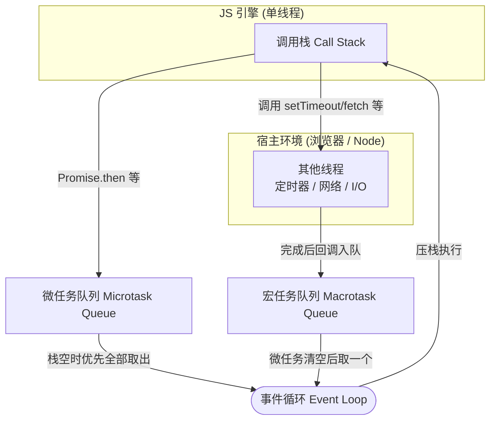
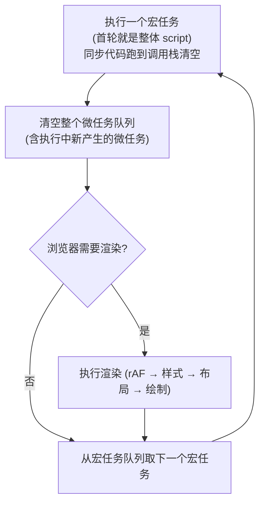

# 事件循环

**JavaScript 是单线程的,事件循环 (Event Loop) 是它在单线程上「不阻塞」地处理异步的调度机制。** 核心规则一句话:**执行完一段同步代码,先清空所有微任务,再取一个宏任务执行,如此往复**。

:::tip 形象记忆
事件循环像 **银行柜台**:柜员 (单线程主线程) 一次只服务一位客户 (同步代码一行行执行)。遇到要等的业务 (异步,如打电话核实),柜员不干等,而是把它交给后台 (其他线程) 去办,自己接着服务下一位。后台办完的业务回来排队;但队伍分两种——「VIP 加急」(微任务) 和「普通号」(宏任务)。柜员每服务完一位普通客户,**都要先把所有 VIP 加急清空**,才叫下一个普通号。
:::

## 为什么需要事件循环

JavaScript 引擎本身**单线程**:同一时刻只有一个调用栈,只能执行一件事。这是历史选择——最初为操作 DOM 而生,多线程同时改 DOM 会引发竞态,索性单线程。

但单线程有个致命问题:碰到耗时操作 (网络请求、定时、读文件) 如果**原地等待**,整个页面就卡死了,连按钮都点不动。

解决办法是**非阻塞**:耗时操作不在主线程上等,而是**交给宿主环境 (浏览器 / Node) 的其他线程**去做 (定时器线程、网络线程、I/O 线程),主线程立刻往下走。等那些操作完成,把对应的**回调函数**放进队列,主线程闲下来后再回来执行。

「主线程不等待、由队列驱动回调」——调度这个队列的机制,就是事件循环。

## 运行时全貌

理解事件循环,先认清几个角色:

- **调用栈 (Call Stack)**:JS 引擎执行代码的地方,函数调用入栈、返回出栈。单线程意味着只有这一个栈。
- **宿主环境 / 其他线程**:浏览器或 Node 提供的能力 (`setTimeout`、`fetch`、文件 I/O 等),真正的等待发生在这里,不占用主线程。
- **任务队列**:异步操作完成后,回调被放进队列排队,分**宏任务队列**和**微任务队列**两种。
- **事件循环**:一个永不停歇的循环,负责在调用栈空了之后,按规则从队列里取回调压回栈上执行。



## 宏任务与微任务

异步回调分两类,**区别只在「什么时候被取出执行」**:宏任务一次取一个,微任务一次性清空。

| | 宏任务 (Macrotask) | 微任务 (Microtask) |
|---|---|---|
| 取出方式 | **每轮循环取一个** | **每轮把队列全部清空** |
| 浏览器常见来源 | 整体 `<script>`、`setTimeout` / `setInterval`、UI 事件、`MessageChannel` | `Promise.then/catch/finally`、`await` 之后的代码、`queueMicrotask`、`MutationObserver` |
| Node 额外来源 | `setImmediate`、I/O 回调 | `process.nextTick` (优先级最高,见下文) |

:::info 微任务是用来「插队」的
微任务的设计目的,是让一段异步逻辑能**在「下一个宏任务 / 下一次渲染」之前就跑完**,保证状态的连续性。比如一连串 `Promise.then`,你希望它们紧挨着执行完,而不是中间插进一个 `setTimeout` 或一帧渲染。所以微任务的优先级高于宏任务,且会「一插到底」清空整个队列。
:::

## 一轮循环的完整步骤

把「一次事件循环」拆开看,引擎重复做这几件事:



三条铁律,做题和理解都靠它:

1. **整体 `<script>` 本身就是第一个宏任务**。所以「先执行同步代码」其实就是「执行第一个宏任务」。
2. **每个宏任务结束后,必须把微任务队列清空再继续**。清空过程中新产生的微任务也要执行掉,直到队列为空。
3. **`await x` 等价于把后续代码包进 `x` 的 `.then` 微任务里**。`await` 之前是同步执行,`await` 之后的部分被挂成微任务。

## 一个最小示例走一遍

```js
console.log(1);

setTimeout(() => console.log(2));        // 宏任务

Promise.resolve().then(() => console.log(3)); // 微任务

console.log(4);
```

执行顺序 `1 → 4 → 3 → 2`,逐步拆解:

1. 整体 script 作为第一个宏任务开始执行,同步打印 `1`。
2. `setTimeout` 把回调交给定时器线程,到点后回调进**宏任务队列**。
3. `Promise.then` 的回调进**微任务队列**。
4. 同步打印 `4`,script 这个宏任务执行完毕,调用栈清空。
5. 清空微任务队列:执行 `3`。
6. 取下一个宏任务:执行 `2`。

记住这个骨架,后面的复杂题不过是往里加「微任务里再生微任务」「await 拆分」等变化。

## Node 与浏览器的差异

事件循环的「微任务优先于宏任务」在两端一致,但 Node 有两点不同:

- **`process.nextTick` 有独立队列,且优先级最高**。每个阶段结束后,Node 先清空 `nextTick` 队列,再清空 Promise 微任务队列,然后才进入下一阶段。
- **宏任务分多个阶段 (phases)**。Node 的事件循环按 `timers (setTimeout/setInterval)` → `poll (I/O)` → `check (setImmediate)` 等阶段轮转,而非浏览器那样笼统的一个宏任务队列。所以 `setImmediate` 和 `setTimeout(fn, 0)` 的先后会因场景而异 (见下方第 4 题)。

## 输出题

:::info
做题时记住三条：

- 执行顺序：**同步代码 → 清空所有微任务 → 取一个宏任务 → 再清空所有微任务**，如此循环
- 每执行完一个宏任务，都要把微任务队列**全部清空**（包括执行过程中新注册的微任务）才会执行下一个宏任务
- `await x` 等价于把后续代码包进 `x` 的 `.then` 微任务里
:::

### async/await 与 Promise 的顺序

```js
async function async1() {
  console.log('async1 start');
  await async2();
  console.log('async1 end');
}

async function async2() {
  console.log('async2');
}

console.log('script start');

setTimeout(function () {
  console.log('setTimeout');
}, 0);

async1();

new Promise(function (resolve) {
  console.log('promise1');
  resolve();
}).then(function () {
  console.log('promise2');
});

console.log('script end');
```

输出顺序：

```
script start
async1 start
async2
promise1
script end
async1 end
promise2
setTimeout
```

- 同步阶段依次打印 `script start`、`async1 start`、`async2`、`promise1`、`script end`
- `await async2()` 之后的 `async1 end` 被挂为微任务；`.then` 里的 `promise2` 也是微任务
- 微任务按入队顺序执行：`async1 end` 先于 `promise2`
- `setTimeout` 是宏任务，最后执行

### 微任务里再注册微任务

```js
setTimeout(() => {
  console.log(0);
  Promise.resolve().then(() => console.log(1));
});
setTimeout(() => console.log(2));
Promise.resolve().then(() => {
  console.log(3);
  Promise.resolve().then(() => console.log(4));
});
Promise.resolve().then(() => console.log(5));
console.log(6);
```

输出顺序 (已用 `node` 实测验证)：

```
6 3 5 4 0 1 2
```

- 同步：`6`
- 清空首轮微任务：先 `3` (其内部又注册一个微任务)，再 `5`；本轮微任务清空前会把新加入的也执行掉，所以接着 `4`
- 取第一个宏任务：`0`，它注册的微任务 `1` 立即在本宏任务后清空
- 取第二个宏任务：`2`

:::warning
微任务队列是「执行到空为止」，包括执行过程中新注册的微任务。所以 `3` 内部的 `4` 会在进入宏任务之前就执行完。
:::

### Promise.then 中的 setTimeout 嵌套

```js
const p = new Promise((resolve) => {
  setTimeout(() => {
    console.log(111);
    resolve();
  }, 1000);
})
  .then(() => {
    setTimeout(() => {
      console.log(222);
    }, 2000);
  })
  .then(() => {
    setTimeout(() => {
      console.log(333);
    }, 500);
  });
```

输出顺序：

```
111 333 222
```

按时间线推算：

- `1000ms`：打印 `111` 并 `resolve`，触发第一个 `.then`，注册一个 `2000ms` 的定时器 (将在 `1000+2000=3000ms` 触发 `222`)
- 第一个 `.then` 返回 `undefined`，立即触发第二个 `.then`，注册一个 `500ms` 的定时器 (将在约 `1000+500=1500ms` 触发 `333`)
- `1500ms` 先到：打印 `333`
- `3000ms`：打印 `222`

:::tip
`.then` 的回调一旦执行完就立刻进入下一个 `.then`，两个内部定时器几乎同时开始计时。所以比的是 `500ms` 和 `2000ms`，`333` 先于 `222`。
:::

### Node 中 nextTick / Promise / setImmediate / setTimeout

```js
new Promise((resolve, reject) => {
  console.log('init promise');
  process.nextTick(resolve);
}).then(() => console.log('promise.then'));

process.nextTick(() => {
  console.log('nextTick');
});

setImmediate(() => {
  console.log('immediate (setImmediate)');
});

setTimeout(() => {
  console.log('immediate (setTimeout)');
}, 0);
```

输出顺序 (已用 `node` 实测验证)：

```
init promise
nextTick
promise.then
immediate (setImmediate)
immediate (setTimeout)
```

- 同步：`init promise`
- Node 的 `process.nextTick` 队列优先级高于 Promise 微任务队列，先执行 `nextTick`，其中 `resolve` 让 `promise.then` 进入微任务，随后执行 `promise.then`
- 进入事件循环各阶段：本例中 `setImmediate` 早于 `setTimeout` 触发

:::warning
`setTimeout(fn, 0)` 与 `setImmediate` 在主模块中的先后**不确定**，取决于进程启动耗时；但若放在 I/O 回调内部，`setImmediate` 一定先于 `setTimeout`。
:::

### var / let 在循环中的闭包差异

```js
for (var i = 0; i < 3; i++) {
  console.log('for中i的值：' + i);
  setTimeout(() => {
    console.log('setTimeout中i的值：' + i);
  }, 300);
}
```

同步先打印 `0`、`1`、`2`，`300ms` 后三次都打印 `3`。`var` 没有块级作用域，三个回调共享同一个 `i`，循环结束时 `i` 已是 `3`。

```js
for (let i = 0; i < 3; i++) {
  console.log('for中i的值：' + i);
  setTimeout(() => {
    console.log('setTimeout中i的值：' + i);
  }, 300);
}
```

同步打印 `0`、`1`、`2`，`300ms` 后依次打印 `0`、`1`、`2`。`let` 在每次迭代创建独立的块级绑定，每个回调捕获各自的 `i`。

:::tip
想用 `var` 达到 `let` 的效果，可用 IIFE 把 `i` 传进去形成独立作用域：`(function(j){ setTimeout(() => console.log(j), 300); })(i)`。
:::

## 参考

1. [并发模型与事件循环 - JavaScript | MDN](https://developer.mozilla.org/zh-CN/docs/Web/JavaScript/EventLoop)
2. [详解JavaScript中的Event Loop（事件循环）机制 - 知乎](https://zhuanlan.zhihu.com/p/33058983)
3. [JavaScipt 中的事件循环(event loop)，以及微任务 和宏任务的概念 - daisy,gogogo - 博客园](https://www.cnblogs.com/daisygogogo/p/10116694.html)
4. [详解 JavaScript 中的 Event Loop —— 掘金](https://juejin.cn/post/6844904169967452174)
5. [The Node.js Event Loop - Node.js 官方文档](https://nodejs.org/en/learn/asynchronous-work/event-loop-timers-and-nexttick)
