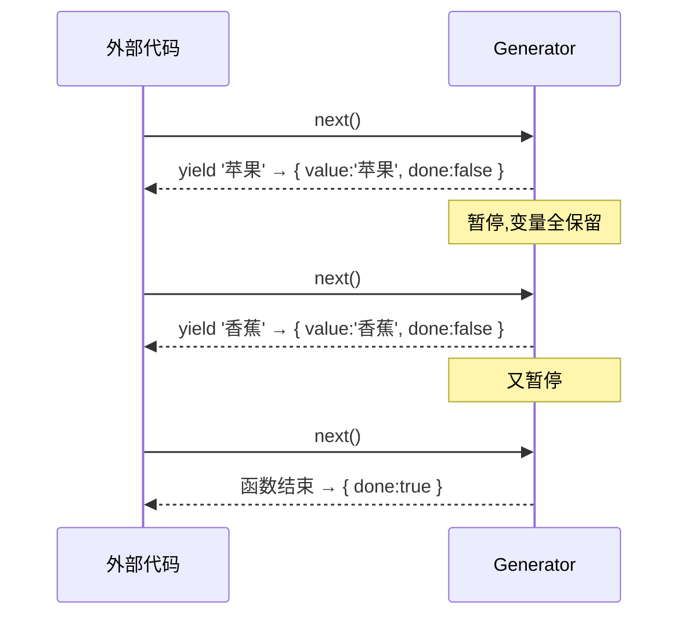

# Generator 生成器

一句话:**Generator 是一种「能中途暂停、之后还能从原地接着跑」的函数**。普通函数一旦调用就一口气执行到底,中间停不下来;Generator 能在 `yield` 处停住、把控制权交还给外部,等外部招呼一声再回到断点继续,连局部变量都原封不动地保留着。

形象例子:普通函数像**一口气读完一本书**,从第一页翻到最后一页中间不撒手。Generator 像**读书时夹了书签**——读到某页停下,书签记着读到哪、脑子里的剧情也都还在;你想继续时翻开书签那页接着读,不用从头来过。`yield` 就是那张书签。

## 普通函数的「霸道」:开始就停不下来

```js
function run() {
  console.log('A');
  console.log('B');
  console.log('C');
}

run(); // 一旦调用,A B C 必然连续打印完,外部插不进手
```

函数体一旦开始,外部就完全失去了控制权,只能干等它跑完。这在大多数场景没问题,但有些活我们希望**跑一半停下来、把主动权交回去**:比如一个超大循环想让浏览器喘口气 (见 [时间分片](../../scenario/time-slicing.md)),或者想等一个异步结果回来再继续 (见 [async/await 原理](./async-await))。Generator 就是为「可暂停」而生的。

## function\* 和 yield:给函数装上暂停键

两处不同:函数名前加 `*` 声明这是 Generator;函数体里用 `yield` 标记**暂停点**。

```js
function* gen() {
  console.log('A');
  yield; // 暂停点 1
  console.log('B');
  yield; // 暂停点 2
  console.log('C');
}
```

关键:**调用 `gen()` 并不会执行函数体**,一行都不跑。它只是返回一个「遥控器」(迭代器对象),函数此刻停在最开头,等你按播放键。

```js
const it = gen(); // 什么都没打印!只拿到一个遥控器 it
```

## next():谁来按播放键

每调用一次 `it.next()`,函数就从当前位置**跑到下一个 `yield` 为止**,然后停下、把控制权还给你。`next()` 返回一个 `{ value, done }`:

```js
const it = gen();

it.next(); // 打印 A,停在暂停点 1 → { value: undefined, done: false }
it.next(); // 打印 B,停在暂停点 2 → { value: undefined, done: false }
it.next(); // 打印 C,函数结束      → { value: undefined, done: true }
it.next(); // 已经结束,再按也没用  → { value: undefined, done: true }
```

- `done: false` 表示「还没跑完,后面还有」;`done: true` 表示「到底了」。
- `value` 是这一次 `yield` **交出来的值**(上面没给 `yield` 带值,所以是 `undefined`)。

`yield` 后面可以跟一个值,这个值就成了本次 `next()` 的 `value`——相当于函数每停一次,**顺手往外递一样东西**:

```js
function* fruits() {
  yield '苹果';
  yield '香蕉';
  yield '橘子';
}

const it = fruits();
it.next(); // { value: '苹果', done: false }
it.next(); // { value: '香蕉', done: false }
it.next(); // { value: '橘子', done: false }
it.next(); // { value: undefined, done: true }
```

这套「外部按一下、函数吐一个值再暂停」的来回,可以画成一场乒乓球:



控制权在**外部和函数之间反复横跳**——这正是 Generator 区别于普通函数的本质:执行节奏由外部一次次 `next()` 掌控。

## yield 是双向通道:next(x) 把值送回函数里

前面是函数往外**吐**值。反过来,外部也能往函数里**送**值:给 `next(x)` 传的参数 `x`,会成为**上一个 `yield` 表达式的返回值**。

```js
function* dialog() {
  const name = yield '你叫什么?'; // 暂停,把问题抛出去;next 传回的值赋给 name
  const age = yield `你好 ${name},几岁?`; // 同理
  return `${name} ${age} 岁,记下了`;
}

const it = dialog();
it.next();        // { value: '你叫什么?', done: false }  ——第一次 next 不用传参,因为没有「上一个 yield」
it.next('小明');   // { value: '你好 小明,几岁?', done: false }  ——'小明' 成了第一个 yield 的返回值
it.next(18);      // { value: '小明 18 岁,记下了', done: true } ——18 成了第二个 yield 的返回值
```

:::warning
第一次 `next()` 传的参数会被**丢弃**,因为此时函数还没执行到任何 `yield`,没有「上一个 yield」可接收。所以送值一般从第二次 `next()` 开始。
:::

这条「送值回去」的通道是 Generator 的精髓:它让函数能**暂停下来等一个外部结果,拿到后再继续**。`async/await` 正是利用这一点——`yield` 出去一个 Promise,执行器等它完成,再把结果 `next` 回来,详见 [async/await 原理](./async-await)。

## return:提前收尾,交出最终值

函数里的 `return value` 会让 Generator **立即结束**,这个 `value` 作为最后一次的 `value`,同时 `done` 变 `true`:

```js
function* gen() {
  yield 1;
  return 100; // 到这就结束了
  yield 2; // 永远执行不到
}

const it = gen();
it.next(); // { value: 1, done: false }
it.next(); // { value: 100, done: true }  ——return 的值
it.next(); // { value: undefined, done: true }
```

:::info
`done: false` 时的 `value` 是「**途中**交出的值」,`done: true` 时的 `value` 是「**最终**结果」。两者语义不同:前者像流水线上一个个传出的半成品,后者像最后盖章的总结果。时间分片里 `timeSlice` 就是靠生成器 `return` 的值拿到最终计算结果的。
:::

## 它天生「可迭代」:for...of 和展开

Generator 返回的对象既是迭代器、也是可迭代对象,所以能直接用 `for...of` 遍历、用 `...` 展开——它们会自动一路 `next()` 到 `done: true`,且**只收集 `done: false` 时的 `value`**(`return` 的值不会被 `for...of` 纳入):

```js
function* fruits() {
  yield '苹果';
  yield '香蕉';
  yield '橘子';
}

for (const f of fruits()) {
  console.log(f); // 苹果 香蕉 橘子
}

const arr = [...fruits()]; // ['苹果', '香蕉', '橘子']
```

## 能干什么

### 1. 惰性序列:要一个才算一个,甚至可以「无限」

普通函数想返回一串值,得先把整个数组算好、占满内存。Generator 可以**用的时候才生产下一个**(这正是「生成器」名字的由来),所以能表示「无限」序列而不爆内存:

```js
// 一个永不结束的自增序列:取多少给多少
function* naturals() {
  let n = 1;
  while (true) {
    yield n++; // 每次只算一个,交出去就暂停
  }
}

const it = naturals();
it.next().value; // 1
it.next().value; // 2
it.next().value; // 3 ... 想取到几就取到几,不会一次性算到天荒地老
```

### 2. 异步流程控制

`yield` 能暂停等结果,把一串异步操作写得像同步一样直白。这是 `async/await` 的底层模型,展开见 [async/await 原理](./async-await)。

### 3. 时间分片

把大任务写成生成器,每 `yield` 一次就是一个**可中断点**,调度器跑一片就让出主线程,浏览器趁机渲染。展开见 [时间分片](../../scenario/time-slicing.md)。

### 4. 状态机

函数在多个 `yield` 之间「记着自己走到哪一步」,天然适合实现一步步推进的状态机(如多步表单、红绿灯切换),不用自己维护一堆 `step` 变量——状态就藏在「函数暂停在第几个 yield」里。

## 小结

| 关键点 | 说明 |
| --- | --- |
| `function*` | 声明 Generator,调用它**不执行**,只返回一个迭代器 |
| `yield` | 暂停点。往外吐值 (`next` 的 `value`),也能接收外部送回的值 (`next(x)` 的 `x`) |
| `next()` | 按播放键,跑到下一个 `yield` 停下,返回 `{ value, done }` |
| `next(x)` | 把 `x` 作为**上一个 `yield`** 的返回值送回函数(第一次 `next` 的参数无效) |
| `return v` | 立即结束,`v` 作为最终值,`done` 变 `true` |
| 可迭代 | 能用 `for...of`、`...` 展开,自动 `next` 到底 |

一句话:**Generator = 能暂停 (`yield`) + 能恢复 (`next`) + 暂停时双向传值的函数**。它本身只是一台「可被外部一步步驱动的状态机」,真正强大的是配上一个**自动驱动它的执行器**——`async/await` 和时间分片都是在这台机器上盖起来的。
