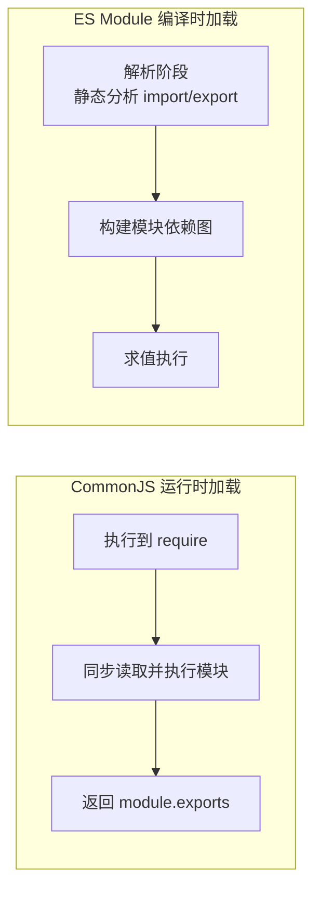

# CommonJS 与 ES Module

一句话区别：**CommonJS 是运行时加载、值拷贝、同步执行；ES Module 是编译时静态分析、值引用 (live binding)、支持异步**。前者是 Node 早年的模块方案，后者是语言层面的官方标准，正在成为唯一未来。

## 语法对比

```js
// CommonJS：导出
module.exports = { add };       // 整体导出
exports.add = add;              // 具名导出 (exports 是 module.exports 的引用)

// CommonJS：导入
const { add } = require('./math');

// ES Module：导出
export const add = (a, b) => a + b; // 具名导出
export default function () {};       // 默认导出

// ES Module：导入
import { add } from './math.js';
import fn from './math.js';
import * as math from './math.js';
```

:::warning
ESM 里 `import` 的路径**必须带文件扩展名** (`./math.js`)，而 CommonJS 的 `require` 可以省略 (`./math`)。这是从 CommonJS 迁移到 ESM 时最常踩的坑之一。
:::

## 核心差异：加载时机

这是两者所有区别的根源。



- **CommonJS**：`require` 是一个**运行时**调用的函数，代码执行到那一行才去加载模块。所以可以写在 `if` 里、可以拼接动态路径 (`require('./' + name)`)。
- **ES Module**：`import` / `export` 是**静态语法**，必须写在模块顶层，引擎在执行前的「解析阶段」就能确定模块依赖关系，不能放进条件语句。需要动态加载时用 `import()` 函数 (返回 Promise)。

:::info
「编译时确定依赖」是 ESM 能做 **tree-shaking** (摇掉没用到的导出) 的前提——打包工具静态分析就知道哪些 `export` 没被 `import`，直接删掉。CommonJS 的 `require` 是运行时动态的，工具无法静态确定，所以很难 tree-shaking。
:::

## 核心差异：值拷贝 vs 值引用

```js
// math.js
let count = 0;
const add = () => count++;
module.exports = { count, add }; // CommonJS
// export { count, add };        // ESM
```

```js
// main.js
const { count, add } = require('./math'); // CommonJS
add();
console.log(count); // 0 —— 拿到的是导入那一刻的值拷贝，不会更新
```

```js
import { count, add } from './math.js'; // ESM
add();
console.log(count); // 1 —— live binding，始终指向模块里的最新值
```

- **CommonJS** 导出的是值的**拷贝**：`require` 时把 `module.exports` 上的值复制一份，之后模块内部再改原变量，导入方感知不到 (对象类型因为拷的是引用，属性变化能感知)。
- **ES Module** 导出的是值的**引用 (live binding)**：导入的变量始终指向源模块里的那个绑定，源变了导入方读到的就是新值。而且 ESM 导入的变量是**只读**的，导入方不能给它重新赋值。

## 其他差异

| 维度 | CommonJS | ES Module |
|------|----------|-----------|
| 加载时机 | 运行时 (动态) | 编译时 (静态) |
| 导出 | 值拷贝 | 值引用 (live binding) |
| 加载方式 | 同步 | 支持异步 (`import()`) |
| 顶层 `this` | 指向 `module.exports` | `undefined` |
| 能否动态路径 | 能 (`require(变量)`) | 静态 `import` 不能，需 `import()` |
| tree-shaking | 难 | 天然支持 |
| 文件扩展名 | 可省略 | 必须带 |
| 运行环境 | Node (浏览器需打包) | 浏览器原生 + Node 原生 |
| 循环依赖 | 返回当前已执行部分的导出 | 靠 live binding，更不易出错 |

## 循环依赖

两者都能处理循环依赖，但机制不同：

- **CommonJS**：A 依赖 B、B 又依赖 A 时，B 里 `require('A')` 拿到的是 A **当前已执行到的那部分** `module.exports` (可能不完整)。
- **ES Module**：因为是 live binding，即使导入时变量还没初始化 (处于暂时性死区)，只要在真正**使用**时已赋值就没问题，更不容易出错。

## 在 Node 里互操作

Node 同时支持两套系统，用文件后缀或 `package.json` 的 `type` 字段区分：

- `.cjs` 强制 CommonJS，`.mjs` 强制 ESM。
- `package.json` 里 `"type": "module"` 则 `.js` 按 ESM 解析，默认 (或 `"commonjs"`) 按 CommonJS。

```js
// ESM 中可以 import CommonJS 模块
import cjs from './legacy.cjs'; // CommonJS 的 module.exports 整体作为 default 导入

// CommonJS 中不能直接 require ESM，要用动态 import()
const esm = await import('./modern.mjs');
```

:::tip
新项目直接用 ESM。老项目迁移时，把入口和工具链 (打包器、`package.json`) 先切到 ESM，再逐步把 `require` 换成 `import`，遗留的 CommonJS 包靠 Node 的互操作兜底。
:::

## 参考

- [Modules: CommonJS modules - Node.js 官方文档](https://nodejs.org/api/modules.html)
- [Modules: ECMAScript modules - Node.js 官方文档](https://nodejs.org/api/esm.html)
- [JavaScript modules - MDN](https://developer.mozilla.org/zh-CN/docs/Web/JavaScript/Guide/Modules)
- [Module 的语法 - ECMAScript 6 入门 (阮一峰)](https://es6.ruanyifeng.com/#docs/module)
