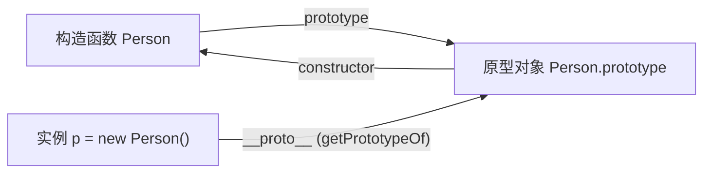
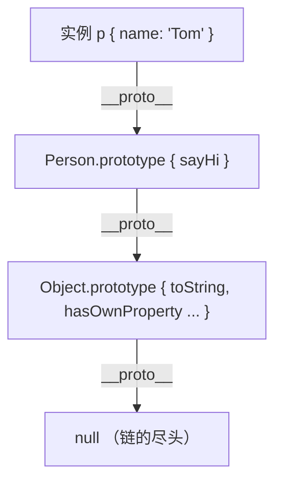

# 原型链与继承

JavaScript 没有「类」的底层机制，对象之间靠 **原型** 共享属性和方法。每个对象都有一个内部链接 `[[Prototype]]`，指向它的原型对象；这些链接串成一条 **原型链**，决定了属性查找的路径。继承，本质上就是想办法把子类的原型链接到父类，让子类既能拿到父类的属性、又能复用父类的方法。`class extends` 则是这套机制的语法糖。

本篇分三部分：先讲清原型链本身，再走一遍 ES5 时代继承方案的「填坑演进史」，最后看 `class` 怎么把最优解包成语法。

## 一、原型与原型链

### 三个核心与三角关系

理解原型，先认清三个角色：

- **构造函数的 `prototype`** —— 构造函数（如 `function Person(){}`）身上的一个属性，指向「原型对象」。用 `new` 创建实例时，实例会共享这个原型对象上的属性和方法。
- **实例的 `__proto__`** —— 实例对象的内部链接，指向「创建它的构造函数的 `prototype`」。标准的读取方式是 `Object.getPrototypeOf(实例)`。
- **原型对象的 `constructor`** —— 原型对象身上的一个属性，反过来指回构造函数。

三者构成一个稳定的三角关系：



用代码验证这个三角：

```js
function Person(name) {
  this.name = name;
}

const p = new Person("Tom");

// 构造函数的 prototype 就是实例的原型
Person.prototype === Object.getPrototypeOf(p); // true
p.__proto__ === Person.prototype; // true

// 原型对象的 constructor 指回构造函数
Person.prototype.constructor === Person; // true
```

:::info
`__proto__` 是早期浏览器提供的非标准访问器，后来才被纳入规范作为兼容保留。工程代码里读原型用 `Object.getPrototypeOf`，写原型用 `Object.setPrototypeOf`，`__proto__` 更多用于讲解和调试。
:::

### 原型链查找机制

读取一个对象的属性时，引擎按这个顺序找：

1. 先看 **对象自身** 有没有这个属性，有就返回。
2. 没有就顺着 `__proto__` 找到它的原型对象，在原型上找。
3. 还没有就继续沿 `__proto__` 往上，一直找到 `Object.prototype`。
4. `Object.prototype` 的 `__proto__` 是 `null`，到顶了还没找到，返回 `undefined`。



```js
function Person(name) {
  this.name = name;
}
Person.prototype.sayHi = function () {
  return "hi, " + this.name;
};

const p = new Person("Tom");

p.name; // 'Tom'      —— 自身就有
p.sayHi(); // 'hi, Tom' —— 自身没有，在 Person.prototype 上找到
p.toString(); // '[object Object]' —— 一路找到 Object.prototype
p.age; // undefined  —— 找到顶层 null 也没有
```

:::tip 形象记忆
查属性像「翻抽屉找东西」：先翻自己的抽屉（实例自身属性），没有就翻爸爸的抽屉（原型对象），还没有翻爷爷的抽屉（上一层原型），一直翻到祖宗顶层 `Object.prototype`。顶层再往上是 `null`，意味着「没爹了」，确实找不到，只好说一声 `undefined`。
:::

### 获取与设置原型的方式

| 目的 | 方式 | 说明 |
|------|------|------|
| 读原型 | `Object.getPrototypeOf(obj)` | 标准读法，推荐 |
| 读原型 | `obj.__proto__` | 兼容写法，等价于上面 |
| 读原型 | `构造函数.prototype` | 拿的是「实例将要用的原型」，不是某个实例自身的原型 |
| 建对象时指定原型 | `Object.create(proto)` | 创建一个新对象，其原型就是 `proto` |
| 改已有对象的原型 | `Object.setPrototypeOf(obj, proto)` | 直接改掉 `obj` 的原型 |

```js
// 第一步：用 Object.create 指定原型，凭空造一个以 animal 为原型的对象
const animal = {
  breathe() {
    return "breathing";
  },
};
const cat = Object.create(animal);
Object.getPrototypeOf(cat) === animal; // true
cat.breathe(); // 'breathing'，沿原型链找到

// 第二步：用 setPrototypeOf 改掉一个已存在对象的原型
const robot = {};
Object.setPrototypeOf(robot, animal);
robot.breathe(); // 'breathing'
```

:::warning
`Object.setPrototypeOf` 和给 `__proto__` 赋值会 **动态改变已存在对象的原型链**，这会让 JS 引擎为该对象做过的属性访问优化全部失效，性能很差。需要指定原型时，优先在创建阶段用 `Object.create(proto)`，而不是事后用 `setPrototypeOf` 去改。参见 [MDN: Object.setPrototypeOf](https://developer.mozilla.org/zh-CN/docs/Web/JavaScript/Reference/Global_Objects/Object/setPrototypeOf)。
:::

## 二、继承的演进

继承的目标是：让子类既拿到父类的 **属性**（如 `name`），又能复用父类原型上的 **方法**（如 `sayName`）。

ES6 之前没有 `class`，开发者靠原型链拼出继承。下面是一部「不断填坑」的演进史：每一种方案都解决了上一种的某个缺点，又暴露出新问题，直到 **寄生组合继承** 收敛成最优解——也就是 `class extends` 的底层。

贯穿全篇的父类如下：

```js
function Parent(name) {
  this.name = name;
  this.hobbies = ["reading"]; // 故意放一个引用类型，用来暴露「共享」问题
}
Parent.prototype.sayName = function () {
  return this.name;
};
```

### 1. 原型链继承

思路：把 **父类的实例** 当作子类的原型。

```js
function Child() {}

// 关键一步：子类原型 = 父类实例，于是子类实例能沿原型链访问父类属性和方法
Child.prototype = new Parent("parent");

const c1 = new Child();
c1.sayName(); // 'parent'，方法继承到了
```

缺点：

- **引用类型属性被所有实例共享**。`hobbies` 现在挂在「父类实例」这个唯一的原型上，所有子类实例共用它，一个改了大家都变。
- **创建子类实例时无法向父类传参**。

```js
const c1 = new Child();
const c2 = new Child();
c1.hobbies.push("coding");
c2.hobbies; // ['reading', 'coding']，c2 被连累了
```

### 2. 借用构造函数

思路：在子类构造函数里用 `call` **借用** 父类构造函数，把父类的属性复制一份到子类实例上。

```js
function Child(name) {
  // 关键一步：以子类实例为 this 执行父类构造函数，name 顺手传进去
  Parent.call(this, name);
}

const c1 = new Child("a");
const c2 = new Child("b");
c1.hobbies.push("coding");
c2.hobbies; // ['reading']，各自独立，互不影响
```

解决了 **共享问题** 和 **传参问题**。但又有新缺点：

- 父类原型上的方法继承不到。`sayName` 在 `Parent.prototype` 上，而这里只是 `call` 了构造函数，没碰原型。

```js
c1.sayName(); // TypeError: c1.sayName is not a function
```

- 如果把方法都写进父类构造函数里来规避这点，那每个实例都会复制一份方法，**无法复用**。

### 3. 组合继承

思路：取前两者之长——用 `call` 拿属性（独立、可传参），用原型链拿方法（可复用）。这是 ES6 之前最经典常用的方案。

```js
function Child(name, age) {
  Parent.call(this, name); // 第一次调用父类：拿到独立的属性
  this.age = age;
}

// 用父类实例做子类原型：拿到原型上的方法
Child.prototype = new Parent(); // 第二次调用父类
Child.prototype.constructor = Child; // 修正 constructor 指向

const c1 = new Child("a", 18);
c1.sayName(); // 'a'，方法有了
c1.hobbies.push("coding");
new Child("b").hobbies; // ['reading']，属性也独立了
```

缺点：

- **父类构造函数被调用了两次**（`Parent.call` 一次，`new Parent()` 一次）。第二次调用在子类原型上留下了一份 `name`、`hobbies` 等多余属性，只是恰好被实例自身的同名属性遮住，没暴露出来而已，但确实浪费且不干净。

### 4. 原型式继承

思路：不借助构造函数，直接以一个 **对象** 为原型造新对象。这正是 `Object.create` 做的事。

```js
const parent = { name: "parent", hobbies: ["reading"] };

// 以 parent 为原型造一个新对象
const child = Object.create(parent);
child.name; // 'parent'，沿原型链找到
```

缺点：和「原型链继承」一样——引用类型属性在原型上被所有派生对象共享，且无法传参。适合「基于一个已有对象造个相似对象」的轻量场景，不适合做完整的类型继承。

### 5. 寄生式继承

思路：在原型式继承的基础上，**包一层工厂函数**，在返回对象前给它增强一些属性或方法。

```js
function createChild(original) {
  const clone = Object.create(original); // 第一步：以 original 为原型造对象
  clone.sayHi = function () {
    // 第二步：增强它
    return "hi";
  };
  return clone;
}

const child = createChild({ name: "parent" });
child.sayHi(); // 'hi'
```

缺点：增强用的方法是在工厂里现加的，**每个对象都会复制一份，无法复用**——和「借用构造函数」的毛病同源。

### 6. 寄生组合继承（最优解）

思路：组合继承唯一的问题是「为了拿父类原型上的方法，多 `new` 了一次父类」。其实我们要的只是「一个以 `Parent.prototype` 为原型的对象」，根本不需要去 `new Parent()`。用 `Object.create(Parent.prototype)` 直接造这个对象即可，避免第二次调用父类构造函数。

```js
function Child(name, age) {
  Parent.call(this, name); // 唯一一次调用父类：拿独立属性
  this.age = age;
}

// 关键一步：用 Object.create(Parent.prototype) 做子类原型
// 它的原型正是 Parent.prototype，能拿到父类方法，又没有 new Parent()
Child.prototype = Object.create(Parent.prototype);
Child.prototype.constructor = Child; // 修正 constructor

const c1 = new Child("a", 18);
c1.sayName(); // 'a'
```

这是所有方案里最干净的：属性独立、方法可复用、父类构造函数只调用一次。**ES6 的 `class extends` 在底层就等价于这套逻辑**。

### 方案对比

| 方案 | 属性独立 | 方法可复用 | 能传参 | 父类构造调用次数 | 备注 |
|------|:---:|:---:|:---:|:---:|------|
| 原型链继承 | ❌ 引用类型共享 | ✅ | ❌ | — | 最早的拼法 |
| 借用构造函数 | ✅ | ❌ | ✅ | 1 | 拿不到原型方法 |
| 组合继承 | ✅ | ✅ | ✅ | 2 | 经典，但有多余属性 |
| 原型式继承 | ❌ 引用类型共享 | ✅ | ❌ | — | 轻量克隆对象 |
| 寄生式继承 | ❌ | ❌ | ❌ | — | 工厂增强 |
| **寄生组合继承** | ✅ | ✅ | ✅ | **1** | **最优解，class 底层** |

理解了寄生组合继承，就理解了 `class extends` 在做什么。

## 三、Class 与 extends

`class` 是 **寄生组合继承的语法糖**。它没有引入新的对象模型，底层仍是原型链——只是把「定义构造函数、把方法挂原型、用 `Object.create` 接父类原型」这套繁琐拼装写成了更易读的形式。同时它补了几条更严格的规则，避免误用。

### 基本写法

```js
class Person {
  // constructor 就是构造函数体，new 的时候执行，负责初始化实例属性
  constructor(name) {
    this.name = name;
  }

  // 方法定义在 Person.prototype 上，所有实例共享，不会每个实例复制一份
  sayName() {
    return this.name;
  }
}

const p = new Person("Tom");
p.sayName(); // 'Tom'

// 验证：方法确实在原型上
Object.getPrototypeOf(p) === Person.prototype; // true
p.hasOwnProperty("sayName"); // false，方法不在实例自身上
```

### extends 与 super

`extends` 建立继承，`super` 是连接父子的桥：

- `super(...)` 在子类 `constructor` 里调用，对应寄生组合继承里的 `Parent.call(this, ...)`，负责让父类初始化 `this` 上的属性。
- `super.method()` 调用父类原型上的方法。
- **子类构造函数里必须先调用 `super()`，才能使用 `this`**。因为子类自己不创建 `this`，`this` 是由父类构造逻辑产出后交给子类的，没 `super()` 就没有 `this` 可用。

```js
class Animal {
  constructor(name) {
    this.name = name;
  }
  speak() {
    return this.name + " makes a sound";
  }
}

class Dog extends Animal {
  constructor(name, breed) {
    super(name); // 第一步：先调父类构造，拿到带 name 的 this
    this.breed = breed; // 第二步：super 之后才能碰 this
  }
  speak() {
    // super.speak() 调父类原型上的同名方法，再做增强
    return super.speak() + " (woof)";
  }
}

const d = new Dog("Rex", "Husky");
d.speak(); // 'Rex makes a sound (woof)'
```

### 它等价于寄生组合继承

把上面的 `class` 翻译回 ES5，就是第二部分的「寄生组合继承」：

```js
function Animal(name) {
  this.name = name;
}
Animal.prototype.speak = function () {
  return this.name + " makes a sound";
};

function Dog(name, breed) {
  Animal.call(this, name); // ← super(name)
  this.breed = breed;
}

// ← class 自动做的：子类原型 = Object.create(父类原型)
Dog.prototype = Object.create(Animal.prototype);
Dog.prototype.constructor = Dog;

Dog.prototype.speak = function () {
  return Animal.prototype.speak.call(this) + " (woof)"; // ← super.speak()
};
```

:::info
`class` 还多连了一条 ES5 拼不出来的链：`Object.getPrototypeOf(Dog) === Animal` 为 `true`，即子类构造函数本身的原型指向父类构造函数，从而能继承父类的 **静态方法**（`static`）。这是 `class` 比手写寄生组合继承更完整的地方。
:::

### 与函数构造的差异

`class` 不只是好看，它对一些容易出错的用法直接报错或禁止：

- **不提升**。函数声明会提升，`class` 声明不会——必须先定义后使用，否则进入「暂时性死区」抛 `ReferenceError`。
- **内部是严格模式**。`class` 体内的代码默认 `"use strict"`，不写也生效。
- **必须用 `new` 调用**。直接 `Person()` 当普通函数调会抛 `TypeError`，避免漏写 `new` 导致 `this` 指向全局的经典坑。
- **原型方法不可枚举**。`class` 里定义的方法 `enumerable` 为 `false`，`for...in` 遍历实例时不会冒出方法名；而手动挂在 `prototype` 上的方法默认可枚举。

```js
const p = new Person("Tom");
for (const k in p) {
  console.log(k); // 只打印 'name'，sayName 不会出现
}
```

:::tip 形象记忆
`class` 像 **宜家的成品家具**：寄生组合继承是一堆零件加说明书，你得自己拧螺丝（`call`、`Object.create`、修 `constructor`），少拧一颗就晃。`class` 把这些零件预装好了，你只管用；它还在边上贴了「必须按说明组装」的警告（必须 `new`、必须先 `super()`），不让你乱来。
:::

## 参考

1. [继承与原型链 - MDN](https://developer.mozilla.org/zh-CN/docs/Web/JavaScript/Guide/Inheritance_and_the_prototype_chain)
2. [类 - MDN](https://developer.mozilla.org/zh-CN/docs/Web/JavaScript/Reference/Classes)
3. [Class 的继承 - ECMAScript 6 入门 - 阮一峰](https://es6.ruanyifeng.com/#docs/class-extends)
4. [JavaScript 常用八种继承方案 - 掘金](https://juejin.cn/post/6844903696111763470)
5. [对象的继承 - JavaScript 教程 - 网道](https://wangdoc.com/javascript/oop/prototype.html)
