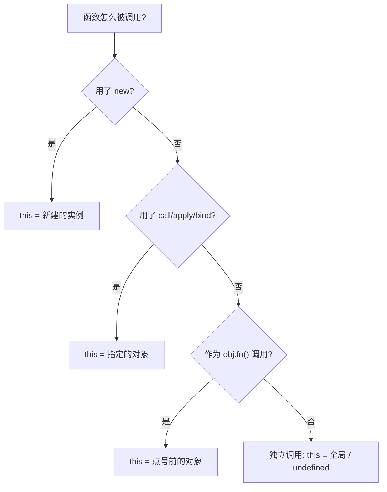

# this 关键词

**`this` 指向谁，不看函数在哪里定义，只看函数怎么被调用。** 它是在函数调用的那一刻才确定的绑定，指向「调用现场」的环境对象。同一个函数，换个方式调用，`this` 就变了。箭头函数是唯一的例外——它没有自己的 `this`。

:::tip 形象记忆
`this` 像口语里的「这位」。会议室里喊一句「请这位发言」，到底指谁，取决于**你喊话时手指着谁**（调用现场），而不是这句话写在剧本的第几页（定义位置）。所以光看函数定义判断不了 `this`，得看它被谁、以什么方式叫起来。
:::

## 为什么会有 `this`

`this` 是为了让 **一个函数能服务于多个对象**——它是一个「隐式传入的参数」，指向当前正在使用这个函数的对象。

设想没有 `this`：一个 `greet` 函数想用到对象自己的 `name`，只能把对象显式传进去。

```js
// 没有 this：每次都得手动把对象传进来
function greet(person) {
  return "hi, " + person.name;
}

const tom = { name: "Tom" };
greet(tom); // 'hi, Tom'
```

更麻烦的是，如果想让方法挂在对象上、还能被很多对象复用，就没法写了——方法体里写死哪个对象都不对。`this` 就是来填这个空的：方法体里用 `this.name`，到底是谁的 `name`，留到 **调用时** 由「谁在调用」决定。

```js
// 有 this：同一个方法，谁调用就用谁的数据
function greet() {
  return "hi, " + this.name;
}

const tom = { name: "Tom", greet };
const jerry = { name: "Jerry", greet };

tom.greet(); // 'hi, Tom'——this 是 tom
jerry.greet(); // 'hi, Jerry'——this 是 jerry
```

这正是原型方法能被所有实例共享的基础：`Person.prototype.greet` 只写一份，每个实例调用时 `this` 自动指向自己。**`this` 把「函数逻辑」和「操作的数据」解耦开**，代价是它的指向不固定、要按调用方式来判断——这才有了下面四种绑定规则。

## 四种绑定规则

判断 `this` 指向，就是判断函数用了下面哪种调用方式。

### 默认绑定：独立调用

函数被「光秃秃」地直接调用 `fn()`，前面没有任何对象修饰。这时 `this` 指向全局对象（浏览器里是 `window`），严格模式下是 `undefined`。

```js
function show() {
  console.log(this);
}

show(); // 非严格模式: window；严格模式: undefined
```

### 隐式绑定：作为对象方法调用

函数被某个对象「点出来」调用 `obj.fn()`，`this` 就指向**点号前面那个对象**。

```js
const obj = {
  name: "obj",
  show() {
    console.log(this.name);
  },
};

obj.show(); // 'obj'——谁调用就指向谁
```

:::warning 隐式绑定丢失
只要函数被「摘下来」单独调用，隐式绑定就丢了，退回默认绑定。最常见的两种场景：赋值给变量、当作回调传出去。
:::

```js
const obj = {
  name: "obj",
  show() {
    console.log(this.name);
  },
};

const fn = obj.show; // 摘下来了
fn(); // undefined——独立调用，this 指向全局

setTimeout(obj.show, 100); // 也是把函数摘出来传给 setTimeout，this 丢失
```

### 显式绑定：call / apply / bind

用 `call`、`apply`、`bind` **强行指定** `this` 指向哪个对象。

```js
function show() {
  console.log(this.name);
}

const me = { name: "me" };

show.call(me); // 'me'——强制 this = me
show.apply(me); // 'me'
const bound = show.bind(me);
bound(); // 'me'——bind 返回绑死 this 的新函数
```

### new 绑定：作为构造函数

函数被 `new` 调用时，引擎会新建一个空对象，把 `this` 指向它，最后返回这个对象。

```js
function Person(name) {
  this.name = name; // this 指向 new 出来的新实例
}

const p = new Person("Tom");
p.name; // 'Tom'
```

## 优先级

四种规则同时具备资格时，按 `new` > 显式 > 隐式 > 默认 的顺序裁决。实际判断时反过来从高往低问一遍即可：



## call、apply、bind 的区别

三者都用来显式指定 `this`，区别在「是否立即执行」和「怎么传参」：

| 方法 | 是否立即执行 | 传参方式 |
|------|:---:|------|
| `call` | 立即 | 参数列表：`fn.call(obj, a, b)` |
| `apply` | 立即 | 数组：`fn.apply(obj, [a, b])` |
| `bind` | 否，返回新函数 | 参数列表，且可分多次传 |

```js
function sum(a, b) {
  return this.base + a + b;
}
const ctx = { base: 100 };

sum.call(ctx, 1, 2); // 103——参数一个个传
sum.apply(ctx, [1, 2]); // 103——参数装数组里传
const add = sum.bind(ctx, 1); // 不执行，先绑好 this 和第一个参数
add(2); // 103——剩下的参数后面补
```

:::tip 形象记忆
`apply` 的 **a** 对应 **array**（数组传参），`call` 一个个用逗号（**c**omma）传；`bind` 是「**绑**好待用」，先把 `this` 系上、不开火，等你需要时再调。
:::

## 箭头函数 vs 普通函数

最核心的区别一句话：**箭头函数没有自己的 `this`**，它捕获定义时所在作用域的 `this`；其余差异 (没有 `arguments`、不能 `new`、没有 `prototype`) 都由此衍生或相关。

| 维度 | 普通函数 | 箭头函数 |
|------|----------|----------|
| `this` | 取决于**调用方式** (谁调用指向谁) | 词法绑定,继承**定义时**外层的 `this` |
| `arguments` | 有 | 没有,用 rest 参数 `...args` 代替 |
| 能否 `new` | 能 (可作构造函数) | 不能 |
| `prototype` 属性 | 有 | 没有 |
| 能否作 Generator | 能 (`function*`) | 不能 |
| `new.target` / `super` | 有自己的 | 继承外层的 |

### this 的差异 (最常考)

普通函数的 `this` 在**调用时**才确定;箭头函数在**定义时**就锁定为外层的 `this`,之后怎么调用都不变。

```js
const obj = {
  name: 'obj',
  normal() {
    console.log(this.name); // 'obj'——谁调用指向谁
  },
  arrow: () => {
    console.log(this.name); // undefined——this 是定义时外层(模块/全局),不是 obj
  },
};
obj.normal();
obj.arrow();
```

这也让箭头函数特别适合**回调**:不用再 `const self = this` 或 `.bind(this)`。

```js
class Timer {
  constructor() {
    this.count = 0;
  }
  start() {
    setInterval(() => {
      this.count++; // 箭头函数捕获 start 的 this,正确指向实例
    }, 1000);
  }
}
```

如果上面用普通函数,`setInterval` 回调里的 `this` 会指向全局 (或 `undefined`),`this.count` 就错了。

### 没有 arguments

```js
function normal() {
  console.log(arguments); // 类数组,拿到所有实参
}

const arrow = (...args) => {
  console.log(args); // 箭头函数没有 arguments,用 rest
};
```

### 不能作构造函数

箭头函数没有 `prototype`、没有自己的 `this`,所以不能 `new`:

```js
const Foo = () => {};
new Foo(); // TypeError: Foo is not a constructor
```

### 怎么选

- **需要动态 `this`** 的场景用普通函数:对象方法、原型方法、构造函数、需要 `this` 指向调用者的事件处理。
- **需要固定 `this` 或写法简洁**的场景用箭头函数:回调、`map` / `filter` 等高阶函数的参数、不关心 `this` 的纯函数。

:::warning
别把对象的方法写成箭头函数 (`this` 会指向外层而非对象),也别给 `prototype` 上的方法用箭头函数——这是箭头函数最常见的误用。
:::

## 输出题

### 箭头函数 vs 普通函数

```js
const a = 10;
const obj = {
  a: 13,
  b: () => {
    console.log(this.a);
  },
  c: function () {
    console.log(this.a);
  },
  d: function () {
    return () => {
      console.log(this);
    };
  },
  e: function () {
    return this.b;
  },
};

obj.b(); // 10
obj.c(); // 13
obj.d()(); // obj
obj.e()(); // 10
```

- `obj.b()`：`b` 是箭头函数，`this` 沿用定义时的外层作用域。这里 `obj` 字面量不构成函数作用域，外层是模块/全局，`this.a` 取到 `10`
- `obj.c()`：普通函数，隐式绑定，`this` 指向 `obj`，输出 `13`
- `obj.d()()`：`d` 是普通函数被 `obj.d()` 调用，`this` 是 `obj`；返回的箭头函数沿用 `d` 的 `this`，所以打印 `obj`
- `obj.e()()`：`e` 返回 `obj.b` 这个函数引用，再以 `()` 独立调用，`b` 又是箭头函数，沿用全局 `this`，输出 `10`

:::warning
顶层 `const a = 10` 不会成为全局对象的属性 (`window.a` 是 `undefined`)。这里能取到 `10`，是因为 ES 模块/普通脚本顶层的 `this.a` 实际取的是同作用域的全局变量 `a`。如果换成严格模式独立函数，`this` 是 `undefined`，会直接报错。
:::

### 箭头函数捕获外层普通函数的 `this`

```js
let obj = {
  name: 'Tyler',
  a: function () {
    let name = 'Anderson';
    let test = () => {
      console.log(this.name);
    };
    test();
  },
};
obj.a(); // 'Tyler'
```

`obj.a()` 隐式绑定，`a` 内的 `this` 是 `obj`。箭头函数 `test` 沿用 `a` 的 `this`，所以 `this.name` 是 `'Tyler'`，与局部变量 `name = 'Anderson'` 无关。`this.name` 永远走对象属性，不会读到函数内的局部变量。

### 函数内嵌套普通函数：丢失绑定

```js
var name = '123';
var obj = {
  name: '456',
  getName: function () {
    function printName() {
      console.log(this.name);
    }
    printName();
  },
};

obj.getName(); // '123'
```

`printName()` 是独立调用，触发默认绑定，`this` 指向全局对象。`var name = '123'` 会挂到全局对象上，所以输出 `'123'`，而不是 `'456'`。

:::tip
内层普通函数无论嵌套多深，只要是 `fn()` 这样独立调用，`this` 就回到默认绑定。想保留外层 `this`，要么用箭头函数，要么 `const self = this` 缓存。
:::

### 赋值表达式的返回值调用

```js
function foo() {
  console.log(this.a);
}

var a = 2;
var o = { a: 3, foo: foo };
var p = { a: 4 };

o.foo(); // 3
(p.foo = o.foo)(); // 2
```

- `o.foo()`：隐式绑定，`this` 是 `o`，输出 `3`
- `(p.foo = o.foo)()`：赋值表达式 `p.foo = o.foo` 的**返回值是函数本身**，而非 `p.foo`。紧接着 `()` 是对这个返回值的独立调用，触发默认绑定，`this` 指向全局，输出 `2`

:::warning
关键点：赋值表达式的值是被赋的那个值 (函数引用)，不是 `p.foo`。所以这是独立调用，不是 `p.foo()`。
:::

## 参考

1. [this - JavaScript | MDN](https://developer.mozilla.org/zh-CN/docs/Web/JavaScript/Reference/Operators/this)
2. [this与对象原型 - 你不懂JS](https://github.com/getify/You-Dont-Know-JS/blob/1ed-zh-CN/this%20%26%20object%20prototypes/ch2.md)
3. [JavaScript 的 this 原理 - 阮一峰的网络日志](https://www.ruanyifeng.com/blog/2018/06/javascript-this.html)
4. [this、apply、call、bind - 掘金](https://juejin.cn/post/6844903496253177863)
