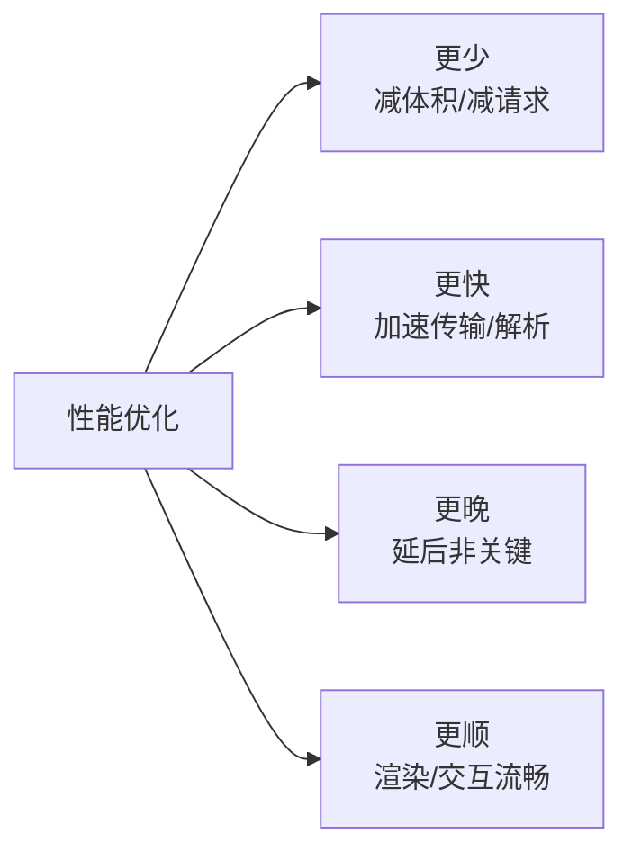

# 性能

性能优化的本质是优化 **关键渲染路径** ——让用户更早看到内容、更快能交互、过程不卡顿。无论 Web 还是 RN,所有具体手段都可以归到四个方向:

| 方向 | 含义 |
| --- | --- |
| **更少** | 减少资源体积与请求数 |
| **更快** | 加速传输与解析 |
| **更晚** | 延后非关键工作 |
| **更顺** | 渲染与交互不卡顿 |

优化是一个 **「度量 → 定位 → 优化 → 再度量」** 的闭环:先用指标和工具找到真正的瓶颈,再针对性下手,不要凭感觉拍脑袋优化。

## 本章地图

| 主题 | 内容 |
| --- | --- |
| [优化策略](./优化策略) | Web 端与 RN 端按维度罗列的可落地手段 |
| [Web Vitals](./web-vitals) | LCP / INP / CLS 等核心用户体验指标 |
| [Lighthouse](./lighthouse) | 实验室诊断工具,跑分与优化建议 |
| [卡顿的原因和解决](./jank-causes-and-solutions) | 掉帧与卡顿的成因排查 |
| [服务端渲染](./server-side-rendering) | SSR / SSG 首屏直出与水合 |
| [懒加载](./懒加载) | 资源按需加载,缩短关键渲染路径 |
