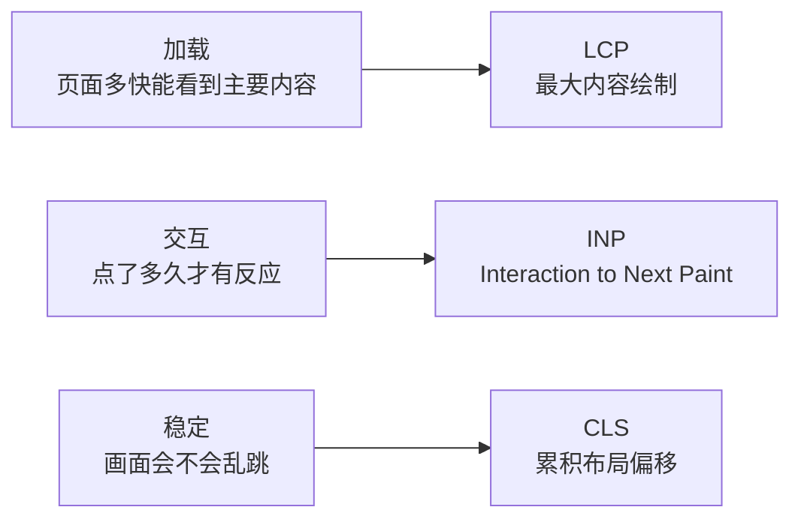

# Web Vitals

Web Vitals 是 Google 定义的一组**以用户为中心**的真实体验指标——不看「服务器多少毫秒返回」这种技术数字,而是直接量化用户实际感受到的「加载快不快、点了有没有反应、画面稳不稳」。

其中 Google 挑出三个最关键的,称为**核心 Web Vitals**(Core Web Vitals),覆盖体验的三个维度:



形象例子:你走进一家餐厅,三件事决定第一印象——**菜上得快不快**(LCP)、**招手服务员理不理你**(INP)、**菜单会不会突然被换走让你点错**(CLS)。三者都好,才算体验流畅。

## 三大核心指标

每个指标都有三档评分线:**good / needs-improvement / poor**。Google 的标准是取**第 75 百分位**的真实用户数据来评——即 75% 的访问都达到 good 才算这个站点合格,不能只看平均值掩盖长尾卡顿。

| 指标 | 测什么 | good | needs-improvement | poor |
| --- | --- | --- | --- | --- |
| **LCP**(最大内容绘制) | 视口内**最大那块内容**(大图、大标题块)绘制完成的时间,代表「主要内容多久看得到」 | ≤ 2.5s | 2.5–4s | > 4s |
| **INP**(Interaction to Next Paint) | 整个页面生命周期里,**所有交互**(点击、点按、按键)从触发到下一帧画面更新的延迟,取近乎最差的一次 | ≤ 200ms | 200–500ms | > 500ms |
| **CLS**(累积布局偏移) | 页面加载过程中元素**意外位移**的累积分数,代表「画面稳不稳」 | ≤ 0.1 | 0.1–0.25 | > 0.25 |

:::info
**INP 在 2024 年 3 月正式取代 FID** 成为核心 Web Vitals。FID(First Input Delay,首次输入延迟)只测**第一次**交互的「延迟」,而且只测到事件开始处理为止,不含处理和重绘——评得太宽松。INP 测**全程所有交互**直到屏幕更新,更能反映真实的交互卡顿。
:::

### LCP:加载

测视口内最大内容元素绘制完成的时刻。常见劣化原因与对策:

- **TTFB 慢 / 资源加载慢** → 用 CDN、缓存、HTTP/2、压缩资源。
- **关键资源阻塞渲染** → 内联关键 CSS、`preload` LCP 图片、移除阻塞的 JS/CSS。
- **图片过大或加载晚** → 压缩、用 WebP/AVIF、`fetchpriority="high"`、避免对首屏大图用懒加载。
- **客户端渲染过晚** → SSR / 预渲染首屏。

### INP:交互

测交互到下一帧绘制的延迟,瓶颈几乎都在**主线程被长任务占住**,事件回调排不上队、或回调本身跑太久。对策:

- 拆分长任务(Long Task > 50ms),用时间分片 / `scheduler.yield()` 让出主线程。
- 把纯计算挪到 Web Worker。
- 减少回调里的同步重排和大量 DOM 操作。
- 用 `requestIdleCallback` 推迟非紧急工作。

### CLS:稳定

测元素意外位移,典型「读着读着内容突然往下跳」。对策:

- 给图片、视频、`iframe` 显式设 `width`/`height` 或用 `aspect-ratio`,预留空间。
- 广告 / 嵌入内容预留固定占位。
- 字体用 `font-display: optional` 或预加载,避免字体换装引发回流。
- 动态插入内容不要插在已有内容上方。

## 辅助指标:FCP 与 TTFB

核心指标之外,这两个常用来诊断 LCP 为什么慢:

- **FCP**(First Contentful Paint,首次内容绘制):**任意**内容(文字、图片)第一次出现在屏幕上的时间。good ≤ 1.8s。FCP 是「白屏结束」的时刻,LCP 是「主内容到位」的时刻。
- **TTFB**(Time to First Byte,首字节时间):从发起请求到收到响应第一个字节的时间。它是 FCP 和 LCP 的**起跑线**——TTFB 慢,后面全慢。good ≤ 0.8s。

## 字段数据 vs 实验数据

同一个指标有两种采法,别混淆:

| | 字段数据(Field / RUM) | 实验数据(Lab) |
| --- | --- | --- |
| 来源 | **真实用户**在真实设备、真实网络下的访问 | 受控环境**模拟**一次访问(如 Lighthouse) |
| 别名 | Real User Monitoring | Lab data / Synthetic |
| 优点 | 反映真实体验,覆盖各种设备和网络 | 可复现、可调试、上线前就能测 |
| 缺点 | 要有流量、采集后才知道、无法调试单次 | 一台机器一种网络,代表不了所有用户 |
| INP / FID | **只能**靠字段数据(需真实交互) | Lab 测不出真实 INP |

:::tip
两者互补:**Lab 用于开发期定位问题和做性能门禁,Field 用于线上验证真实用户的体验**。Google 搜索排名只认 Field 数据(来自 CrUX,Chrome 用户体验报告)。Lighthouse 的细节见 [Lighthouse](./lighthouse.md)。
:::

## 怎么采集

浏览器提供 `PerformanceObserver` 直接监听这些指标,但边界条件很多(BFCache、多次交互合并等)。官方的 **`web-vitals` 库**封装好了这些细节,推荐直接用:

```js
// 用官方 web-vitals 库采集核心指标,回调里把数据上报到自己的分析后端
import { onLCP, onINP, onCLS } from 'web-vitals';

function report(metric) {
  // metric.name 是指标名,metric.value 是数值,metric.rating 是 good/needs-improvement/poor
  navigator.sendBeacon('/analytics', JSON.stringify(metric));
}

onLCP(report);
onINP(report);
onCLS(report);
```

底层其实就是 `PerformanceObserver`,例如手动测 LCP:

```js
// 监听 largest-contentful-paint 条目,最后一条即最终 LCP
new PerformanceObserver((list) => {
  const entries = list.getEntries();
  const last = entries[entries.length - 1];
  console.log('LCP:', last.startTime);
}).observe({ type: 'largest-contentful-paint', buffered: true });
```

## 参考

- [Web Vitals - web.dev](https://web.dev/articles/vitals)
- [Largest Contentful Paint (LCP) - web.dev](https://web.dev/articles/lcp)
- [Interaction to Next Paint (INP) - web.dev](https://web.dev/articles/inp)
- [Cumulative Layout Shift (CLS) - web.dev](https://web.dev/articles/cls)
- [web-vitals 库 - GitHub](https://github.com/GoogleChrome/web-vitals)
