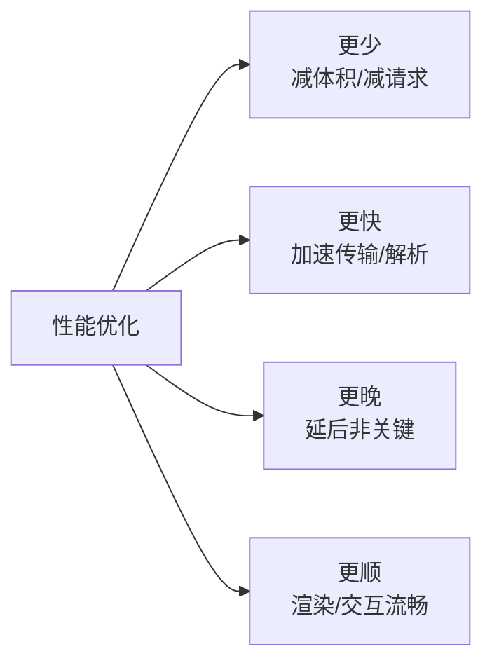

# 优化策略

性能优化的本质是优化**关键渲染路径**,四个方向:**更少**(减少资源体积与请求)、**更快**(加速传输与解析)、**更晚**(延后非关键工作)、**更顺**(渲染与交互不卡顿)。下面按 Web 端和 RN 端分别罗列可落地的手段。

## Web 端

### 1. 网络与加载

- **HTTP/2、HTTP/3**:多路复用,消除队头阻塞,头部压缩。
- **CDN**:就近分发静态资源,降低延迟。
- **强缓存 + 协商缓存**:`Cache-Control`/`ETag`,静态资源指纹化后长期缓存。
- **Gzip / Brotli 压缩**:文本资源传输体积砍掉 60%~80%,Brotli 通常优于 Gzip。
- **资源提示**:`dns-prefetch`(提前解析 DNS)、`preconnect`(提前建连)、`preload`(高优先级预加载关键资源)、`prefetch`(空闲预取下一页资源)。
- **减少重定向**:每次重定向多一个 RTT。
- **避免请求瀑布**:减少串行依赖的请求链,能并行就并行。

### 2. 资源优化

- **图片**:压缩;用 **WebP / AVIF** 替代 JPEG/PNG;**响应式图片**(`srcset`/`sizes` 按屏幕给图);**懒加载**(`loading="lazy"` 或 `IntersectionObserver`);雪碧图合并小图标。
- **字体**:**子集化**(只保留用到的字形)、`preload` 关键字体、`font-display: swap`(先用系统字体兜底,避免 FOIT)、用字体图标或 SVG 替代图片图标。
- **按需加载资源**:首屏外的资源一律延后。

### 3. JavaScript 优化

- **代码拆分(code splitting)**:按路由/组件拆包,首屏只下首屏代码。
- **动态 `import()`**:把非首屏模块延后加载。
- **Tree-shaking + 删无用代码**:依赖 ESM 静态分析摇掉死代码。
- **减少主线程长任务**:大计算用**时间分片**(参见 [时间分片](../../scenario/time-slicing.md))或 **Web Worker** 挪出主线程。
- **减小包体**:换更轻的库、按需引入(如 `lodash-es` 具名引入)、避免重复打包。

### 4. CSS 优化

- **关键 CSS 内联**,非关键 CSS 异步加载,避免 CSS 阻塞渲染。
- **降低选择器复杂度**,避免深层后代选择器。
- **优先用 CSS 动画 / `transform`、`opacity`**:只触发合成,不引起回流重绘。
- **`content-visibility: auto`、`contain`**:跳过屏幕外内容的渲染计算。

### 5. 渲染优化

- **减少回流与重绘**:批量改 DOM、读写分离(避免强制同步布局)、用 `class` 切换替代逐条改样式。参见 [回流与重绘](../browser/reflow-and-repaint.md)。
- **减少 DOM 数量与层级**。
- **虚拟列表**:长列表只渲染可视区,避免一次性挂上万节点。
- **合成层提升**:对频繁动画元素用 `will-change`/`transform` 提到独立合成层。

### 6. 运行时与交互

- **防抖 / 节流**:高频事件(输入、滚动、resize)限流。
- **事件委托**:用冒泡把大量子元素的监听收敛到父节点。
- **`requestAnimationFrame`**:动画对齐刷新帧;**`requestIdleCallback`**:非紧急任务塞进空闲帧。

### 7. 框架与渲染架构

- **SSR / SSG / 流式 SSR**:首屏直出 HTML,改善 FCP 与 SEO(注意水合成本,参见 [SSR 专题](./server-side-rendering.md))。
- **路由级与组件级懒加载**:`React.lazy` + `Suspense`。
- **避免无谓重渲染**:`memo`、`useMemo`、`useCallback`、稳定 key、状态下沉。

### 8. 感知性能(让「等待」体感更短)

- **骨架屏 / 占位图**:先给结构感,减少白屏焦虑。
- **乐观更新**:交互先反馈,请求在后台跑。
- **渐进式加载**:图片由模糊到清晰、内容分块渲染。

### 9. 度量与监控

- **Web Vitals**(LCP / INP / CLS)作为核心指标,参见 [Web Vitals](./web-vitals.md)。
- **Lighthouse** 做实验室诊断,参见 [Lighthouse](./lighthouse.md)。
- **RUM(真实用户监控)**:线上采集长任务、慢请求、卡顿。

## RN 端

RN 的瓶颈和 Web 不同,核心矛盾在 **JS 线程**、**渲染/通信** 和 **启动**。系统优化参见 [React Native 性能优化](../../React/React_Native/性能优化.md),卡顿排查参见 [卡顿的原因和解决](./jank-causes-and-solutions.md)。

### 1. 启动速度

- **Hermes 引擎**:预编译字节码,削减启动解析时间、降低内存。
- **inline requires**:模块下沉到首次使用才求值,启动只跑首屏需要的代码。
- **RAM bundle**:模块按索引分块、按需求值(上了 Hermes 后收益减弱)。
- **base + 业务包拆分**:公共基础包常驻、业务包按需下发与独立发版。
- **精简启动期初始化**:把非必要的 SDK/模块初始化延后。

### 2. JS 线程与通信

- **别阻塞 JS 线程**:重计算分片或挪到原生/Worklet。
- **减少跨端通信**:旧架构走 Bridge 序列化有开销;新架构(JSI / Fabric / TurboModules)用同步直调降低开销。
- **减少重渲染**:`React.memo`、`PureComponent`、`useMemo`/`useCallback`,避免在 `render` 里建新对象/匿名函数。

### 3. 长列表

用 `FlatList`/`SectionList` 而非 `ScrollView` 全量渲染,关键参数:

- `getItemLayout`:固定行高时跳过测量。
- `windowSize`、`initialNumToRender`、`maxToRenderPerBatch`:控制渲染窗口。
- `removeClippedSubviews`:回收屏幕外视图。
- 稳定的 `keyExtractor`,避免行内匿名函数与 inline style。
- 列表项用 `memo` 包裹。

### 4. 图片

- 用 **FastImage** 之类带缓存的组件,做磁盘/内存缓存。
- 按显示尺寸下发合适分辨率,别用原图;屏幕外懒加载。

### 5. 动画与原生

- **`useNativeDriver: true`**:动画跑在 UI 线程,不受 JS 线程卡顿影响。
- **Reanimated(Worklet)**:动画逻辑在 UI 线程执行,手势/动画更跟手。
- 重计算或高频原生能力封装成**原生模块**。

### 6. 包体与热更新

- **拆包 + 删无用原生依赖**,压缩安装包与启动加载量。
- **OTA 差量热更新**(CodePush / 自建):只下发新旧 bundle 的 diff。

### 7. 度量

- 监控**启动耗时**、**JS FPS 与 UI FPS**、**掉帧/卡顿**,定位是 JS 线程还是渲染线程的问题。

## 参考

1. [Web 性能 | MDN](https://developer.mozilla.org/zh-CN/docs/Web/Performance)
2. [快速加载 | web.dev](https://web.dev/fast/)
3. [Lazy loading | MDN](https://developer.mozilla.org/zh-CN/docs/Web/Performance/Lazy_loading)
4. [Optimizing JavaScript performance | React Native](https://reactnative.dev/docs/performance)
