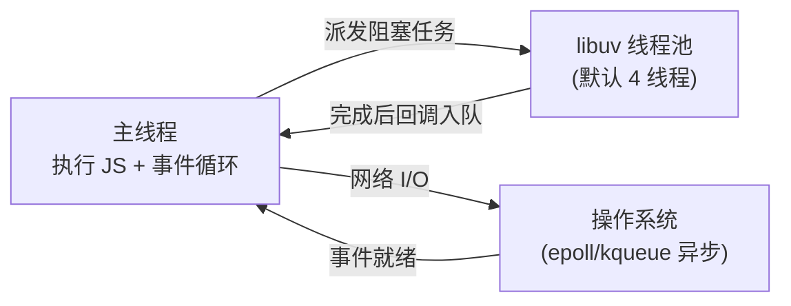

# 进程与线程

**进程是资源分配的最小单位，线程是 CPU 调度的最小单位。** 一句话区分：进程之间内存隔离，线程共享所属进程的内存。

## 进程 vs 线程

| | 进程 (Process) | 线程 (Thread) |
|---|---|---|
| 定义 | 一个运行中的程序实例 | 进程内的一条执行流 |
| 资源 | 独立的内存空间、文件句柄 | 共享所属进程的内存与资源 |
| 通信 | 需 IPC(管道、socket、共享内存) | 直接读写共享内存即可 |
| 开销 | 创建/切换开销大 | 创建/切换开销小 |
| 隔离性 | 一个进程崩溃不影响其他进程 | 一个线程崩溃会拖垮整个进程 |
| 调度 | 操作系统按进程分配资源 | 操作系统按线程调度 CPU |

打个比方：进程是一套独立的房子(有自己的水电、家具)，线程是房子里的人。两套房子(进程)互不干扰；同一套房子里的人(线程)共用客厅厨房,沟通方便但也容易互相打架(竞态)。

:::info
**为什么线程切换比进程快？** 进程切换要切换页表、刷新 TLB、保存整套上下文；线程同属一个进程，共享地址空间，切换只需保存少量寄存器和栈指针,代价小得多。
:::

## Node.js 的线程模型

常说「Node.js 是单线程的」,指的是**执行 JavaScript 代码的主线程只有一个**——所有 JS 回调都在这一个线程上跑,不存在两段 JS 同时执行。这也是 JS 没有多线程锁、竞态问题的根源。

但 Node.js 进程整体**不是**只有一个线程:

- **主线程**:执行 JS、跑事件循环。
- **libuv 线程池**:默认 4 个线程(`UV_THREADPOOL_SIZE` 可调),处理文件 I/O、DNS、`crypto`、`zlib` 等无法异步化的阻塞操作。主线程把活派给线程池,完成后再把回调塞回事件循环。



所以「单线程」是说 JS 执行单线程,底层 I/O 靠多线程和操作系统异步机制撑起高并发。详见[事件循环](./事件循环.md)和[架构](./架构.md)。

## 单线程的瓶颈与突破

单线程的软肋是 **CPU 密集型任务**:一段长时间运行的同步 JS(如大数组排序、图像处理)会霸占主线程,事件循环卡住,所有请求被阻塞。I/O 密集 Node 很擅长,CPU 密集则需要把活分出去。

Node.js 提供三种「多干活」的手段:

### `child_process` —— 多进程

启动一个全新的子进程(可以是另一个 Node 脚本,也可以是任意命令),有独立内存,通过 IPC 通信。适合执行外部命令或隔离不稳定的任务。

```js
const { fork } = require('child_process');
const child = fork('./heavy-task.js');
child.send({ data: 123 }); // 主进程发消息
child.on('message', (result) => console.log(result)); // 收子进程结果
```

### `cluster` —— 多进程榨干多核

单进程只能用一个 CPU 核心。`cluster` 基于 `child_process`,fork 出多个**共享同一端口**的工作进程,由主进程负载均衡分发请求,把多核 CPU 都用上。这是 Node 服务端横向扩展的经典方案(PM2 底层即用它)。

```js
const cluster = require('cluster');
const os = require('os');

if (cluster.isPrimary) {
  os.cpus().forEach(() => cluster.fork()); // 每个核心一个工作进程
} else {
  require('./server.js'); // 工作进程跑实际服务
}
```

### `worker_threads` —— 多线程

Node 10.5+ 引入,在**同一进程内**开真正的线程,共享内存(可通过 `SharedArrayBuffer`),线程创建和通信开销比多进程小。专为 **CPU 密集型计算**设计,别拿它做 I/O(那是事件循环的活)。

```js
const { Worker } = require('worker_threads');
const worker = new Worker('./compute.js', { workerData: { n: 1e9 } });
worker.on('message', (sum) => console.log(sum));
```

:::tip
**选型口诀**:I/O 密集——默认单线程足够;要榨干多核扛并发——用 `cluster` 多进程;单个 CPU 密集计算想加速——用 `worker_threads`;调用外部程序——用 `child_process`。
:::

## 死锁

多线程共享资源时,若两个线程互相持有对方需要的锁、又都不释放,就会**死锁**——彼此永远等待。产生需同时满足四个条件:**互斥、持有并等待、不可剥夺、循环等待**,破坏任意一个即可避免(如规定所有线程按固定顺序加锁,破坏「循环等待」)。

:::info
得益于单线程模型,纯 JS 业务代码几乎不用操心锁和死锁——同一时刻只有一段 JS 在跑。只有用 `worker_threads` + `SharedArrayBuffer` 做共享内存并发时,才需要关心数据竞争。
:::
