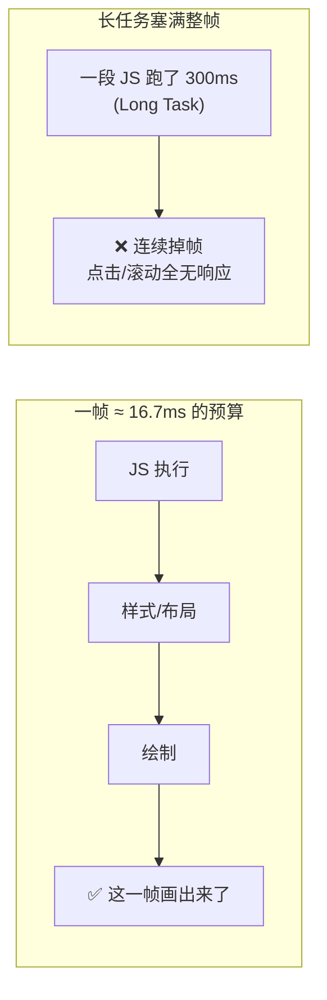
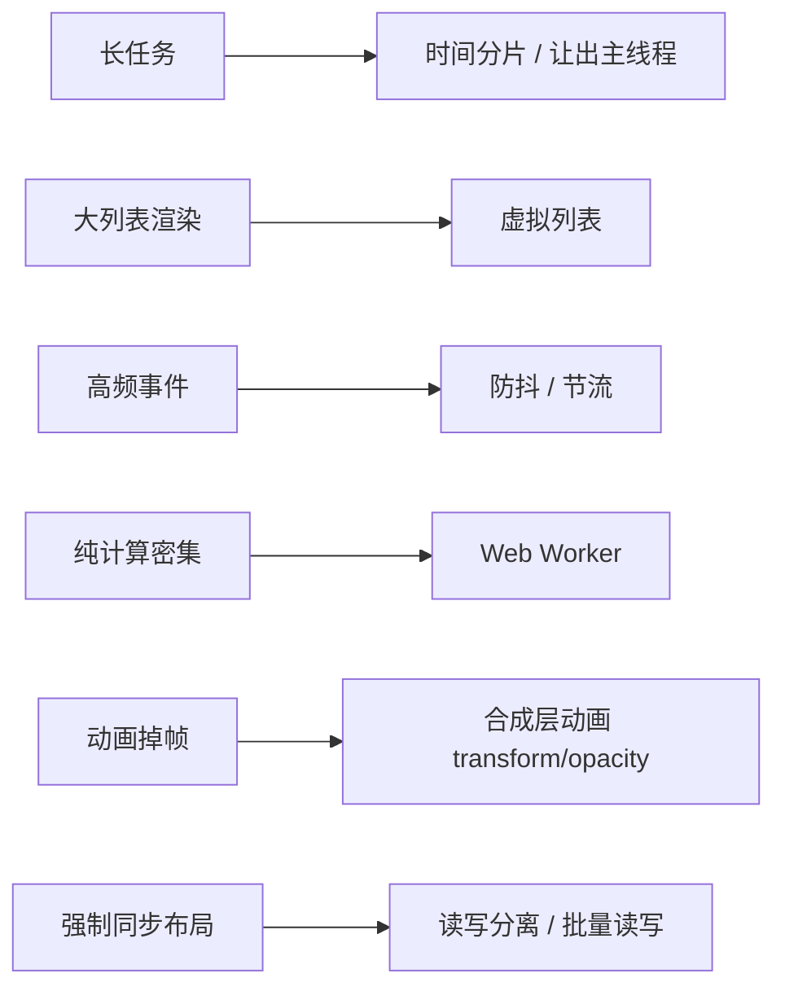

# 卡顿的原因和解决

卡顿的本质只有一句话:**主线程被长时间占用,来不及在一帧(约 16.7ms)内完成渲染**。屏幕 60fps,每帧只有约 16.7ms 预算,主线程在这点时间里要跑完 JS、算样式布局、绘制。一旦某段工作超时,这一帧就「画不出来」——表现为**掉帧、动画顿挫、点击半天没反应**。



形象例子:渲染像**地铁每 16.7ms 发一班车**,每班车要装完「这一帧该显示的画面」准时发出。某个乘客(长任务)赖在车门口不走,这班车发不出去,后面全堵——屏幕就卡住了。

## 成因

卡顿几乎都能归到「**主线程被占住**」这一类,常见来源:

| 成因 | 为什么卡 |
| --- | --- |
| **长任务**(Long Task > 50ms) | 一段 JS 同步跑太久,期间无法响应交互、无法渲染 |
| **强制同步布局**(layout thrashing) | JS 里读了布局属性(如 `offsetHeight`)又改样式,反复触发**同步重排**,本可批处理的布局被逼着一次次立即算 |
| **频繁重排重绘** | 改动几何属性(宽高、位置)频繁触发 layout/paint |
| **大列表一次性渲染** | 一次性创建上千个 DOM 节点,单帧塞不下 |
| **复杂 JS 计算** | 大数据排序、加解密、图像处理等纯计算独占主线程 |
| **动画跑在主线程** | 用 JS 逐帧改样式做动画,JS 一忙动画就掉帧 |

## 解法逐一对应



### 1. 长任务 → 时间分片

把一个大任务切成小片,每片只占一小段时间,片间用 `requestIdleCallback` 让出主线程,给渲染和交互留机会。详见 [时间分片](../scenario/time-slicing.md)。

### 2. 大列表 → 虚拟列表

只渲染**可视区域**的那几十个节点,滚动时回收复用,DOM 数量恒定。十万条数据也只挂几十个节点。详见 [虚拟列表](../scenario/virtual-list.md)。

### 3. 高频事件 → 防抖 / 节流

`scroll`、`resize`、`input` 每秒触发几十上百次,回调里若有重活就会卡。**防抖**让它停下来才执行一次,**节流**让它固定频率执行。详见 [防抖与节流](../scenario/debounce-throttle.md)。

### 4. 纯计算 → Web Worker

时间分片是在主线程「挤时间」,而 Web Worker 是把计算**整个挪到另一条线程**,主线程完全不参与。适合纯计算密集型任务(大数据处理、加解密、图像处理),代价是 Worker 不能直接操作 DOM、有数据通信开销。

```js
// 把耗时计算丢给 Worker,主线程只管收结果,全程不卡
const worker = new Worker('compute.js');
worker.postMessage(bigData);
worker.onmessage = (e) => render(e.data); // 算完才回来,主线程一直流畅
```

### 5. 动画 → 合成层动画

只用 **`transform` 和 `opacity`** 做动画:它们由 GPU 在**合成层**处理,**不触发 layout 和 paint**,直接在合成阶段完成,即使主线程繁忙也丝滑。反例是动 `width`、`top`、`margin` 这类几何属性,每帧都触发重排,极易掉帧。

```css
/* 好:走合成层,不碰布局 */
.move { transform: translateX(100px); }

/* 差:改 left 每帧触发重排 */
.move-bad { left: 100px; }
```

### 6. 强制同步布局 → 读写分离

浏览器本会把多次样式改动**批量**算一次布局。但如果你「改了样式立刻又读布局属性」,浏览器为给你准确值只能**立即同步重排**,批处理优化失效。解法:**先集中读、再集中写**。

```js
// 差:循环里读一次 offsetWidth 就被逼算一次布局(layout thrashing)
items.forEach((el) => {
  el.style.width = el.offsetWidth + 10 + 'px'; // 读写交替,每次都强制同步布局
});

// 好:先把要读的值一次性读出来,再统一写
const widths = items.map((el) => el.offsetWidth); // 集中读
items.forEach((el, i) => {
  el.style.width = widths[i] + 10 + 'px'; // 集中写,只触发一次布局
});
```

### 调度:rAF 与 rIC

- **`requestAnimationFrame`**:回调在**下次重绘前**执行,和刷新率对齐,用来做视觉更新/动画,不会出现 `setTimeout` 那种计时与刷新错位的掉帧。
- **`requestIdleCallback`**:在浏览器**空闲时**执行低优先级后台任务,不抢渲染。时间分片就靠它在片间让出主线程。

## 和 SSR 的关系

SSR 改善的是**首屏**——让 HTML 早点出现,FCP 提前;但它带来的**水合**本身是一段集中的 JS 工作,会占住主线程、推高 TBT,反而可能引入「看得见点不动」的主线程卡顿。所以 SSR 和卡顿是一体两面:优化首屏的同时要盯住水合成本。详见 [服务端渲染](./server-side-rendering.md)。

## 参考

- [Long Tasks API - MDN](https://developer.mozilla.org/zh-CN/docs/Web/API/Long_Tasks_API)
- [Avoid large, complex layouts and layout thrashing - web.dev](https://web.dev/articles/avoid-large-complex-layouts-and-layout-thrashing)
- [Stick to compositor-only properties - web.dev](https://web.dev/articles/stick-to-compositor-only-properties-and-manage-layer-count)
- [使用 Web Workers - MDN](https://developer.mozilla.org/zh-CN/docs/Web/API/Web_Workers_API/Using_web_workers)
