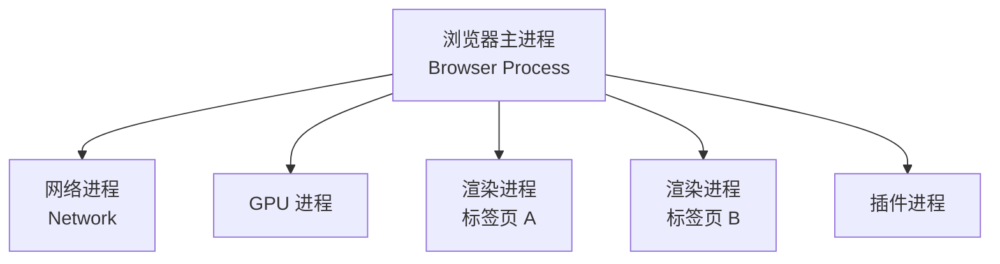
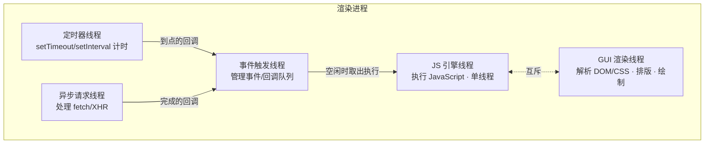
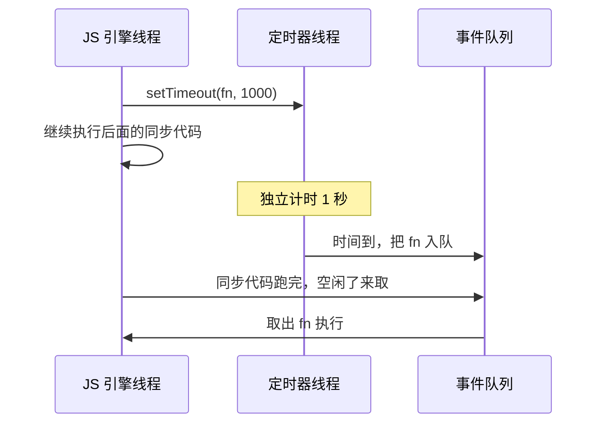

# 浏览器进程与线程

现代浏览器是**多进程架构**,不是单进程。Chrome 把不同职责拆到独立进程:一个标签页崩了不拖垮整个浏览器,渲染网页的代码跑在沙箱里碰不到系统资源。理解这套架构,是理解「JS 为什么单线程」「页面为什么会卡」「时间分片为什么有用」的前提。

## 五类核心进程

| 进程 | 数量 | 职责 |
| --- | --- | --- |
| **浏览器主进程**(Browser) | 1 个 | 浏览器的「大脑」。管地址栏、书签、前进/后退等界面;创建和管理其他子进程;协调文件读写等。 |
| **渲染进程**(Renderer) | 每个标签页/站点 1 个 | 把 HTML/CSS/JS 变成屏幕上的像素。**JS 引擎、排版、绘制全在这里**,跑在沙箱中,不能直接访问系统资源。 |
| **网络进程**(Network) | 1 个 | 发起网络请求、加载资源。早期内置在主进程,后来独立出来。 |
| **GPU 进程** | 1 个 | GPU 加速绘制——3D、CSS 动画、页面合成。整个浏览器共用一个。 |
| **插件进程**(Plugin) | 每个插件 1 个 | 运行浏览器插件,隔离开防止插件崩溃波及页面。 |

:::info
此外还有按需启动的辅助进程:**Utility 进程**(音频播放、数据解码等)、**Storage 进程**(存储)等。Chrome 的进程模型一直在演进,具体拆分各版本略有不同,但「主进程 + 渲染进程 + GPU + 网络」这套核心骨架是稳定的。
:::

## 渲染进程内的多线程

性能问题的核心几乎都发生在**渲染进程内部**。它不是单线程,而是多条线程协作——这正是事件循环、JS 单线程的物理基础:

| 线程 | 职责 |
| --- | --- |
| **GUI 渲染线程** | 解析 HTML 构建 DOM、解析 CSS 构建 CSSOM、布局(layout)、绘制(paint)。页面要重新渲染时由它负责。 |
| **JS 引擎线程** | 执行 JavaScript,**单线程**。同一时刻只能跑一段 JS。 |
| **事件触发线程** | 维护一个事件/任务队列。各类异步事件就绪后,对应回调被它放进队列等 JS 引擎来取。 |
| **定时器线程** | `setTimeout`/`setInterval` 的计时由独立线程完成(不占 JS 引擎),到点把回调交给事件触发线程。 |
| **异步 HTTP 请求线程** | `fetch`/`XHR` 发出后由独立线程等待响应,完成后把回调交给事件触发线程。 |

## 两条关键结论

### 1. JS 引擎线程与 GUI 渲染线程互斥

两者**不能同时运行**:JS 执行时,GUI 渲染挂起;JS 跑完(或让出),累积的渲染才会进行。

原因很直接——JS 能修改 DOM,如果一边渲染一边改 DOM,画面会错乱。所以浏览器干脆让它俩互斥。

**这就是页面卡顿的根源**:一段 JS 跑了几百毫秒(比如同步计算 1 亿次累加、复杂同步逻辑),这期间 GUI 线程一直被挂起,页面不刷新、点击没反应——表现为「卡死」。[时间分片](../scenario/time-slicing)解决的正是这个问题:把长任务切成小片,片间让出 JS 引擎线程,给 GUI 渲染留出机会。

### 2. JS「单线程」≠ 浏览器单线程

JS 是单线程,指的只是**JS 引擎线程**只有一条。但定时器计时、网络等待这些「耗时但不烧 CPU」的活,浏览器交给了**其他线程**去做:

- `setTimeout(fn, 1000)`:定时器线程在另一条线程上计时,1 秒后把 `fn` 丢进事件队列,**不占用** JS 引擎线程。
- `fetch(url)`:异步请求线程在后台等响应,回来后把回调丢进队列。

JS 引擎线程只需在**空闲时**从队列里取回调来执行。这套「单线程执行 + 多线程辅助 + 队列衔接」的机制,就是**事件循环**(Event Loop)。

## 多进程架构的好处与代价

**好处:**

- **稳定性**:一个渲染进程崩溃,只挂掉对应标签页,其余页面和浏览器本体正常。
- **安全性**:渲染进程跑在沙箱中,恶意网页无法直接读写本地文件或调用系统能力,所有敏感操作必须经主进程审批。
- **隔离性**:**站点隔离**(Site Isolation)让不同站点使用不同渲染进程,防止跨站数据窃取(如 Spectre 这类侧信道攻击)。

**代价:**

- **内存开销大**:每个进程都有一份独立的基础内存占用(包括各自的 JS 引擎、渲染管线)。标签页开多了吃内存,根源就在这里。Chrome 会在内存紧张时合并同源标签页的进程来缓解。

:::tip
面试里「浏览器有哪些进程/线程」常和**事件循环**、**重排重绘**、**性能优化**连起来问。把握一条主线即可串起来:多进程是为了**稳定与安全**;渲染进程内 **JS 与 GUI 互斥**导致长任务卡顿;**事件循环 + 辅助线程**让单线程的 JS 也能处理异步;优化手段(时间分片、Web Worker、减少重排)本质都是在**不阻塞 GUI 渲染线程**上做文章。
:::
