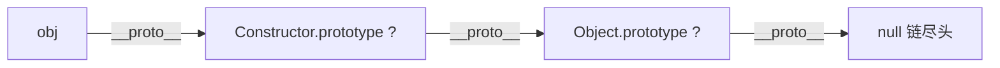

# new 与 instanceof

这两道题考的是同一个底层知识——**原型链**。`new` 负责「建立」原型链，`instanceof` 负责「查找」原型链。

## 手写 new

`new` 一个构造函数时，引擎做了四件事：

1. 创建一个**空对象**。
2. 把空对象的原型 (`__proto__`) 指向**构造函数的 `prototype`**。
3. 执行构造函数，把里面的 `this` **绑定到这个空对象**。
4. 如果构造函数**返回了一个对象**，就用它；否则返回第一步创建的对象。

```js
function myNew(Constructor, ...args) {
  // 1 + 2：创建对象并把原型连到 Constructor.prototype
  const obj = Object.create(Constructor.prototype);

  // 3：执行构造函数，this 指向新对象
  const result = Constructor.apply(obj, args);

  // 4：构造函数返回对象就用它，否则返回新对象
  return result instanceof Object ? result : obj;
}
```

:::info
第 4 步是易漏点：构造函数若 `return` 一个**对象**，`new` 的结果就是那个对象；若返回基本类型 (或没返回)，才用新建的 `obj`。这就是为什么平时写构造函数不用 `return`。
:::

## 手写 instanceof

`a instanceof B` 的本质是：**沿着 `a` 的原型链往上找，看能不能找到 `B.prototype`**。

```js
function myInstanceof(obj, Constructor) {
  // 基本类型不在任何原型链上
  if (obj === null || (typeof obj !== 'object' && typeof obj !== 'function')) {
    return false;
  }

  let proto = Object.getPrototypeOf(obj); // 拿到 obj 的原型
  while (proto) {
    if (proto === Constructor.prototype) return true; // 找到了
    proto = Object.getPrototypeOf(proto);             // 顺着链继续往上
  }

  return false; // 找到链尽头 (null) 都没找到
}
```



## 一句话口诀

> **new 是「建链」——空对象连上构造函数原型、执行构造函数、处理返回值；instanceof 是「查链」——顺着原型链找目标的 prototype。**
