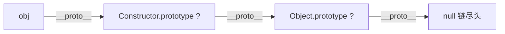

# 手写 instanceof

`a instanceof B` 做的事就一句话：**顺着 `a` 的原型链一层层往上爬，看路上能不能撞到 `B.prototype`**。它和 [`new`](./new.md) 是一体两面——`new` 建链，`instanceof` 查链。

```js
function myInstanceof(obj, Constructor) {
  // 第一步：基本类型 (null、数字、字符串等) 不在任何原型链上，直接返回 false
  const isObject = typeof obj === 'object' && obj !== null;
  const isFunction = typeof obj === 'function';
  if (!isObject && !isFunction) {
    return false;
  }

  // 第二步：拿到目标的「上一层」原型，作为爬链的起点
  let proto = Object.getPrototypeOf(obj);

  // 第三步：一层一层往上爬，直到爬到链尽头 (null) 为止
  while (proto !== null) {
    // 第四步：路上撞到了 Constructor.prototype，说明是它的实例
    if (proto === Constructor.prototype) {
      return true;
    }
    // 没撞到就继续往上爬
    proto = Object.getPrototypeOf(proto);
  }

  // 第五步：爬到尽头都没撞到，不是它的实例
  return false;
}
```

形象的例子：`instanceof` 就像 **查家谱认祖宗**。`obj` 是你，`Constructor.prototype` 是你想确认的某位祖先。你从父亲查起 (`getPrototypeOf`)，一代代往上翻族谱，只要族谱里出现了这位祖先就认 (`return true`)；一直翻到家谱开头的始祖 (`null`) 都没他，那就不是一家人 (`return false`)。



```js
console.log(myInstanceof([], Array)); // true，数组的链上有 Array.prototype
console.log(myInstanceof([], Object)); // true，再往上还有 Object.prototype
console.log(myInstanceof(1, Number)); // false，基本类型不在原型链上
```
