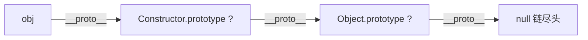

# 手写 instanceof

`a instanceof B` 的本质是：**沿着 `a` 的原型链往上找，看能不能找到 `B.prototype`**。它和 [`new`](./new.md) 是一体两面——`new` 建链，`instanceof` 查链。

```js
function myInstanceof(obj, Constructor) {
  // 基本类型不在任何原型链上
  if (obj === null || (typeof obj !== 'object' && typeof obj !== 'function')) {
    return false;
  }

  let proto = Object.getPrototypeOf(obj); // 拿到 obj 的原型
  while (proto) {
    if (proto === Constructor.prototype) return true; // 找到了
    proto = Object.getPrototypeOf(proto); // 顺着链继续往上
  }

  return false; // 找到链尽头 (null) 都没找到
}
```



## 一句话口诀

> **instanceof 是「查链」**——顺着原型链找目标的 `prototype`，找到尽头 `null` 都没有就 `false`。
