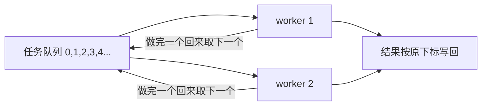

# 并发调度

并发调度器做的事一句话说清：**任意时刻最多 `limit` 个任务在跑，完成一个才补一个，全部跑完后结果按原顺序返回**。

为什么需要它？一批异步任务不能一股脑全发出去：批量上传会打满接口 QPS，并发爬虫会被封 IP，几百个请求同时挤还会拖垮浏览器。



形象例子：把整个机制想成**银行大厅排队取号办业务**。墙上一叠号票，号码就是任务下标 `0、1、2…`；大厅只开 `limit` 个**窗口**，每个窗口干的事一模一样——撕一张号、办完、回来再撕下一张、号撕光就关窗。没有经理派活，谁先办完手上的谁就先回来撕号，「空出来就补位」是自然发生的。`limit` 个窗口同时开工，所以任意时刻最多 `limit` 个任务在跑。

## 固定任务列表

任务开工前就定死在一个数组里，跑起来不再增减。单个任务失败不中断其余，结果按原顺序返回（对应 `Promise.allSettled` 语义）。

```js
async function asyncPool(tasks, limit) {
  // 第一步：准备好放结果的数组，和一个所有 worker 共用的「下一张号」计数器
  const results = new Array(tasks.length);
  let nextIndex = 0;

  // 第二步：定义单个 worker——不断撕号、办业务，直到号撕光
  async function worker() {
    while (nextIndex < tasks.length) {
      // nextIndex++ 是同步操作，撕号的瞬间就把号锁死，保证结果按原下标写回
      const current = nextIndex++;
      try {
        const value = await tasks[current]();
        results[current] = { status: 'fulfilled', value };
      } catch (reason) {
        // 失败也只记一笔，绝不中断其他窗口
        results[current] = { status: 'rejected', reason };
      }
    }
  }

  // 第三步：一次开 limit 个窗口（worker 数不超过任务总数），并行消费同一个队列
  const workerCount = Math.min(limit, tasks.length);
  const workers = Array.from({ length: workerCount }, () => worker());

  // 第四步：等所有窗口都关窗，结果数组就填满了
  await Promise.all(workers);
  return results;
}
```

:::info
关键在 `nextIndex++` 是同步操作：多个 worker 共享同一个计数器，谁先空闲谁取下一个，天然实现「完成即补位」，不需要手动管理任务池。每个任务用 `try/catch` 兜住，单个失败只记一笔 `rejected`，不会拖垮整批。
:::

验证：

```js
const sleep = (ms, val) =>
  new Promise((resolve) => setTimeout(() => resolve(val), ms));

const tasks = [
  () => sleep(1000, 'a'),
  () => sleep(500, 'b'),
  () => sleep(300, 'c'),
  () => sleep(400, 'd'),
];

asyncPool(tasks, 2).then(console.log);
// 任意时刻最多 2 个任务执行，按原顺序返回：
// [
//   { status: 'fulfilled', value: 'a' },
//   { status: 'fulfilled', value: 'b' },
//   { status: 'fulfilled', value: 'c' },
//   { status: 'fulfilled', value: 'd' },
// ]
// 若某个任务 reject，对应位置变成 { status: 'rejected', reason }，不影响其余
```

## 动态加任务

`asyncPool` 按 `nextIndex++` **下标**取任务，前提是 `tasks` 开工前就定死了，跑起来不能再加。

改成**看队列**——worker 每次从队头 `shift()` 一个，队列随时能 `push()` 新任务进去，就支持「边跑边加」。形象例子：还是那个银行大厅，只不过现在**号票筒可以随时往里塞新号**，窗口办完手上的回头一看筒里还有号就接着办，办到筒空了才关窗。

```js
class TaskPool {
  queue = []; // 待执行的 job（已包好各自的 resolve/reject）
  running = 0; // 当前开着的窗口数

  constructor(limit) {
    this.limit = limit; // 最多开几个窗口
  }

  // add：加一个任务，返回这个任务专属的 Promise——谁加谁 await 自己的结果
  add(task) {
    return new Promise((resolve, reject) => {
      // 第一步：把 task 连同它自己的 resolve/reject 包成一个 job 塞进号票筒
      const job = async () => {
        try {
          const value = await task();
          resolve(value); // 结果透传给上面返回的那个 Promise
        } catch (e) {
          reject(e); // 失败只通知「加这个任务的人」，不影响别人
        }
      };
      this.queue.push(job);

      // 第二步：塞完号就喊一声「有空窗口快来办」
      this.schedule();
    });
  }

  // schedule：只要还有空窗口、筒里还有号，就再开一个窗口去办
  schedule() {
    while (this.running < this.limit && this.queue.length > 0) {
      this.running++;
      this.worker();
    }
  }

  // worker：一个窗口的工作循环——不停从队头取号办，直到筒空才关窗
  async worker() {
    while (this.queue.length > 0) {
      const job = this.queue.shift();
      await job(); // job 内部已 try/catch，结果各自透传，绝不抛到这里
    }
    this.running--; // 筒空了，这个窗口关闭，腾出一个名额
  }
}
```

用起来，任何时刻都能继续加，哪怕前面的还没跑完。`add` 返回该任务专属的 Promise，谁加谁拿自己的结果：

```js
const pool = new TaskPool(2); // 最多 2 个并发

// 谁加的任务，谁拿自己的结果
pool.add(() => fetch('/a').then((r) => r.json())).then((data) => {
  console.log('a 完成', data);
});

pool.add(() => fetch('/b')); // 不关心结果也行，照常跑
pool.add(() => fetch('/c')); // 窗口满了，进筒里排队

// 也能直接 await 单个任务的结果
const d = await pool.add(() => fetch('/d').then((r) => r.json()));
console.log('d 完成', d);
```

想等「这一批」全部完成，就把这些 `add()` 的返回值收进数组一起 `Promise.all`：

```js
const results = await Promise.all([
  pool.add(() => fetch('/a').then((r) => r.json())),
  pool.add(() => fetch('/b').then((r) => r.json())),
  pool.add(() => fetch('/c').then((r) => r.json())),
]); // 仍然最多 2 个并发，但能一次拿齐三个结果
```

:::info
worker 见队列空就 `running--` 关窗；之后再 `add()`，`schedule()` 发现 `running < limit` 又会重新开窗。所以池子能「空了又满、满了又空」地长期运转，适合任务陆续到达的场景——流式上传、滚动加载、消息消费。
:::

:::tip
两种写法的并发模型完全一样，区别在两点：**取任务**——固定列表看**下标**、动态队列看**队头**；**拿结果**——固定版全部跑完一次性返回 `PromiseSettledResult[]`，动态版没有统一终点，靠每个 `add` 返回各自的 Promise。真实场景里大文件分片上传就是用它并发传几十个分片、限制同时上传数。
:::

## 一句话口诀

> **开 `limit` 个 worker 抢同一个任务队列，谁空谁取下一个，天然「完成即补位」。固定列表看下标、结果一次性返回；动态加任务看队头、每个 `add` 返回各自的 Promise。**
