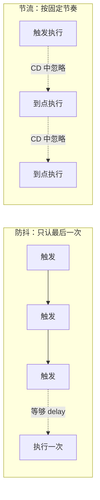

# 防抖节流

两者都是 **限制高频事件的执行次数** ，区别在「怎么限」：

- **防抖 (debounce)** ：事件触发后等一段时间再执行，期间只要再次触发就 **重新计时** 。只认「最后一次」。
- **节流 (throttle)** ：固定时间间隔内 **最多执行一次** ，不管触发多频繁。按「固定节奏」执行。

记忆类比：

- **防抖像电梯关门** ——电梯门要关，突然又有人进来，于是重新等几秒；只要不断有人进，门就一直不关，直到「安静」够久才真正关门出发。
- **节流像游戏技能冷却** ——一个技能放完进入 5 秒 CD，这 5 秒里你狂点鼠标也没用，只有冷却结束那一下点击才生效，节奏固定。



## 防抖

核心是一个 `timer` ：每次触发都先清掉上一个定时器，重新计时，只有「安静」够久才真正执行。

```js
function debounce(fn, delay) {
  // 第一步：用闭包存一个定时器句柄，跨多次触发共享
  let timer = null;

  // 第二步：返回一个新函数，真正绑到事件上的是它
  return function (...args) {
    // 第三步：又有人触发了 -> 取消上一次还在等待的定时器（电梯门又有人进来，重新等）
    if (timer) {
      clearTimeout(timer);
    }

    // 第四步：重新开始计时，delay 内没人再触发才执行
    timer = setTimeout(() => {
      fn.apply(this, args);
    }, delay);
  };
}
```

适用场景： **搜索框输入联想** （停止输入才发请求）、`resize` / `input` 事件。

## 节流

核心是记一个「上次执行时间」，没到间隔（冷却没结束）就直接跳过。

```js
function throttle(fn, interval) {
  // 第一步：用闭包记住「上一次执行的时间戳」，初始为 0 保证首次必定执行
  let last = 0;

  // 第二步：返回真正绑到事件上的新函数
  return function (...args) {
    // 第三步：取当前时间，和上次执行时间比一比
    const now = Date.now();

    // 第四步：距上次执行已超过 interval（技能 CD 转好了），才执行并刷新时间戳
    if (now - last >= interval) {
      last = now;
      fn.apply(this, args);
    }
    // 否则什么都不做，CD 期间的触发全部丢弃
  };
}
```

适用场景： **滚动加载** 、拖拽、鼠标移动等持续触发、但要稳定响应的事件。

:::tip
节流还有「定时器版」（用 `setTimeout` ，在间隔结束时执行最后一次）。时间戳版「先执行、间隔末尾不补」，定时器版「延迟执行、能补最后一次」。面试讲清两者差异即可，时间戳版更简单好记。
:::

## Hook 写法

在 React 里直接用上面的闭包版会有两个坑：每次渲染都会 **重新生成** 一个新的防抖函数，导致 `timer` 丢失、防抖失效；闭包还会 **捕获到旧的 props / state** 。所以要用 `useRef` 把定时器和最新的 `fn` 存住，用 `useCallback` 把返回的函数固定下来。

```js
import { useRef, useEffect, useCallback } from 'react';

// 防抖一个函数（用于事件回调，如 onChange、onScroll）
function useDebounceFn(fn, delay) {
  // 第一步：把最新的 fn 存进 ref，每次渲染同步，避免闭包拿到旧的 state
  const fnRef = useRef(fn);
  fnRef.current = fn;

  // 第二步：定时器句柄也放 ref，跨渲染保持同一个，不会被重新创建
  const timerRef = useRef(null);

  // 第三步：组件卸载时清掉残留定时器，防止在已卸载组件上执行
  useEffect(() => {
    return () => clearTimeout(timerRef.current);
  }, []);

  // 第四步：返回一个跨渲染稳定的防抖函数，逻辑和闭包版完全一样
  return useCallback(
    (...args) => {
      if (timerRef.current) {
        clearTimeout(timerRef.current);
      }
      timerRef.current = setTimeout(() => fnRef.current(...args), delay);
    },
    [delay], // 只要 delay 不变，返回的函数引用就稳定
  );
}
```

```js
// 节流一个函数（用于滚动、拖拽等持续触发的回调）
function useThrottleFn(fn, interval) {
  // 第一步：同样用 ref 存最新 fn，规避闭包陈旧问题
  const fnRef = useRef(fn);
  fnRef.current = fn;

  // 第二步：用 ref 记住上次执行时间，跨渲染保持
  const lastRef = useRef(0);

  // 第三步：返回稳定的节流函数
  return useCallback(
    (...args) => {
      const now = Date.now();
      if (now - lastRef.current >= interval) {
        lastRef.current = now;
        fnRef.current(...args);
      }
    },
    [interval],
  );
}
```

用法和普通函数一样，但拿到的是一个 **跨渲染稳定** 的回调：

```jsx
function SearchBox() {
  const onSearch = useDebounceFn((keyword) => {
    fetch(`/api/search?q=${keyword}`);
  }, 300);

  return <input onChange={(e) => onSearch(e.target.value)} />;
}
```

:::tip
如果要防抖的是一个 **值** （而不是回调），可以写一个 `useDebounce(value, delay)` ：把值放进 `useState` ，在 `useEffect` 里用清理函数清掉上一轮定时器，连续 `delay` 不变才更新。原理同上。
:::

## 一句话口诀

> **防抖像电梯关门——不断有人进就一直重新等；节流像技能冷却——CD 期间狂点也没用，到点才放一次。**

- 要「等用户停下来」-> 防抖（搜索联想）。
- 要「持续但别太频繁」-> 节流（滚动、拖拽）。
