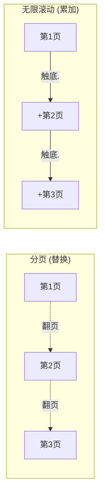

# 分页与无限滚动

分页和无限滚动底层是**同一件事**——后端数据太多，分批取。区别只在前端**怎么呈现**：

- **分页**：一次只显示一页，翻页是**替换**（第 2 页盖掉第 1 页）
- **无限滚动**：把页**累加**，一直往下接（第 2 页拼在第 1 页后面）



抓住「替换 vs 累加」这个区别，两者的实现就清晰了。

## 分页

最朴素的做法：把**页码**当作数据的标识，页码变了就是一份新数据，各页各自缓存、各自请求。

```ts
type FetchPage<T> = (page: number) => Promise<T>;

function usePaginatedList<T>(page: number, fetchPage: FetchPage<T>) {
  const [data, setData] = useState<T>();
  const [loading, setLoading] = useState(false);
  const lastData = useRef<T>(); // 记住上一页，翻页时当占位

  useEffect(() => {
    let active = true;
    setLoading(true);
    fetchPage(page).then((res) => {
      if (!active) return;
      setData(res);
      lastData.current = res;
      setLoading(false);
    });

    return () => {
      active = false; // 翻页过快时，丢弃旧请求结果，避免竞态
    };
  }, [page]);

  return {
    // 关键：新页还没回来时，先显示上一页，避免翻页闪白
    data: loading ? lastData.current : data,
    loading,
  };
}
```

### 核心痛点：翻页闪白

`page` 一变，新页还没请求回来，列表会先被清空、闪一下 loading，再填上新数据——体验割裂。

解法就是上面的 `lastData`：**新页加载期间继续展示旧页**，数据回来再无缝替换。这正是 TanStack Query 里 `placeholderData: keepPreviousData` 做的事。

:::tip
分页用**页码**（`?page=2`）最自然，因为用户需要「跳到第 5 页」这种能力，页码是天然的索引。
:::

## 无限滚动

无限滚动不能再「各页各存」了——要把**所有已加载的页累积进一个数组**，同时记住「下一页从哪取」。

```ts
interface PageResult<T> {
  list: T[];
  nextCursor: string | null; // 没有下一页时为 null
}

type FetchPage<T> = (cursor: string | null) => Promise<PageResult<T>>;

function useInfiniteList<T>(fetchPage: FetchPage<T>) {
  const [items, setItems] = useState<T[]>([]); // 累积的所有数据
  const [cursor, setCursor] = useState<string | null>(null); // 下一页游标，null = 从头取
  const [hasMore, setHasMore] = useState(true);
  const [loading, setLoading] = useState(false);

  const loadMore = async () => {
    if (loading || !hasMore) return; // 防重复触发 + 到底就停

    setLoading(true);
    const res = await fetchPage(cursor); // 用游标取下一页
    setItems((prev) => [...prev, ...res.list]); // 累加，不是替换
    setCursor(res.nextCursor);
    setHasMore(Boolean(res.nextCursor)); // 没有下一页游标 = 到底了
    setLoading(false);
  };

  return { items, loadMore, hasMore, loading };
}
```

### 怎么触发加载下一页

在列表底部放一个「哨兵」空元素，用 `IntersectionObserver` 监听它是否进入视口——进了就说明用户滚到底了，加载下一页。

```ts
function useLoadMoreOnView(loadMore: () => void) {
  const ref = useRef<HTMLDivElement>(null);

  useEffect(() => {
    const el = ref.current;
    if (!el) return;

    const io = new IntersectionObserver((entries: IntersectionObserverEntry[]) => {
      const [entry] = entries;
      if (entry.isIntersecting) loadMore(); // 哨兵露头 → 加载下一页
    });
    io.observe(el);

    return () => io.disconnect();
  }, [loadMore]);

  return ref; // 挂到列表底部的哨兵元素：<div ref={ref} />
}
```

:::info
为什么用 `IntersectionObserver` 而不是监听 `scroll` 事件算位置？`scroll` 高频触发、要手动算 `scrollTop + clientHeight >= scrollHeight` 还得配合节流，又啰嗦又容易抖。`IntersectionObserver` 由浏览器判断「元素是否可见」，天生异步、不阻塞主线程，是这个场景的标准答案。
:::

这套对应 TanStack Query 的 `useInfiniteQuery`：`data.pages` 是页数组，`getNextPageParam` 算下一页参数，`fetchNextPage` 取下一页，`hasNextPage` 判断到底没。

## 一个必踩的坑：游标 vs 页码

取「下一批」有两种定位方式，选错了无限滚动会出 bug：

| | 页码分页 `?page=2` | 游标分页 `?cursor=xxx` |
|---|---|---|
| 原理 | 跳过前 N 条（`OFFSET`） | 「从这条记录之后再来 N 条」 |
| 适合 | 传统分页（要跳页） | 无限滚动 |
| 数据变动时 | **会重复/漏数据** | 稳，游标锚定在具体记录上 |

关键差异在**数据实时变动**时：如果你在看第 1 页时，列表头部新插了一条，页码方案下「第 2 页 = 跳过前 20 条」会整体后移一位，导致第 2 页第一条**正是你在第 1 页已经看过的那条**——无限滚动里就是「划着划着出现重复项」。

游标方案锚定在「上一页最后一条记录」这个具体位置上，不受前面增删影响，所以**无限滚动优先用游标**。

## 一句话口诀

> **分页 = 替换**：页码当 key，各页各缓存；用「保留上一页」消除翻页闪白。
> **无限滚动 = 累加**：所有页拼进一个数组，游标记住下一页位置，`IntersectionObserver` 监听底部哨兵触发加载。
> **实时变动的列表用游标，别用页码**，否则会重复或漏数据。
