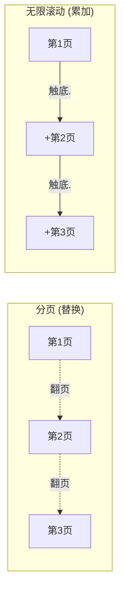

# 分页与无限滚动

分页和无限滚动底层是**同一件事**——后端数据太多，分批取。区别只在前端**怎么呈现**：

- **分页**：一次只显示一页，翻页是**替换**（第 2 页盖掉第 1 页）
- **无限滚动**：把页**累加**，一直往下接（第 2 页拼在第 1 页后面）



形象例子：分页像**翻一本相册**，翻到下一页，上一页就看不见了；无限滚动像**刷朋友圈**，越往下刷内容越长，前面刷过的还在上头接着。抓住「替换 vs 累加」这个区别，两者的实现就清晰了。

## 分页

最朴素的做法：把**页码**当作数据的标识，页码变了就是一份新数据，各页各自请求。核心难点是消除「翻页闪白」——后面会专门讲。

```js
function usePaginatedList(page, fetchPage) {
  // 第一步：准备状态——当前页数据、是否加载中、以及「上一页」的备份
  const [data, setData] = useState();
  const [loading, setLoading] = useState(false);
  const lastData = useRef(); // 记住上一页，翻页时拿来当占位

  useEffect(() => {
    // 第二步：page 一变就发请求；同时用 active 标记防止竞态
    let active = true;
    setLoading(true);

    fetchPage(page).then((res) => {
      // 第三步：请求回来时，如果这次 effect 已被新翻页顶替，就丢弃结果
      if (!active) return;
      setData(res);
      lastData.current = res; // 成功的这一页存为「上一页」备份
      setLoading(false);
    });

    // 第四步：翻页过快时，清理函数把旧请求标记为作废，避免旧数据盖掉新数据
    return () => {
      active = false;
    };
  }, [page]);

  return {
    // 关键：新页还没回来时，先显示上一页，避免翻页闪白
    data: loading ? lastData.current : data,
    loading,
  };
}
```

### 核心痛点：翻页闪白

`page` 一变，新页还没请求回来，列表会先被清空、闪一下 loading，再填上新数据——体验割裂，像翻相册时中间夹了一张白纸。

解法就是上面的 `lastData`：**新页加载期间继续展示旧页**，数据回来再无缝替换。这正是 TanStack Query 里 `placeholderData: keepPreviousData` 做的事。

:::tip
分页用**页码**（`?page=2`）最自然，因为用户需要「跳到第 5 页」这种能力，页码是天然的索引。
:::

## 无限滚动

无限滚动不能再「各页各存」了——要把**所有已加载的页累积进一个数组**，同时记住「下一页从哪取」。

```js
function useInfiniteList(fetchPage) {
  // 第一步：准备状态——累积的全部数据、下一页游标、是否还有更多、是否加载中
  const [items, setItems] = useState([]); // 累积的所有数据
  const [cursor, setCursor] = useState(null); // 下一页游标，null = 从头取
  const [hasMore, setHasMore] = useState(true);
  const [loading, setLoading] = useState(false);

  const loadMore = async () => {
    // 第二步：进门先拦截——正在加载、或已经到底，直接返回，避免重复请求
    if (loading || !hasMore) return;

    // 第三步：用当前游标取下一页
    setLoading(true);
    const res = await fetchPage(cursor);

    // 第四步：把新一页「拼」到已有数据后面，而不是替换
    setItems((prev) => [...prev, ...res.list]);
    setCursor(res.nextCursor);
    setHasMore(Boolean(res.nextCursor)); // 没有下一页游标 = 到底了
    setLoading(false);
  };

  return { items, loadMore, hasMore, loading };
}
```

### 怎么触发加载下一页

在列表底部放一个「哨兵」空元素，用 `IntersectionObserver` 监听它是否进入视口——进了就说明用户滚到底了，加载下一页。形象例子：哨兵就像电梯门口的**红外感应灯**，人一靠近（哨兵进视口）灯就亮（触发加载），不用一直盯着人走到哪了。

```js
function useLoadMoreOnView(loadMore) {
  const ref = useRef(null);

  useEffect(() => {
    // 第一步：拿到底部哨兵元素，没挂上就不做事
    const el = ref.current;
    if (!el) return;

    // 第二步：创建观察者，哨兵一露头就调 loadMore
    const io = new IntersectionObserver((entries) => {
      const [entry] = entries;
      if (entry.isIntersecting) loadMore(); // 哨兵进视口 → 加载下一页
    });

    // 第三步：开始观察这个哨兵
    io.observe(el);

    // 第四步：组件卸载时断开观察，防止内存泄漏
    return () => io.disconnect();
  }, [loadMore]);

  return ref; // 挂到列表底部的哨兵元素：<div ref={ref} />
}
```

:::info
为什么用 `IntersectionObserver` 而不是监听 `scroll` 事件算位置？`scroll` 高频触发、要手动算 `scrollTop + clientHeight >= scrollHeight` 还得配合节流，又啰嗦又容易抖。`IntersectionObserver` 由浏览器判断「元素是否可见」，天生异步、不阻塞主线程，是这个场景的标准答案。
:::

这套对应 TanStack Query 的 `useInfiniteQuery`：`data.pages` 是页数组，`getNextPageParam` 算下一页参数，`fetchNextPage` 取下一页，`hasNextPage` 判断到底没。

## 一个必踩的坑：游标 vs 页码

取「下一批」有两种定位方式，选错了无限滚动会出 bug：

| | 页码分页 `?page=2` | 游标分页 `?cursor=xxx` |
|---|---|---|
| 原理 | 跳过前 N 条（`OFFSET`） | 「从这条记录之后再来 N 条」 |
| 适合 | 传统分页（要跳页） | 无限滚动 |
| 数据变动时 | **会重复/漏数据** | 稳，游标锚定在具体记录上 |

关键差异在**数据实时变动**时：如果你在看第 1 页时，列表头部新插了一条，页码方案下「第 2 页 = 跳过前 20 条」会整体后移一位，导致第 2 页第一条**正是你在第 1 页已经看过的那条**——无限滚动里就是「划着划着出现重复项」。

形象例子：页码像**按座位号点名**（第 21 到 40 号），中途插进来一个人，所有人座位号后移，再点「21 号」点到的是刚才已经点过的人；游标像**记住「上次念到张三为止」**，下次从张三的下一个继续念，中间插队的人不影响。所以**无限滚动优先用游标**。

## 一句话口诀

> **分页 = 替换**：页码当 key，用「保留上一页」消除翻页闪白。**无限滚动 = 累加**：所有页拼进一个数组，游标记住下一页位置，`IntersectionObserver` 监听底部哨兵触发加载。**实时变动的列表用游标，别用页码**，否则会重复或漏数据。
