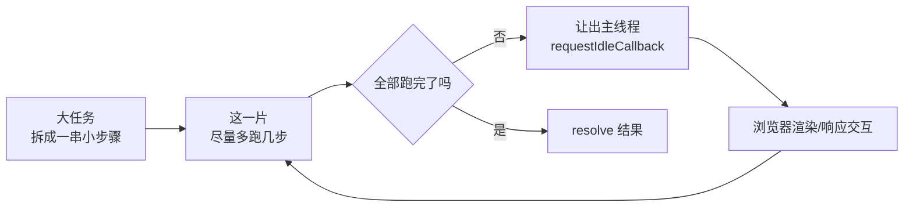

# 时间分片

一个大计算同步跑会**独占主线程**——浏览器的渲染、点击、滚动全部被卡住，直到算完。计算 1 到 1 亿的总和，同步循环要几百毫秒甚至几秒，这期间页面完全冻结。

时间分片（time slicing）的思路：**把大任务切成一片片小任务，每片只占用一小段时间（如 15ms），片与片之间把主线程让出去**，浏览器趁机渲染、响应交互，空闲了再继续下一片。



形象例子：像**一个人搬一卡车砖**。一口气搬完会累趴下，期间别人插不上手；改成搬 15 秒就歇一下，让别人（浏览器）也能用这条过道（主线程）走两趟，歇够了再接着搬，搬到砖光为止。活照样干完，过道却始终没被堵死。

## 题目

写一个**通用**的时间分片函数 `timeSlice`，要求：

- 不绑定任何具体业务——求和、渲染大列表、批量处理数据都能用它
- 把活拆成一串小步骤，每片只占一小段时间，片间让出主线程
- 返回 Promise，全部跑完后 `resolve` 最终结果

关键设计：**用生成器 (generator) 把任务和调度解耦**。生成器负责「把活拆成可暂停的步骤」——每 `yield` 一次就是一个**可中断点**；`timeSlice` 只负责「这一片到底跑多少步」，不关心具体在算什么。

## 实现

```js
// 通用时间分片调度器：把一个「可暂停的生成器」分片跑完
function timeSlice(gen) {
  return new Promise((resolve) => {
    // 第一步：定义「跑一片」——deadline 是浏览器给的本次空闲额度
    function chunk(deadline) {
      // 第二步：先推进一步，拿到 { value, done }
      let result = gen.next();

      // 第三步：只要这一片还有空闲时间、生成器还没结束，就继续推进
      while (!result.done && deadline.timeRemaining() > 0) {
        result = gen.next();
      }

      // 第四步：跑完了就交出生成器 return 的值；没跑完就让出主线程，下一片再续
      if (result.done) {
        resolve(result.value);
      } else {
        requestIdleCallback(chunk);
      }
    }

    // 第五步：启动第一片（用 requestIdleCallback 才能拿到 deadline）
    requestIdleCallback(chunk);
  });
}
```

调度器写好后，**任何任务只要能写成生成器就能分片跑**。`yield` 放在哪，哪里就是可以暂停的安全点。

求和——每加一次设一个中断点：

```js
function* sumTo(n) {
  let sum = 0;
  for (let i = 1; i <= n; i++) {
    sum += i;
    yield; // 一个可中断点：算到这若时间用完了，就停在这下一片再继续
  }
  return sum; // 算完把结果交出去 → 成为 timeSlice 的 resolve 值
}

timeSlice(sumTo(100_000_000)).then(console.log); // 5000000050000000
```

渲染一万条评论——每插一行设一个中断点，列表「长出来」而不是卡死：

```js
function* renderList(items, container) {
  for (const item of items) {
    container.appendChild(createRow(item));
    yield; // 每插一行就可以让浏览器喘口气去绘制
  }
}

timeSlice(renderList(tenThousandComments, listEl));
```

## 为什么这么写

| 设计点 | 做法 | 好处 |
| --- | --- | --- |
| 任务与调度解耦 | 业务写成生成器，`yield` 标可中断点 | 同一个 `timeSlice` 复用到任何任务 |
| 控制每片时长 | `deadline.timeRemaining() > 0` 当循环条件 | 跟随浏览器实际空闲，忙时少跑、闲时多跑 |
| 让出主线程 | 没跑完时 `requestIdleCallback(chunk)` | 下一片排到浏览器**空闲时段**，不抢渲染 |
| 返回结果 | 生成器 `return value`，`timeSlice` 把它 `resolve` | 外部 `.then()` 拿最终结果 |

形象例子接着上面的搬砖：生成器是**把整车砖码成一块块、随时能放下手的状态**；`deadline.timeRemaining()` 是**工头报的「这条过道还能借你用 X 毫秒」**，过道忙就让你少搬两块、闲就让你多搬几块，搬到一半随时能撂下，下次从那块接着搬。

:::info
**用 `timeRemaining()` 还是固定 15ms？** `deadline.timeRemaining()` 返回本次空闲期还剩多少毫秒，跟随浏览器实际繁忙度动态调整，吞吐更高。如果拿不到 `deadline`（比如下面降级到 `setTimeout` 的情况），就退回**固定预算**：片头记 `const start = performance.now()`，循环条件改成 `performance.now() - start < 15`。

15ms 这个数：屏幕通常 60fps，一帧约 `16.7ms`，一帧内浏览器还要算样式、布局、绘制，留给 JS 的预算就是十几毫秒。控制在 15ms 内才能见缝插针、不掉帧。计时务必用 `performance.now()`（单调递增高精度时钟），不要用 `Date.now()`（精度低、可能因校时回拨）。
:::

## 两个工程增强

### 1. timeout 兜底，防止饿死

`requestIdleCallback` 只在浏览器**空闲**时触发。如果页面持续繁忙（频繁动画、大量交互），它可能迟迟不被调用，计算被无限拖延。加 `timeout` 选项，保证最长等待后强制执行：

```js
requestIdleCallback(chunk, { timeout: 100 }); // 最多等 100ms 必定执行
```

### 2. 降级：requestIdleCallback 兼容性不全

Safari 长期不支持 `requestIdleCallback`。封装一个调度器，缺失时降级到 `setTimeout`：

```js
// 第一步：判断浏览器支不支持 requestIdleCallback
const schedule =
  typeof requestIdleCallback !== 'undefined'
    ? // 第二步：支持就直接用，它天然会把真实的 deadline 传给 chunk
      requestIdleCallback
    : // 第三步：不支持（如老 Safari）就用 setTimeout 兜底，
      // 自己伪造一个 deadline：给每片固定 15ms 预算
      (cb) =>
        setTimeout(() => {
          const start = performance.now();
          cb({ timeRemaining: () => 15 - (performance.now() - start) });
        }, 0);

// 之后把 timeSlice 里的 requestIdleCallback(chunk) 换成 schedule(chunk)，
// chunk 照样能读 deadline.timeRemaining()，两条路径写法统一
```

:::tip
追求更快让出、更可控的调度，可以用 `MessageChannel`——它的回调是宏任务，但比 `setTimeout(cb, 0)` 少了最低 4ms 的钳制延迟，让出更「轻快」。React 调度器内部正是用 `MessageChannel` 而非 `setTimeout` 来切片的。
:::

## 延伸：这就是 React 并发渲染的内核

React 16 起的 **Fiber 架构**就是一套时间分片：把组件树的协调（reconcile）拆成一个个 Fiber 工作单元，每做一小片就检查「这一帧的时间预算用完了没」，用完就让出主线程渲染、响应输入，下一帧再从断点继续。`useTransition`、`useDeferredValue` 这些并发特性，底层都依赖这套「可中断、可恢复的分片调度」。理解了这道题，就理解了 React 为什么能在大规模更新时仍保持界面流畅。

:::info
上面的生成器版本，`yield` 就是「可中断、可恢复」最直观的体现——暂停在哪、下次从哪继续，语言帮你记着。React 团队早期也考虑过用 generator 实现 Fiber，但最终选择**手写 fiber 链表**：因为 generator 只能从顶部恢复、难以做优先级插队和复用，手写链表能精确控制从任意节点恢复。思路同源，工业实现因性能诉求而不同。
:::

:::info
**时间分片 vs Web Worker**：两者都能避免卡顿，但思路相反。时间分片是在**主线程**上「挤时间」，适合必须访问 DOM、或拆分成本低的计算；Web Worker 是把计算**整个挪到另一条线程**，主线程完全不参与，适合纯计算密集型任务（如图像处理、加解密），代价是 Worker 不能直接操作 DOM、且有数据通信开销。
:::
