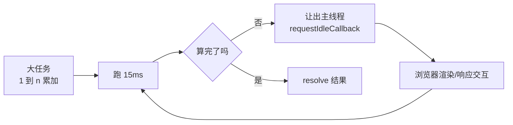

# 时间分片

一个大计算同步跑会**独占主线程**——浏览器的渲染、点击、滚动全部被卡住,直到算完。计算 1 到 1 亿的总和,同步循环要几百毫秒甚至几秒,这期间页面完全冻结。时间分片(time slicing)的思路:**把大任务切成一片片小任务,每片只占用一小段时间(如 15ms),片与片之间把主线程让出去**,浏览器趁机渲染、响应交互,空闲了再继续下一片。



## 题目

写一个函数返回 Promise,计算从 1 到 `n` 的总和,要求:

- **不能用求和公式** `n * (n + 1) / 2`,必须循环累加
- 每段计算控制在 **15ms** 以内
- 超过 15ms 就让出主线程,等浏览器空闲再继续

## 实现

```js
function sumToN(n) {
  return new Promise((resolve) => {
    let sum = 0;
    let i = 1;

    function chunk() {
      const start = performance.now();
      // 在 15ms 的时间片内尽量多算，一旦超时立刻跳出
      while (i <= n && performance.now() - start < 15) {
        sum += i;
        i++;
      }

      if (i > n) {
        resolve(sum); // 全部算完
      } else {
        // 这一片到点了还没算完 → 等浏览器空闲再继续下一片
        requestIdleCallback(chunk);
      }
    }

    chunk();
  });
}

sumToN(100_000_000).then(console.log); // 5000000050000000
```

## 为什么这么写

| 要求 | 做法 |
| --- | --- |
| 不用公式 | `sum += i` 循环累加 |
| 每片 ≤ 15ms | 片头记 `start = performance.now()`,`while` 条件里实时比对,超时即跳出 |
| 让出主线程 | 没算完时 `requestIdleCallback(chunk)`,下一片排到浏览器**空闲时段** |
| 返回 Promise | 算完 `resolve(sum)`,外部 `.then()` 拿结果 |

:::info
**为什么是 15ms?** 屏幕通常 60fps,一帧约 `16.7ms`。一帧之内浏览器要跑 JS、计算样式、布局、绘制,留给 JS 的预算大约就是十几毫秒。把单片控制在 15ms 以内,就能在每帧的空隙里见缝插针地算,既不掉帧又持续推进,用户感觉不到卡顿。
:::

:::warning
计时用 `performance.now()` 而不是 `Date.now()`:前者是**单调递增的高精度时钟**(亚毫秒,不受系统时间调整影响),专门用于测量时间间隔;后者精度低且可能因校时回拨。
:::

## 用 deadline.timeRemaining() 控时

`requestIdleCallback` 的回调自带一个 `deadline` 参数,`deadline.timeRemaining()` 返回**本次空闲期还剩多少毫秒**。直接拿它当循环条件,就不用自己记 `start` 了,而且更贴合"浏览器到底有多少空闲"的真实情况:

```js
function sumToN(n) {
  return new Promise((resolve) => {
    let sum = 0;
    let i = 1;

    function chunk(deadline) {
      // 只要这一帧还有空闲时间就继续算
      while (i <= n && deadline.timeRemaining() > 0) {
        sum += i;
        i++;
      }

      if (i > n) {
        resolve(sum);
      } else {
        requestIdleCallback(chunk);
      }
    }

    requestIdleCallback(chunk);
  });
}
```

两种控时各有取舍:固定 15ms **切片大小稳定、可预期**;`timeRemaining()` **跟随浏览器实际空闲动态调整**,忙时切得小、闲时切得大,吞吐更高。

## 两个工程增强

### 1. timeout 兜底,防止饿死

`requestIdleCallback` 只在浏览器**空闲**时触发。如果页面持续繁忙(频繁动画、大量交互),它可能迟迟不被调用,计算被无限拖延。加 `timeout` 选项,保证最长等待后强制执行:

```js
requestIdleCallback(chunk, { timeout: 100 }); // 最多等 100ms 必定执行
```

### 2. 降级:requestIdleCallback 兼容性不全

Safari 长期不支持 `requestIdleCallback`。封装一个调度器,缺失时降级到 `setTimeout`:

```js
const schedule =
  typeof requestIdleCallback !== 'undefined'
    ? (cb) => {
        requestIdleCallback(() => cb());
      }
    : (cb) => {
        setTimeout(cb, 0);
      };

// 用 schedule(chunk) 代替 requestIdleCallback(chunk)
```

:::tip
追求更快让出、更可控的调度,可以用 `MessageChannel`——它的回调是宏任务,但比 `setTimeout(cb, 0)` 少了最低 4ms 的钳制延迟,让出更"轻快"。React 调度器内部正是用 `MessageChannel` 而非 `setTimeout` 来切片的。
:::

## 延伸:这就是 React 并发渲染的内核

React 16 起的 **Fiber 架构**就是一套时间分片:把组件树的协调(reconcile)拆成一个个 Fiber 工作单元,每做一小片就检查"这一帧的时间预算用完了没",用完就让出主线程渲染、响应输入,下一帧再从断点继续。`useTransition`、`useDeferredValue` 这些并发特性,底层都依赖这套"可中断、可恢复的分片调度"。理解了这道题,就理解了 React 为什么能在大规模更新时仍保持界面流畅。

:::info
**时间分片 vs Web Worker**:两者都能避免卡顿,但思路相反。时间分片是在**主线程**上"挤时间",适合必须访问 DOM、或拆分成本低的计算;Web Worker 是把计算**整个挪到另一条线程**,主线程完全不参与,适合纯计算密集型任务(如图像处理、加解密),代价是 Worker 不能直接操作 DOM、且有数据通信开销。
:::
