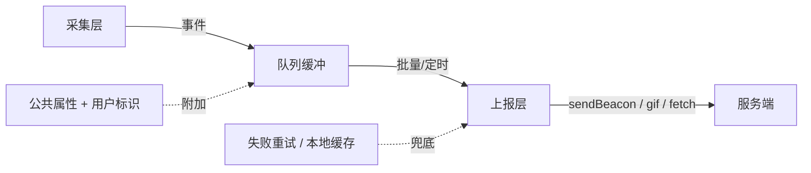
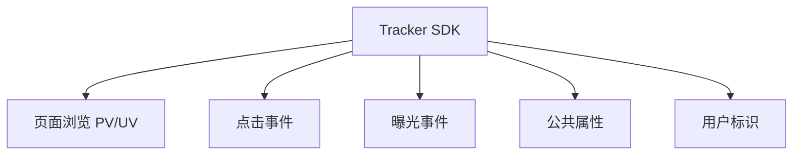
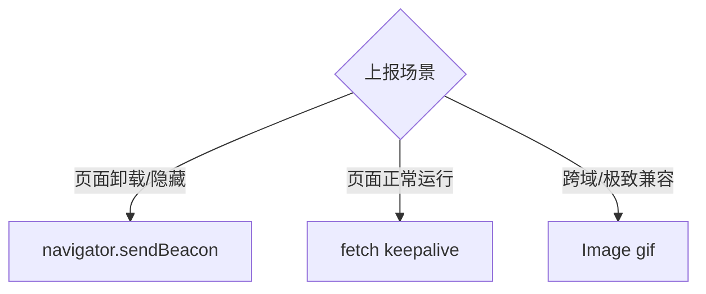
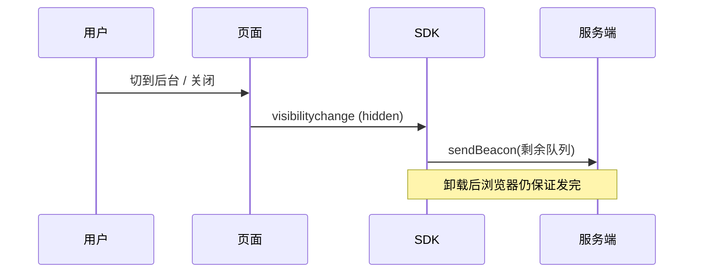

# 埋点 SDK 设计

埋点 SDK 干一件事：**把用户行为采集下来，可靠地送到服务端，且不能拖垮业务**。拆开看是三层职责——采集（什么时候记一条事件）、上报（怎么把事件送出去）、保活（页面关了也不丢数据）。整套设计都围绕「**对业务零侵入、对性能零负担、对数据零丢失**」这三个目标展开。



## 三种埋点方式

先确定「事件从哪来」。业界三种采集方式，各有取舍：

| 方式 | 做法 | 优点 | 缺点 |
|------|------|------|------|
| 代码埋点（手动） | 在业务代码里手动调 `track('click', {...})` | 精准、可带任意业务参数 | 侵入业务、改一次发一次版、维护成本高 |
| 可视化埋点 | 后台圈选页面元素，配置规则下发，SDK 按规则匹配 | 不改代码、产品经理可自助配 | 只能采标准事件、复杂参数采不到、依赖元素结构稳定 |
| 无埋点（全埋点） | 全局监听所有点击/曝光，先全采回来，用时再筛 | 不会漏采、上线即有数据 | 数据量大、噪声多、难带业务语义 |

:::tip
真实项目通常**三者混用**：PV/UV、通用点击用全埋点兜底保证「不漏」，关键转化路径（下单、支付）用代码埋点保证「精准带参」，运营活动用可视化埋点保证「快速迭代不发版」。
:::

:::info
全埋点的「全」是指**采集时机自动化**，不是真的把页面上每个像素都传回去。实现上通常在 `document` 上做事件委托，监听冒泡到顶层的 `click`，再通过元素的 `data-*` 属性或 DOM 路径反推这是哪个按钮。
:::

## 核心能力

SDK 对外暴露的能力可以归成四类：



- **事件采集**：点击 (`click`)、曝光 (`expose`)、页面浏览 (`pv`)。PV 是页面被打开的次数，UV 是独立访客数——前端只负责上报「谁在什么时候打开了哪个页面」，UV 由服务端按 `用户标识` 去重统计。
- **公共属性**：每条事件都要带的上下文（设备、OS、屏幕、SDK 版本、页面 URL），抽出来统一附加，避免每次手动传。
- **用户标识**：匿名用户用 `localStorage` 里的设备 ID (`device_id`) 标识；登录后补上业务 `user_id`。两者结合才能在登录前后串起同一个人的行为链路。

## 数据上报策略

### 何时上报

| 策略 | 触发时机 | 适用 |
|------|----------|------|
| 实时上报 | 每产生一条立即发 | 支付成功等关键事件，不能丢、不能晚 |
| 批量上报 | 攒够 N 条再一次性发 | 高频的曝光、点击，省请求 |
| 定时上报 | 每隔 T 秒发一次 | 兜底，防止量少时一直攒着不发 |

实践上是**批量 + 定时**组合：队列攒到阈值就发，或者超时就发，二者谁先到走谁。关键事件走实时通道单独发。

### 用什么发



- **`navigator.sendBeacon`**：浏览器保证在页面卸载后**异步把数据发完**，不阻塞页面跳转，是页面卸载场景的首选。缺点是只能 `POST`、数据量有上限（约 64KB）、拿不到响应。
- **`Image`（gif）**：最古老最兼容的方案，`new Image().src = url` 即发，天然跨域、不受同源限制。缺点是只能 `GET`、URL 长度有限（约 2KB）、只能传简单参数。
- **`fetch`**：能力最全（可 `POST`、可读响应、可带大数据），配合 `keepalive: true` 也能在卸载时坚持发完。缺点是老浏览器 `keepalive` 支持有限。

:::tip
选型口诀：**正常运行期用 `fetch`，页面要走人时用 `sendBeacon`，需要极致兼容或纯 `GET` 打点时用 `gif`**。SDK 内部封装一个 `report` 方法自动按场景降级即可。
:::

### 页面卸载时不丢数据

页面关闭、切后台、跳转的瞬间，队列里往往还攒着没发的事件。`unload` 事件不可靠（移动端常常不触发），正确做法是监听 `visibilitychange`，在页面变为 `hidden` 时用 `sendBeacon` 把队列**最后冲刷一次**。



形象例子：把队列里没发的事件想成**结账前购物车里的东西**。用户随时可能关页面走人，就像随时可能放下购物车离店；`visibilitychange` 的 `hidden` 是「人要往门口走了」这个最可靠的信号，趁这一刻用 `sendBeacon` 把车里的东西一次性结掉。

```js
document.addEventListener('visibilitychange', () => {
  // 第一步：只在页面变为 hidden（要走了）这一刻动作
  // hidden 比 unload 可靠：移动端切后台、锁屏都会触发，且只有它能配合 sendBeacon
  if (document.visibilityState === 'hidden') {
    // 第二步：强制用 sendBeacon 把队列最后冲刷一次，传 true 表示同步冲刷
    tracker.flush(true);
  }
});
```

:::warning
不要依赖 `beforeunload` / `unload`。iOS Safari 在切后台、用户从多任务里划掉页面时根本不触发它们，数据就此丢失。`visibilitychange` 的 `hidden` 是目前唯一可靠的「页面要走了」信号。
:::

## 上报优化

### 批量队列 + 节流

事件先进内存队列，达到容量阈值或定时器到点才统一上报。这样把 N 次请求压成 1 次。形象例子：像**小区快递柜的快递车**——不是来一个包裹就跑一趟，而是攒够一车（`maxSize`）就发车，或者就算没装满，到点了（`interval`）也照样发，免得零星包裹一直压着不送。

```js
class ReportQueue {
  constructor({ maxSize = 10, interval = 5000, onFlush }) {
    this.queue = [];
    this.maxSize = maxSize; // 攒够这么多条就发（装满一车）
    this.interval = interval; // 或最多等这么久就发（到点发车）
    this.onFlush = onFlush;
    this.timer = null;
  }

  push(event) {
    // 第一步：包裹先进车
    this.queue.push(event);

    // 第二步：装满一车立刻发车
    if (this.queue.length >= this.maxSize) {
      this.flush();
    } else if (!this.timer) {
      // 第三步：没装满且还没起定时器，就起一个「到点发车」的兜底定时器
      this.timer = setTimeout(() => this.flush(), this.interval);
    }
  }

  flush(useBeacon = false) {
    // 第一步：发车了，先把「到点发车」的定时器清掉，避免重复发
    if (this.timer) {
      clearTimeout(this.timer);
      this.timer = null;
    }

    // 第二步：车是空的就不发
    if (this.queue.length === 0) return;

    // 第三步：先把车清空再发，避免发送途中新进来的包裹被这一车重复带走
    const batch = this.queue;
    this.queue = [];
    this.onFlush(batch, useBeacon);
  }
}
```

### 失败重试 + 本地缓存兜底

上报失败（网络抖动、服务端 5xx）不能直接丢。两道兜底：

1. **失败重试**：失败的批次重新入队，下次合并上报；重试设上限，避免坏数据无限循环。
2. **本地缓存**：进队列前先落一份到 `localStorage`，上报成功再删。页面崩溃、断网下次进来时，先把上次没发成功的捞出来补发。形象例子：像**寄信前先在本子上抄一份底稿**，信寄丢了还能照底稿重寄；确认对方收到了，才把底稿划掉。

```js
const STORAGE_KEY = '__tracker_buffer__';

function persist(events) {
  try {
    // 第一步：读出本子上已有的底稿（没有就当空数组）
    const old = JSON.parse(localStorage.getItem(STORAGE_KEY) || '[]');

    // 第二步：把这次的新事件追加到底稿后面，整体写回
    localStorage.setItem(STORAGE_KEY, JSON.stringify([...old, ...events]));
  } catch (e) {
    // localStorage 写满或被禁用，静默忽略，绝不抛错影响业务
  }
}

function clearPersisted() {
  try {
    // 确认都寄到了，把底稿整本划掉
    localStorage.removeItem(STORAGE_KEY);
  } catch (e) {}
}
```

:::info
本地缓存解决的是「**进程级丢失**」——浏览器进程被杀、断电、断网都能让内存队列灰飞烟灭。落盘后即使整个页面没了，下次访问 SDK 初始化时读出残留数据补发，数据就能续上。
:::

## 曝光埋点：IntersectionObserver

曝光 = 元素**真正进入视口**才算被看见。用滚动事件 + `getBoundingClientRect` 判断既费性能又难写，正解是 `IntersectionObserver`——浏览器原生异步通知元素与视口的交叉状态，零滚动监听。形象例子：像**商场橱窗的客流计数器**，顾客真正走到橱窗前（元素露出过半）才算「看过这件商品」，记一笔就行，不用一直盯着每个人在商场里怎么走动。

```js
// 第一步：创建观察者，约定「元素露出多少才算曝光」以及曝光后做什么
const exposeObserver = new IntersectionObserver(
  (entries) => {
    entries.forEach((entry) => {
      // 第二步：元素达到阈值（这里是露出 50%）才算真曝光
      if (entry.isIntersecting) {
        const el = entry.target;

        // 第三步：上报这次曝光，参数从元素的 data-track 上读
        tracker.track('expose', JSON.parse(el.dataset.track || '{}'));

        // 第四步：曝光只记一次，记完就取消观察，省得反复触发
        exposeObserver.unobserve(el);
      }
    });
  },
  { threshold: 0.5 }, // 元素露出 50% 视为曝光
);

// 第五步：给所有需要曝光埋点的元素挂上观察
document.querySelectorAll('[data-track]').forEach((el) => {
  exposeObserver.observe(el);
});
```

:::tip
曝光要去重——同一个卡片在屏幕里反复滑进滑出不应算多次。简单做法是曝光后 `unobserve`（只记一次）；若产品需要「每次露出都算」，则改为记录上次曝光时间做节流。
:::

## 性能与稳定性

SDK 是「寄生」在业务里的，最高准则是**绝不影响业务**。三个手段：

### 不阻塞主线程

上报、序列化这类活儿用 `requestIdleCallback` 塞进浏览器空闲时段，让位给业务的渲染和交互。形象例子：像**家政钟点工挑你不在家、没人用厨房的时候来打扫**，不跟主人抢厨房用；但也不能无限期不来，最多 2 秒必到（`timeout`），免得活儿一直拖着。

```js
function scheduleReport(fn) {
  // 第一步：浏览器支持 requestIdleCallback，就排到空闲时段执行，不和业务抢主线程
  if ('requestIdleCallback' in window) {
    requestIdleCallback(fn, { timeout: 2000 }); // 2s 内必执行，防饿死
  } else {
    // 第二步：不支持就降级用 setTimeout 兜底
    setTimeout(fn, 0);
  }
}
```

### 错误隔离

SDK 内部任何异常都不能冒泡到业务。所有对外方法用 `try/catch` 包裹，出错只内部吞掉或上报自身错误，**绝不 throw 给业务**。形象例子：像给一台机器装**保险丝**——SDK 内部哪根线短路了，保险丝自己烧断（吞掉异常），绝不让电流窜出去把整个业务电路（页面）也烧坏。

```js
function safe(fn) {
  // 返回一个「包了保险丝」的新函数
  return (...args) => {
    try {
      // 第一步：正常执行原函数
      return fn(...args);
    } catch (e) {
      // 第二步：出错只在内部记一笔，绝不 throw 给业务
      console.warn('[tracker] internal error', e);
    }
  };
}
```

### 采样

高频事件（曝光、滚动）全量上报会压垮服务端。按比例采样，只上报一部分。形象例子：像**食品厂质检不会每包都拆**，而是随机抽一成来检；`Math.random()` 掷出 0 到 1 的随机数，落在 `rate` 以内的才「中签」上报。

```js
function shouldSample(rate = 1) {
  // 掷一个 0~1 的骰子，小于 rate 才算中签上报；rate=0.1 即约 10% 中签
  return Math.random() < rate;
}
```

:::warning
采样要分级：曝光、滚动这类海量事件可以采样（如 10%），但下单、支付这种关键转化事件必须 **100% 全量**，否则漏统计直接影响业务决策。
:::

## 核心 SDK 骨架

把上面的能力组装成一个类。对外只暴露 `init`、`track`、`setUser`、`flush`，内部串起队列、公共属性、错误隔离、保活。形象例子：把整个 `Tracker` 想成**一个驻店记账员**——开店时（`init`）先备好账本和昨天没记完的旧账，营业中（`track`）每笔生意都按统一格式记一条、攒成一沓批量交给后台，打烊（页面 `hidden`）前再把手头没交的账冲刷干净。

```js
class Tracker {
  constructor() {
    // 第一步：备好账本基础信息——公共属性、用户标识、设备 ID、批量队列
    this.commonProps = {};
    this.userId = null;
    this.deviceId = this.getDeviceId();
    this.queue = new ReportQueue({
      maxSize: 10,
      interval: 5000,
      onFlush: (batch, useBeacon) => this.report(batch, useBeacon),
    });
  }

  // init：开店准备
  init(config = {}) {
    // 第一步：记下上报地址和采样率
    this.url = config.url;
    this.sampleRate = config.sampleRate ?? 1;

    // 第二步：采集设备、屏幕、UA 等公共属性，之后每条事件都带上
    this.collectCommonProps();

    // 第三步：补发上次崩溃残留的本地缓存（昨天没记完的旧账）
    this.resend();

    // 第四步：监听 visibilitychange，页面要走时做最后冲刷
    this.bindLifecycle();
    return this;
  }

  // 设备 ID：localStorage 兜底，匿名用户也能被唯一标识
  getDeviceId() {
    // 第一步：先从 localStorage 里找已有的设备 ID
    let id = localStorage.getItem('device_id');

    // 第二步：没有就生成一个（时间戳 + 随机串）并存下来
    if (!id) {
      id = `${Date.now()}-${Math.random().toString(36).slice(2)}`;
      localStorage.setItem('device_id', id);
    }
    return id;
  }

  setUser(userId) {
    this.userId = userId; // 登录后补上业务 ID，串起登录前后链路
  }

  // track：记一笔账（用 safe 包了保险丝，内部出错绝不影响业务）
  track = safe((type, props = {}) => {
    // 第一步：采样不中签就直接放弃这条
    if (!shouldSample(this.sampleRate)) return;

    // 第二步：按统一格式拼出一条事件——公共属性 + 业务参数 + 身份 + 时间地点
    const event = {
      type, // pv / click / expose
      ...this.commonProps,
      ...props,
      device_id: this.deviceId,
      user_id: this.userId,
      ts: Date.now(),
      url: location.href,
    };

    // 第三步：先落盘兜底（抄底稿），再趁空闲入队等批量上报
    persist([event]);
    scheduleReport(() => this.queue.push(event));
  });

  // report：把一沓事件真正发出去
  report(batch, useBeacon) {
    const data = JSON.stringify(batch);

    // 第一步：卸载场景用 sendBeacon，保证发完；成功即清掉本地底稿
    if (useBeacon && navigator.sendBeacon) {
      const ok = navigator.sendBeacon(this.url, data);
      if (ok) clearPersisted();
      return;
    }

    // 第二步：正常场景用 fetch + keepalive；成功清底稿，失败重新入队
    fetch(this.url, { method: 'POST', body: data, keepalive: true })
      .then(() => clearPersisted())
      .catch(() => batch.forEach((e) => this.queue.push(e)));
  }

  flush(useBeacon) {
    this.queue.flush(useBeacon);
  }

  // bindLifecycle：打烊信号——页面变 hidden 就强制冲刷
  bindLifecycle() {
    document.addEventListener('visibilitychange', () => {
      if (document.visibilityState === 'hidden') this.flush(true);
    });
  }

  // resend：开店时把上次没发成功的旧账捞出来补发
  resend() {
    try {
      const buffered = JSON.parse(localStorage.getItem(STORAGE_KEY) || '[]');
      if (buffered.length) this.report(buffered, false);
    } catch (e) {}
  }
}
```

使用：

```js
const tracker = new Tracker().init({ url: '/api/log', sampleRate: 0.1 });

tracker.track('pv'); // 页面浏览
tracker.setUser('u_1001'); // 登录后
tracker.track('click', { button: 'buy', sku: 'A123' }); // 关键点击
```
