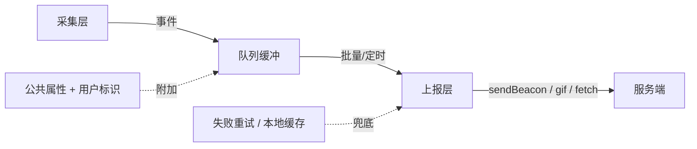
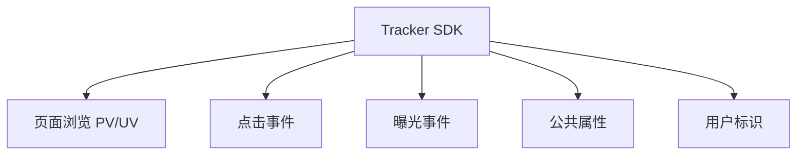
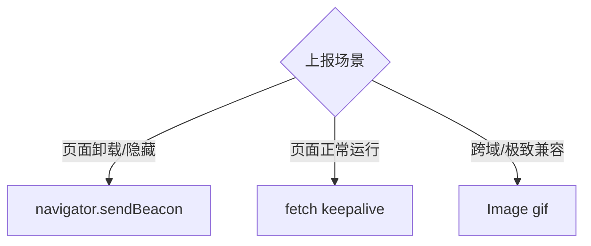
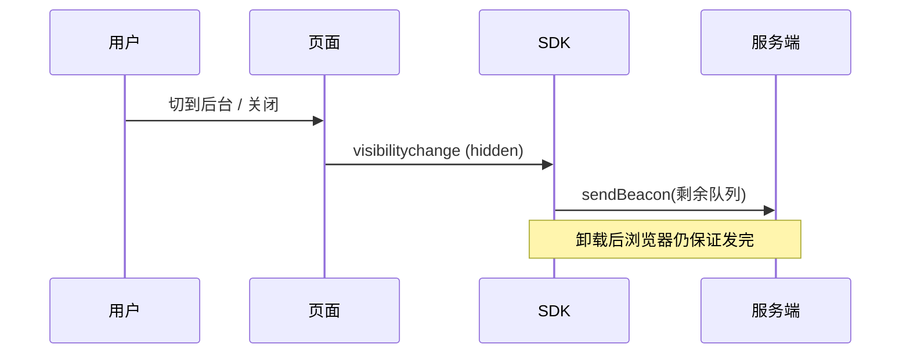
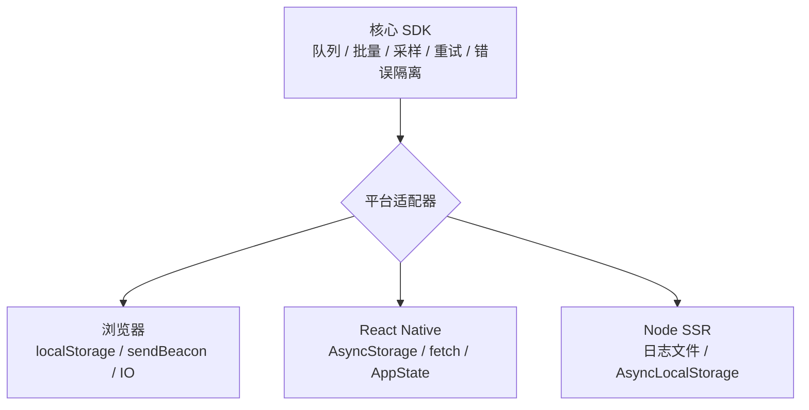
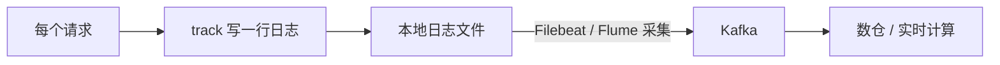

# 埋点 SDK 设计

埋点 SDK 干一件事：**把用户行为采集下来，可靠地送到服务端，且不能拖垮业务**。拆开看是三层职责——采集（什么时候记一条事件）、上报（怎么把事件送出去）、保活（页面关了也不丢数据）。整套设计都围绕「**对业务零侵入、对性能零负担、对数据零丢失**」这三个目标展开。



## 三种埋点方式

先确定「事件从哪来」。业界三种采集方式，各有取舍：

| 方式 | 做法 | 优点 | 缺点 |
|------|------|------|------|
| 代码埋点（手动） | 在业务代码里手动调 `track('click', {...})` | 精准、可带任意业务参数 | 侵入业务、改一次发一次版、维护成本高 |
| 可视化埋点 | 后台圈选页面元素，配置规则下发，SDK 按规则匹配 | 不改代码、产品经理可自助配 | 只能采标准事件、复杂参数采不到、依赖元素结构稳定 |
| 无埋点（全埋点） | 全局监听所有点击/曝光，先全采回来，用时再筛 | 不会漏采、上线即有数据 | 数据量大、噪声多、难带业务语义 |

:::tip
真实项目通常**三者混用**：PV/UV、通用点击用全埋点兜底保证「不漏」，关键转化路径（下单、支付）用代码埋点保证「精准带参」，运营活动用可视化埋点保证「快速迭代不发版」。
:::

:::info
全埋点的「全」是指**采集时机自动化**，不是真的把页面上每个像素都传回去。实现上通常在 `document` 上做事件委托，监听冒泡到顶层的 `click`，再通过元素的 `data-*` 属性或 DOM 路径反推这是哪个按钮。
:::

## 核心能力

SDK 对外暴露的能力可以归成四类：



- **事件采集**：点击 (`click`)、曝光 (`expose`)、页面浏览 (`pv`)。PV 是页面被打开的次数，UV 是独立访客数——前端只负责上报「谁在什么时候打开了哪个页面」，UV 由服务端按 `用户标识` 去重统计。
- **公共属性**：每条事件都要带的上下文（设备、OS、屏幕、SDK 版本、页面 URL），抽出来统一附加，避免每次手动传。
- **用户标识**：匿名用户用 `localStorage` 里的设备 ID (`device_id`) 标识；登录后补上业务 `user_id`。两者结合才能在登录前后串起同一个人的行为链路。

## 数据上报策略

### 何时上报

| 策略 | 触发时机 | 适用 |
|------|----------|------|
| 实时上报 | 每产生一条立即发 | 支付成功等关键事件，不能丢、不能晚 |
| 批量上报 | 攒够 N 条再一次性发 | 高频的曝光、点击，省请求 |
| 定时上报 | 每隔 T 秒发一次 | 兜底，防止量少时一直攒着不发 |

实践上是**批量 + 定时**组合：队列攒到阈值就发，或者超时就发，二者谁先到走谁。关键事件走实时通道单独发。

:::warning 为什么不干脆全量实时上报？
直觉上「每条立即发」最不容易丢，但**全量实时既不可取、也并不能真正保证不丢**：

- **性能与成本扛不住**：曝光、滚动每秒能产生几十上百条，逐条发请求会拖垮页面、耗尽移动端电量、压垮服务端。业界 SDK（神策、GA、Amplitude）默认都批量，原因就在这。
- **实时本身也会丢**：用户关页面 / 杀进程的**那一瞬间**，正在「飞」的那条请求照样发不出去——实时只是把「攒着可能丢一批」换成「丢在途的那一条」，没有根除丢失。

关键在于：**实时性和可靠性是两个正交的维度，别用「实时」去解「丢失」**。

- **可靠性**靠**持久化落盘 + 补发**：每条事件入队前先写本地存储，发成功才删；进程被杀、断电、断网，下次启动把残留捞出来补发（见下文 [失败重试 + 本地缓存兜底](#失败重试--本地缓存兜底)）。这才是「不丢」的真正保证。
- **实时性**靠**分级**：支付、下单这类关键转化事件走实时单独通道 + 落盘双保险；曝光、滚动这类高频事件批量上报、容忍极小概率丢失（反正它们本就采样）。
:::

:::info 那「用户直接关浏览器 / 杀掉 App 进程」到底怎么兜底？
分两层，缺一不可：

1. **抓住「要走了」的信号做最后冲刷**：浏览器用 `visibilitychange` 的 `hidden` + `sendBeacon`（卸载后浏览器替你发完），RN 用 `AppState` 切 `background` 时 flush。**正常关闭、切后台、跳转都能覆盖。**
2. **极端情况（强杀进程、断电、瞬间断网）连冲刷都来不及**——这时唯一能救的就是**落盘**：事件早在产生时就写进了 `localStorage` / `AsyncStorage` / `MMKV`，下次启动 `resend()` 自动补发。

所以答案不是「改成实时」，而是「**信号冲刷兜正常场景 + 落盘补发兜极端场景**」。实时通道只是给关键事件再加一道保险，不是用来替代落盘的。
:::

### 用什么发



- **`navigator.sendBeacon`**：浏览器保证在页面卸载后**异步把数据发完**，不阻塞页面跳转，是页面卸载场景的首选。缺点是只能 `POST`、数据量有上限（约 64KB）、拿不到响应。
- **`Image`（gif）**：最古老最兼容的方案，`new Image().src = url` 即发，天然跨域、不受同源限制。缺点是只能 `GET`、URL 长度有限（约 2KB）、只能传简单参数。
- **`fetch`**：能力最全（可 `POST`、可读响应、可带大数据），配合 `keepalive: true` 也能在卸载时坚持发完。缺点是老浏览器 `keepalive` 支持有限。

:::tip
选型口诀：**正常运行期用 `fetch`，页面要走人时用 `sendBeacon`，需要极致兼容或纯 `GET` 打点时用 `gif`**。SDK 内部封装一个 `report` 方法自动按场景降级即可。
:::

### 页面卸载时不丢数据

页面关闭、切后台、跳转的瞬间，队列里往往还攒着没发的事件。`unload` 事件不可靠（移动端常常不触发），正确做法是监听 `visibilitychange`，在页面变为 `hidden` 时用 `sendBeacon` 把队列**最后冲刷一次**。



形象例子：把队列里没发的事件想成**结账前购物车里的东西**。用户随时可能关页面走人，就像随时可能放下购物车离店；`visibilitychange` 的 `hidden` 是「人要往门口走了」这个最可靠的信号，趁这一刻用 `sendBeacon` 把车里的东西一次性结掉。

```js
document.addEventListener('visibilitychange', () => {
  // 第一步：只在页面变为 hidden（要走了）这一刻动作
  // hidden 比 unload 可靠：移动端切后台、锁屏都会触发，且只有它能配合 sendBeacon
  if (document.visibilityState === 'hidden') {
    // 第二步：强制用 sendBeacon 把队列最后冲刷一次，传 true 表示同步冲刷
    tracker.flush(true);
  }
});
```

:::warning
不要依赖 `beforeunload` / `unload`。iOS Safari 在切后台、用户从多任务里划掉页面时根本不触发它们，数据就此丢失。`visibilitychange` 的 `hidden` 是目前唯一可靠的「页面要走了」信号。
:::

## 上报优化

### 批量队列 + 节流

事件先进内存队列，达到容量阈值或定时器到点才统一上报。这样把 N 次请求压成 1 次。形象例子：像**小区快递柜的快递车**——不是来一个包裹就跑一趟，而是攒够一车（`maxSize`）就发车，或者就算没装满，到点了（`interval`）也照样发，免得零星包裹一直压着不送。

```js
class ReportQueue {
  constructor({ maxSize = 10, interval = 5000, onFlush }) {
    this.queue = [];
    this.maxSize = maxSize; // 攒够这么多条就发（装满一车）
    this.interval = interval; // 或最多等这么久就发（到点发车）
    this.onFlush = onFlush;
    this.timer = null;
  }

  push(event) {
    // 第一步：包裹先进车
    this.queue.push(event);

    // 第二步：装满一车立刻发车
    if (this.queue.length >= this.maxSize) {
      this.flush();
    } else if (!this.timer) {
      // 第三步：没装满且还没起定时器，就起一个「到点发车」的兜底定时器
      this.timer = setTimeout(() => this.flush(), this.interval);
    }
  }

  flush(useBeacon = false) {
    // 第一步：发车了，先把「到点发车」的定时器清掉，避免重复发
    if (this.timer) {
      clearTimeout(this.timer);
      this.timer = null;
    }

    // 第二步：车是空的就不发
    if (this.queue.length === 0) return;

    // 第三步：先把车清空再发，避免发送途中新进来的包裹被这一车重复带走
    const batch = this.queue;
    this.queue = [];
    this.onFlush(batch, useBeacon);
  }
}
```

### 失败重试 + 本地缓存兜底

上报失败（网络抖动、服务端 5xx）不能直接丢。两道兜底：

1. **失败重试**：失败的批次重新入队，下次合并上报；重试设上限，避免坏数据无限循环。
2. **本地缓存**：进队列前先落一份到 `localStorage`，上报成功再删。页面崩溃、断网下次进来时，先把上次没发成功的捞出来补发。形象例子：像**寄信前先在本子上抄一份底稿**，信寄丢了还能照底稿重寄；确认对方收到了，才把底稿划掉。

```js
const STORAGE_KEY = '__tracker_buffer__';

function persist(events) {
  try {
    // 第一步：读出本子上已有的底稿（没有就当空数组）
    const old = JSON.parse(localStorage.getItem(STORAGE_KEY) || '[]');

    // 第二步：把这次的新事件追加到底稿后面，整体写回
    localStorage.setItem(STORAGE_KEY, JSON.stringify([...old, ...events]));
  } catch (e) {
    // localStorage 写满或被禁用，静默忽略，绝不抛错影响业务
  }
}

function clearPersisted() {
  try {
    // 确认都寄到了，把底稿整本划掉
    localStorage.removeItem(STORAGE_KEY);
  } catch (e) {}
}
```

:::info
本地缓存解决的是「**进程级丢失**」——浏览器进程被杀、断电、断网都能让内存队列灰飞烟灭。落盘后即使整个页面没了，下次访问 SDK 初始化时读出残留数据补发，数据就能续上。
:::

## 曝光埋点：IntersectionObserver

曝光 = 元素**真正进入视口**才算被看见。用滚动事件 + `getBoundingClientRect` 判断既费性能又难写，正解是 `IntersectionObserver`——浏览器原生异步通知元素与视口的交叉状态，零滚动监听。形象例子：像**商场橱窗的客流计数器**，顾客真正走到橱窗前（元素露出过半）才算「看过这件商品」，记一笔就行，不用一直盯着每个人在商场里怎么走动。

```js
// 第一步：创建观察者，约定「元素露出多少才算曝光」以及曝光后做什么
const exposeObserver = new IntersectionObserver(
  (entries) => {
    entries.forEach((entry) => {
      // 第二步：元素达到阈值（这里是露出 50%）才算真曝光
      if (entry.isIntersecting) {
        const el = entry.target;

        // 第三步：上报这次曝光，参数从元素的 data-track 上读
        tracker.track('expose', JSON.parse(el.dataset.track || '{}'));

        // 第四步：曝光只记一次，记完就取消观察，省得反复触发
        exposeObserver.unobserve(el);
      }
    });
  },
  { threshold: 0.5 }, // 元素露出 50% 视为曝光
);

// 第五步：给所有需要曝光埋点的元素挂上观察
document.querySelectorAll('[data-track]').forEach((el) => {
  exposeObserver.observe(el);
});
```

:::tip
曝光要去重——同一个卡片在屏幕里反复滑进滑出不应算多次。简单做法是曝光后 `unobserve`（只记一次）；若产品需要「每次露出都算」，则改为记录上次曝光时间做节流。
:::

## 性能与稳定性

SDK 是「寄生」在业务里的，最高准则是**绝不影响业务**。三个手段：

### 不阻塞主线程

上报、序列化这类活儿用 `requestIdleCallback` 塞进浏览器空闲时段，让位给业务的渲染和交互。形象例子：像**家政钟点工挑你不在家、没人用厨房的时候来打扫**，不跟主人抢厨房用；但也不能无限期不来，最多 2 秒必到（`timeout`），免得活儿一直拖着。

```js
function scheduleReport(fn) {
  // 第一步：浏览器支持 requestIdleCallback，就排到空闲时段执行，不和业务抢主线程
  if ('requestIdleCallback' in window) {
    requestIdleCallback(fn, { timeout: 2000 }); // 2s 内必执行，防饿死
  } else {
    // 第二步：不支持就降级用 setTimeout 兜底
    setTimeout(fn, 0);
  }
}
```

### 错误隔离

SDK 内部任何异常都不能冒泡到业务。所有对外方法用 `try/catch` 包裹，出错只内部吞掉或上报自身错误，**绝不 throw 给业务**。形象例子：像给一台机器装**保险丝**——SDK 内部哪根线短路了，保险丝自己烧断（吞掉异常），绝不让电流窜出去把整个业务电路（页面）也烧坏。

```js
function safe(fn) {
  // 返回一个「包了保险丝」的新函数
  return (...args) => {
    try {
      // 第一步：正常执行原函数
      return fn(...args);
    } catch (e) {
      // 第二步：出错只在内部记一笔，绝不 throw 给业务
      console.warn('[tracker] internal error', e);
    }
  };
}
```

### 采样

高频事件（曝光、滚动）全量上报会压垮服务端。按比例采样，只上报一部分。形象例子：像**食品厂质检不会每包都拆**，而是随机抽一成来检；`Math.random()` 掷出 0 到 1 的随机数，落在 `rate` 以内的才「中签」上报。

```js
function shouldSample(rate = 1) {
  // 掷一个 0~1 的骰子，小于 rate 才算中签上报；rate=0.1 即约 10% 中签
  return Math.random() < rate;
}
```

:::warning
采样要分级：曝光、滚动这类海量事件可以采样（如 10%），但下单、支付这种关键转化事件必须 **100% 全量**，否则漏统计直接影响业务决策。
:::

## 核心 SDK 骨架

把上面的能力组装成一个类。对外只暴露 `init`、`track`、`setUser`、`flush`，内部串起队列、公共属性、错误隔离、保活。形象例子：把整个 `Tracker` 想成**一个驻店记账员**——开店时（`init`）先备好账本和昨天没记完的旧账，营业中（`track`）每笔生意都按统一格式记一条、攒成一沓批量交给后台，打烊（页面 `hidden`）前再把手头没交的账冲刷干净。

```js
class Tracker {
  constructor() {
    // 第一步：备好账本基础信息——公共属性、用户标识、设备 ID、批量队列
    this.commonProps = {};
    this.userId = null;
    this.deviceId = this.getDeviceId();
    this.queue = new ReportQueue({
      maxSize: 10,
      interval: 5000,
      onFlush: (batch, useBeacon) => this.report(batch, useBeacon),
    });
  }

  // init：开店准备
  init(config = {}) {
    // 第一步：记下上报地址和采样率
    this.url = config.url;
    this.sampleRate = config.sampleRate ?? 1;

    // 第二步：采集设备、屏幕、UA 等公共属性，之后每条事件都带上
    this.collectCommonProps();

    // 第三步：补发上次崩溃残留的本地缓存（昨天没记完的旧账）
    this.resend();

    // 第四步：监听 visibilitychange，页面要走时做最后冲刷
    this.bindLifecycle();
    return this;
  }

  // 设备 ID：localStorage 兜底，匿名用户也能被唯一标识
  getDeviceId() {
    // 第一步：先从 localStorage 里找已有的设备 ID
    let id = localStorage.getItem('device_id');

    // 第二步：没有就生成一个（时间戳 + 随机串）并存下来
    if (!id) {
      id = `${Date.now()}-${Math.random().toString(36).slice(2)}`;
      localStorage.setItem('device_id', id);
    }
    return id;
  }

  setUser(userId) {
    this.userId = userId; // 登录后补上业务 ID，串起登录前后链路
  }

  // track：记一笔账（用 safe 包了保险丝，内部出错绝不影响业务）
  track = safe((type, props = {}) => {
    // 第一步：采样不中签就直接放弃这条
    if (!shouldSample(this.sampleRate)) return;

    // 第二步：按统一格式拼出一条事件——公共属性 + 业务参数 + 身份 + 时间地点
    const event = {
      type, // pv / click / expose
      ...this.commonProps,
      ...props,
      device_id: this.deviceId,
      user_id: this.userId,
      ts: Date.now(),
      url: location.href,
    };

    // 第三步：先落盘兜底（抄底稿），再趁空闲入队等批量上报
    persist([event]);
    scheduleReport(() => this.queue.push(event));
  });

  // report：把一沓事件真正发出去
  report(batch, useBeacon) {
    const data = JSON.stringify(batch);

    // 第一步：卸载场景用 sendBeacon，保证发完；成功即清掉本地底稿
    if (useBeacon && navigator.sendBeacon) {
      const ok = navigator.sendBeacon(this.url, data);
      if (ok) clearPersisted();
      return;
    }

    // 第二步：正常场景用 fetch + keepalive；成功清底稿，失败重新入队
    fetch(this.url, { method: 'POST', body: data, keepalive: true })
      .then(() => clearPersisted())
      .catch(() => batch.forEach((e) => this.queue.push(e)));
  }

  flush(useBeacon) {
    this.queue.flush(useBeacon);
  }

  // bindLifecycle：打烊信号——页面变 hidden 就强制冲刷
  bindLifecycle() {
    document.addEventListener('visibilitychange', () => {
      if (document.visibilityState === 'hidden') this.flush(true);
    });
  }

  // resend：开店时把上次没发成功的旧账捞出来补发
  resend() {
    try {
      const buffered = JSON.parse(localStorage.getItem(STORAGE_KEY) || '[]');
      if (buffered.length) this.report(buffered, false);
    } catch (e) {}
  }
}
```

使用：

```js
const tracker = new Tracker().init({ url: '/api/log', sampleRate: 0.1 });

tracker.track('pv'); // 页面浏览
tracker.setUser('u_1001'); // 登录后
tracker.track('click', { button: 'buy', sku: 'A123' }); // 关键点击
```

## 跨端通用方案：核心不变，换适配层

上面整套是浏览器实现，但它**绑死了一堆浏览器 API**——`localStorage`、`document`、`visibilitychange`、`sendBeacon`、`IntersectionObserver`。这些在 React Native、Node 里统统不存在。

如果每个端重写一套 SDK，逻辑（队列、批量、采样、重试、落盘、错误隔离）会重复三遍。正确做法：**把「端相关」的部分隔离到一个适配层，核心 SDK 只依赖一个抽象接口**。各端只实现这个接口，核心代码一行不改。



形象例子：核心 SDK 像**一台通用的发动机**，适配器像**针对不同路面换的轮胎**——公路、雪地、越野换轮胎就行，发动机不用重造。

随端变化的只有四件事，抽成一个适配器接口：

```js
// 平台适配器：核心 SDK 只认这个接口，不碰任何具体平台 API
const adapter = {
  storage, // 本地缓存读写：{ get(key), set(key, val), remove(key) }
  send, // 把数据发出去：send(url, data, { useBeacon })
  onExit, // 注册「要走了」的回调：onExit(cb)，触发时机由各端决定
  getCommonProps, // 采集端相关公共属性：设备、OS、屏幕、版本
};
```

四件事在三端的对应实现：

| 能力 | 浏览器 | React Native | Node SSR |
|------|--------|--------------|----------|
| 本地缓存 | `localStorage` | `AsyncStorage` / `MMKV` | 内存队列 + 日志文件 |
| 发送 | `sendBeacon` / `fetch` / gif | `fetch` | 写日志文件 → Kafka |
| 退出信号 | `visibilitychange` hidden | `AppState` 切 background | 响应结束 / `SIGTERM` |
| 公共属性 | `navigator` / `screen` | `Platform` / DeviceInfo | request 的 header / cookie |
| PV 来源 | `history` / `location` | 路由库监听 | 每个请求即一次 |
| 曝光 | `IntersectionObserver` | `FlatList` 可见性回调 | 无（服务端没有视口） |

下面只讲 RN 和 Node 这两端**与浏览器不同**的部分，相同的逻辑（队列、采样、重试）直接复用核心 SDK。

## React Native 埋点

RN 没有 DOM、没有 `window` 生命周期、没有 `localStorage`，但 `fetch` 是有的。逐个替换四件事即可。

### 退出信号：用 AppState 代替 visibilitychange

浏览器靠 `visibilitychange` 的 `hidden` 抓「页面要走了」。RN 的等价信号是 **`AppState`**——应用切到后台（`background` / `inactive`）就是「用户要走了」，趁这一刻冲刷队列。

```js
import { AppState } from 'react-native';

AppState.addEventListener('change', (next) => {
  // App 切后台 / 被锁屏，等价于网页的 hidden：要走了，最后冲刷一次
  if (next === 'background' || next === 'inactive') {
    tracker.flush();
  }
});
```

:::warning
RN 没有 `sendBeacon`——切后台后系统可能很快冻结 JS 线程甚至断网，`fetch` 不保证发完。所以 RN 比浏览器**更依赖落盘兜底**：每条事件先写 `AsyncStorage`，下次启动 `resend()` 补发。「切后台时 flush」是尽力而为，「落盘 + 启动补发」才是可靠保证。
:::

### 本地缓存：AsyncStorage 是异步的

浏览器 `localStorage` 是同步的，`persist([event])` 一行就落盘。RN 的 `AsyncStorage` 是**异步**的，读写都返回 Promise：

```js
import AsyncStorage from '@react-native-async-storage/async-storage';

const storage = {
  async get(key) {
    const raw = await AsyncStorage.getItem(key);
    return raw ? JSON.parse(raw) : null;
  },
  async set(key, val) {
    await AsyncStorage.setItem(key, JSON.stringify(val));
  },
  async remove(key) {
    await AsyncStorage.removeItem(key);
  },
};
```

:::tip
对落盘频繁、又想要同步读写的场景，用 **MMKV**（`react-native-mmkv`）替代 `AsyncStorage`：它基于 mmap，读写是同步的、快一个数量级，用法和 `localStorage` 一样直观，能少改不少异步逻辑。
:::

### PV：监听路由库，而不是 location

RN 没有 URL。页面浏览靠**路由库**（React Navigation）的状态变化触发：

```js
import { NavigationContainer } from '@react-navigation/native';

<NavigationContainer
  ref={navigationRef}
  // 第一步：每次路由栈变化，说明发生了页面切换
  onStateChange={() => {
    // 第二步：取当前激活的路由名，作为 PV 的页面标识
    const route = navigationRef.getCurrentRoute();
    tracker.track('pv', { screen: route?.name });
  }}
>
  {/* ... */}
</NavigationContainer>;
```

### 曝光：FlatList 的可见性回调代替 IntersectionObserver

RN 没有 `IntersectionObserver`，但长列表 `FlatList` / `SectionList` 自带可见性检测 `onViewableItemsChanged`，作用完全对应——元素露出到阈值就回调：

```js
import { useRef } from 'react';

// 第一步：阈值配置——露出 50% 算曝光（对应 IO 的 threshold: 0.5）
const viewabilityConfig = useRef({ itemVisiblePercentThreshold: 50 }).current;

// 第二步：可见项变化时，对新进入视口的 item 上报曝光
const onViewableItemsChanged = useRef(({ viewableItems }) => {
  viewableItems.forEach(({ item }) => {
    tracker.track('expose', { id: item.id });
  });
}).current;

<FlatList
  data={items}
  viewabilityConfig={viewabilityConfig}
  onViewableItemsChanged={onViewableItemsChanged}
  renderItem={renderItem}
/>;
```

:::warning
`onViewableItemsChanged` 和 `viewabilityConfig` 必须用 `useRef` 固定成**稳定引用**，每次渲染传新函数 RN 会直接报错 `Changing onViewableItemsChanged on the fly is not supported`。
:::

### 点击：RN 没有事件冒泡，全埋点要靠包装

浏览器全埋点靠 `document` 上的事件委托接住冒泡。RN 的触摸事件**不冒泡到统一顶层**，做不了全局委托。两条路：

- **代码埋点**：在 `onPress` 里手动 `track`，最直接。
- **无埋点**：封装一个 `<Trackable>` 高阶组件包裹 `Pressable`，或在初始化时 **monkey-patch `Pressable`/`TouchableOpacity` 的 `onPress`**，统一拦截后自动上报。这是 RN 全埋点的通用实现思路。

```js
// 一个最小的 Trackable 包装：拦截 onPress，先埋点再放行原逻辑
function Trackable({ event, params, children, onPress }) {
  const handlePress = (e) => {
    tracker.track('click', { event, ...params }); // 先记一笔
    onPress?.(e); // 再执行业务原本的 onPress
  };
  return <Pressable onPress={handlePress}>{children}</Pressable>;
}
```

## Node 服务端（SSR）埋点

服务端埋点和前端是**两套思路**。先想清楚为什么要在服务端埋：

- **抓得到前端抓不到的人**：JS 没加载完、被禁用、爬虫/SEO 访问——这些客户端埋点全漏，服务端只要请求到达就记得到。
- **首屏 PV 更准**：SSR 在服务端直接记 PV，不用等客户端 hydration，避免「页面还没活起来用户就走了」漏掉的访问。
- **拿得到客户端看不到的数据**：真实后端耗时、SSR 渲染错误、IP/地理位置。
- **更难伪造**：客户端上报可被篡改，服务端基于真实请求记录可信度更高。

形象例子：服务端埋点像**商场大门口的客流闸机**——不管你手机有没有电、装没装店家 App，只要跨进大门（请求到服务器）就记一笔；客户端埋点像**店员观察你在店里摸了哪些商品**，更细，但要你手机正常工作才记得到。两者互补，不是替代。

### 最大的坑：进程是多用户共享的，不能用单例存用户态

浏览器一个页面就一个用户，`this.userId` 这种单例天经地义。**Node 一个进程同时服务成千上万个请求**，如果把用户身份挂在模块级单例上，请求之间会互相覆盖——**数据串号**，把 A 的行为记成 B 的。

解法：身份必须是**请求级**的。Node 用 `AsyncLocalStorage` 给每个请求开一份独立上下文，贯穿整条异步调用链：

```js
import { AsyncLocalStorage } from 'node:async_hooks';

const als = new AsyncLocalStorage();

// 中间件：每个请求进来，开一份只属于它自己的上下文
app.use((req, res, next) => {
  const ctx = {
    deviceId: req.cookies.device_id || genId(), // 从 cookie 取设备标识
    userId: req.session?.userId || null, // 从会话取登录态
    ua: req.headers['user-agent'],
    ip: req.ip,
  };
  // 在这份上下文里执行后续逻辑，链路上任意位置都能取回「本请求」的身份
  als.run(ctx, () => next());
});

function track(type, props = {}) {
  const ctx = als.getStore() || {}; // 取的是「当前请求」的身份，绝不串号
  writeLog({
    type,
    ...props,
    device_id: ctx.deviceId,
    user_id: ctx.userId,
    ts: Date.now(),
  });
}
```

### 上报：不发网络请求，而是写日志文件

服务端没有 `sendBeacon`/gif。最稳的做法不是从服务端再发一次 HTTP，而是**写本地日志文件，由采集 agent 收走**：



为什么写文件而不是直连 Kafka：**解耦且不丢**。写本地文件几乎不耗时、不阻塞响应；下游 Kafka 挂了，日志还躺在磁盘上，采集 agent 恢复后继续收，数据不丢。用成熟日志库（如 `pino`）还自带高性能和背压处理：

```js
import pino from 'pino';

// 输出到文件，交给 Filebeat 之类的 agent 去采集
const logger = pino(pino.destination('/var/log/app/track.log'));

function writeLog(event) {
  logger.info(event); // 一行一条 JSON，不阻塞请求
}
```

### 不阻塞响应 + 优雅退出兜底

两条服务端独有的纪律：

1. **埋点绝不拖慢响应**。埋点是旁路，`track` 要么同步写本地文件（极快），要么 fire-and-forget 丢进内存队列异步刷，**绝不 `await` 一个网络上报**让用户多等。
2. **进程退出前冲刷**。浏览器靠 `hidden`，服务端的「要走了」是进程收到 `SIGTERM`（部署、重启、缩容）。退出前必须把内存里没落盘的日志冲刷干净：

```js
process.on('SIGTERM', async () => {
  await flushAll(); // 优雅关闭：把缓冲里的日志写完再退，避免丢最后一批
  process.exit(0);
});
```

### SSR 同构：服务端种 ID，客户端接力

SSR 的精髓是「一份代码两端跑」，埋点也可以**同构**：同一个 `track()` API，适配器在服务端写日志、在客户端发 beacon。

一个 SSR 特有的关键动作：**服务端在首屏就把 `device_id` 种进 cookie 并注入 HTML，客户端 SDK 初始化时复用它**，保证 hydration 前后是同一个人，行为链路不断：

```js
// 服务端渲染时
res.cookie('device_id', ctx.deviceId); // 1. 种进 cookie，下次请求带回来
html = html.replace(
  '</head>',
  // 2. 注入到 HTML，客户端 SDK init 时读 window.__TRACK__ 复用同一个 ID
  `<script>window.__TRACK__=${JSON.stringify({ deviceId: ctx.deviceId })}</script></head>`,
);

// 3. 首屏 PV 直接由服务端记，不等客户端 JS——这正是 SSR 埋点比纯前端准的地方
track('pv', { screen: req.path, render: 'ssr' });
```

:::info
这样首屏 PV 由服务端兜底，后续的点击、曝光、加载完成后的交互再由客户端 SDK 接力上报。服务端负责「**有没有人来、来的是谁**」，客户端负责「**来了之后做了什么**」，靠同一个 `device_id` 串成完整链路。
:::
