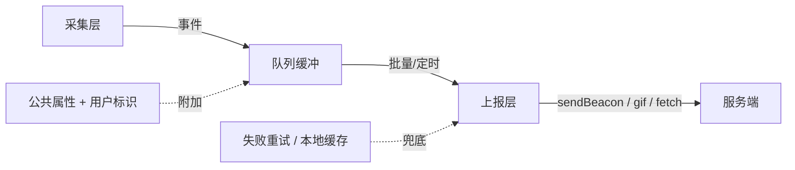
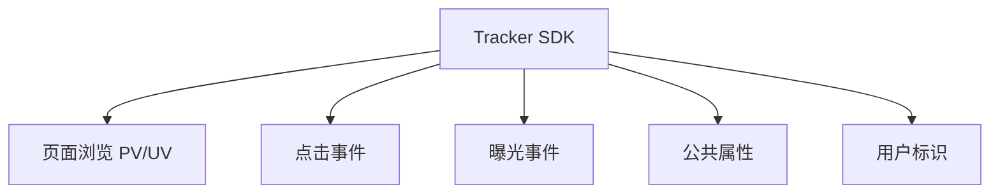
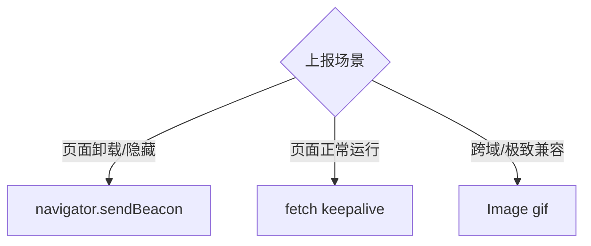
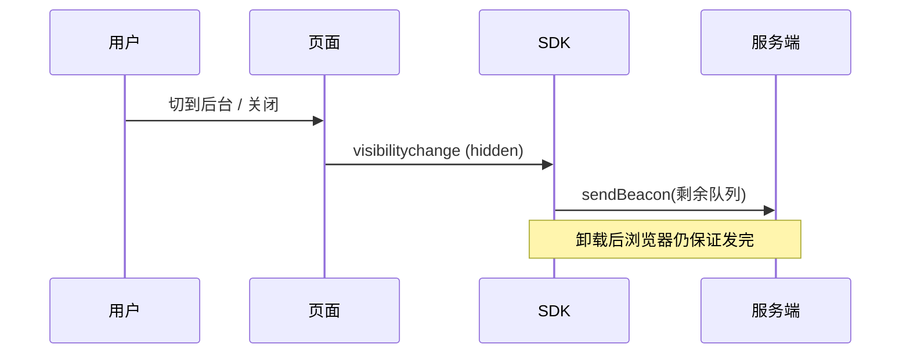

# 埋点 SDK 设计

埋点 SDK 干一件事：**把用户行为采集下来，可靠地送到服务端，且不能拖垮业务**。拆开看是三层职责——采集（什么时候记一条事件）、上报（怎么把事件送出去）、保活（页面关了也不丢数据）。整套设计都围绕「**对业务零侵入、对性能零负担、对数据零丢失**」这三个目标展开。



## 三种埋点方式

先确定「事件从哪来」。业界三种采集方式，各有取舍：

| 方式 | 做法 | 优点 | 缺点 |
|------|------|------|------|
| 代码埋点（手动） | 在业务代码里手动调 `track('click', {...})` | 精准、可带任意业务参数 | 侵入业务、改一次发一次版、维护成本高 |
| 可视化埋点 | 后台圈选页面元素，配置规则下发，SDK 按规则匹配 | 不改代码、产品经理可自助配 | 只能采标准事件、复杂参数采不到、依赖元素结构稳定 |
| 无埋点（全埋点） | 全局监听所有点击/曝光，先全采回来，用时再筛 | 不会漏采、上线即有数据 | 数据量大、噪声多、难带业务语义 |

:::tip
真实项目通常**三者混用**：PV/UV、通用点击用全埋点兜底保证「不漏」，关键转化路径（下单、支付）用代码埋点保证「精准带参」，运营活动用可视化埋点保证「快速迭代不发版」。
:::

:::info
全埋点的「全」是指**采集时机自动化**，不是真的把页面上每个像素都传回去。实现上通常在 `document` 上做事件委托，监听冒泡到顶层的 `click`，再通过元素的 `data-*` 属性或 DOM 路径反推这是哪个按钮。
:::

## 核心能力

SDK 对外暴露的能力可以归成四类：



- **事件采集**：点击 (`click`)、曝光 (`expose`)、页面浏览 (`pv`)。PV 是页面被打开的次数，UV 是独立访客数——前端只负责上报「谁在什么时候打开了哪个页面」，UV 由服务端按 `用户标识` 去重统计。
- **公共属性**：每条事件都要带的上下文（设备、OS、屏幕、SDK 版本、页面 URL），抽出来统一附加，避免每次手动传。
- **用户标识**：匿名用户用 `localStorage` 里的设备 ID (`device_id`) 标识；登录后补上业务 `user_id`。两者结合才能在登录前后串起同一个人的行为链路。

## 数据上报策略

### 何时上报

| 策略 | 触发时机 | 适用 |
|------|----------|------|
| 实时上报 | 每产生一条立即发 | 支付成功等关键事件，不能丢、不能晚 |
| 批量上报 | 攒够 N 条再一次性发 | 高频的曝光、点击，省请求 |
| 定时上报 | 每隔 T 秒发一次 | 兜底，防止量少时一直攒着不发 |

实践上是**批量 + 定时**组合：队列攒到阈值就发，或者超时就发，二者谁先到走谁。关键事件走实时通道单独发。

### 用什么发



- **`navigator.sendBeacon`**：浏览器保证在页面卸载后**异步把数据发完**，不阻塞页面跳转，是页面卸载场景的首选。缺点是只能 `POST`、数据量有上限（约 64KB）、拿不到响应。
- **`Image`（gif）**：最古老最兼容的方案，`new Image().src = url` 即发，天然跨域、不受同源限制。缺点是只能 `GET`、URL 长度有限（约 2KB）、只能传简单参数。
- **`fetch`**：能力最全（可 `POST`、可读响应、可带大数据），配合 `keepalive: true` 也能在卸载时坚持发完。缺点是老浏览器 `keepalive` 支持有限。

:::tip
选型口诀：**正常运行期用 `fetch`，页面要走人时用 `sendBeacon`，需要极致兼容或纯 `GET` 打点时用 `gif`**。SDK 内部封装一个 `report` 方法自动按场景降级即可。
:::

### 页面卸载时不丢数据

页面关闭、切后台、跳转的瞬间，队列里往往还攒着没发的事件。`unload` 事件不可靠（移动端常常不触发），正确做法是监听 `visibilitychange`，在页面变为 `hidden` 时用 `sendBeacon` 把队列**最后冲刷一次**。



```js
document.addEventListener('visibilitychange', () => {
  // hidden 比 unload 可靠：移动端切后台、锁屏都会触发，且只有它能配合 sendBeacon
  if (document.visibilityState === 'hidden') {
    tracker.flush(true); // true 表示强制用 sendBeacon 同步冲刷
  }
});
```

:::warning
不要依赖 `beforeunload` / `unload`。iOS Safari 在切后台、用户从多任务里划掉页面时根本不触发它们，数据就此丢失。`visibilitychange` 的 `hidden` 是目前唯一可靠的「页面要走了」信号。
:::

## 上报优化

### 批量队列 + 节流

事件先进内存队列，达到容量阈值或定时器到点才统一上报。这样把 N 次请求压成 1 次。

```js
class ReportQueue {
  constructor({ maxSize = 10, interval = 5000, onFlush }) {
    this.queue = [];
    this.maxSize = maxSize; // 攒够这么多条就发
    this.interval = interval; // 或最多等这么久就发
    this.onFlush = onFlush;
    this.timer = null;
  }

  push(event) {
    this.queue.push(event);
    // 攒满立刻发，否则启动定时器兜底
    if (this.queue.length >= this.maxSize) {
      this.flush();
    } else if (!this.timer) {
      this.timer = setTimeout(() => this.flush(), this.interval);
    }
  }

  flush(useBeacon = false) {
    if (this.timer) {
      clearTimeout(this.timer);
      this.timer = null;
    }
    if (this.queue.length === 0) return;
    const batch = this.queue;
    this.queue = []; // 先清空再发，避免发送途中新事件被重复带走
    this.onFlush(batch, useBeacon);
  }
}
```

### 失败重试 + 本地缓存兜底

上报失败（网络抖动、服务端 5xx）不能直接丢。两道兜底：

1. **失败重试**：失败的批次重新入队，下次合并上报；重试设上限，避免坏数据无限循环。
2. **本地缓存**：进队列前先落一份到 `localStorage`，上报成功再删。页面崩溃、断网下次进来时，先把上次没发成功的捞出来补发。

```js
const STORAGE_KEY = '__tracker_buffer__';

function persist(events) {
  try {
    const old = JSON.parse(localStorage.getItem(STORAGE_KEY) || '[]');
    localStorage.setItem(STORAGE_KEY, JSON.stringify([...old, ...events]));
  } catch (e) {
    // localStorage 写满或被禁用，静默忽略，绝不抛错影响业务
  }
}

function clearPersisted() {
  try {
    localStorage.removeItem(STORAGE_KEY);
  } catch (e) {}
}
```

:::info
本地缓存解决的是「**进程级丢失**」——浏览器进程被杀、断电、断网都能让内存队列灰飞烟灭。落盘后即使整个页面没了，下次访问 SDK 初始化时读出残留数据补发，数据就能续上。
:::

## 曝光埋点：IntersectionObserver

曝光 = 元素**真正进入视口**才算被看见。用滚动事件 + `getBoundingClientRect` 判断既费性能又难写，正解是 `IntersectionObserver`——浏览器原生异步通知元素与视口的交叉状态，零滚动监听。

```js
const exposeObserver = new IntersectionObserver(
  (entries) => {
    entries.forEach((entry) => {
      // intersectionRatio 达阈值才算曝光，可设 0.5 表示露出一半
      if (entry.isIntersecting) {
        const el = entry.target;
        tracker.track('expose', JSON.parse(el.dataset.track || '{}'));
        exposeObserver.unobserve(el); // 曝光只记一次，记完就取消观察
      }
    });
  },
  { threshold: 0.5 }, // 元素露出 50% 视为曝光
);

// 给需要曝光埋点的元素打标记并观察
document.querySelectorAll('[data-track]').forEach((el) => {
  exposeObserver.observe(el);
});
```

:::tip
曝光要去重——同一个卡片在屏幕里反复滑进滑出不应算多次。简单做法是曝光后 `unobserve`（只记一次）；若产品需要「每次露出都算」，则改为记录上次曝光时间做节流。
:::

## 性能与稳定性

SDK 是「寄生」在业务里的，最高准则是**绝不影响业务**。三个手段：

### 不阻塞主线程

上报、序列化这类活儿用 `requestIdleCallback` 塞进浏览器空闲时段，让位给业务的渲染和交互。

```js
function scheduleReport(fn) {
  // 浏览器空闲时再上报，不和业务抢主线程
  if ('requestIdleCallback' in window) {
    requestIdleCallback(fn, { timeout: 2000 }); // 2s 内必执行，防饿死
  } else {
    setTimeout(fn, 0); // 降级
  }
}
```

### 错误隔离

SDK 内部任何异常都不能冒泡到业务。所有对外方法用 `try/catch` 包裹，出错只内部吞掉或上报自身错误，**绝不 throw 给业务**。

```js
function safe(fn) {
  return (...args) => {
    try {
      return fn(...args);
    } catch (e) {
      // SDK 自己的错只记录，绝不影响业务运行
      console.warn('[tracker] internal error', e);
    }
  };
}
```

### 采样

高频事件（曝光、滚动）全量上报会压垮服务端。按比例采样，只上报一部分。

```js
function shouldSample(rate = 1) {
  return Math.random() < rate; // rate=0.1 表示只采 10%
}
```

:::warning
采样要分级：曝光、滚动这类海量事件可以采样（如 10%），但下单、支付这种关键转化事件必须 **100% 全量**，否则漏统计直接影响业务决策。
:::

## 核心 SDK 骨架

把上面的能力组装成一个类。对外只暴露 `init`、`track`、`setUser`、`flush`，内部串起队列、公共属性、错误隔离、保活。

```js
class Tracker {
  constructor() {
    this.commonProps = {}; // 公共属性
    this.userId = null;
    this.deviceId = this.getDeviceId();
    this.queue = new ReportQueue({
      maxSize: 10,
      interval: 5000,
      onFlush: (batch, useBeacon) => this.report(batch, useBeacon),
    });
  }

  init(config = {}) {
    this.url = config.url; // 上报地址
    this.sampleRate = config.sampleRate ?? 1;
    this.collectCommonProps(); // 采集设备、屏幕、UA 等
    this.resend(); // 补发上次崩溃残留的本地缓存
    this.bindLifecycle(); // 监听 visibilitychange 做卸载冲刷
    return this;
  }

  // 设备 ID：localStorage 兜底，匿名用户也能被唯一标识
  getDeviceId() {
    let id = localStorage.getItem('device_id');
    if (!id) {
      id = `${Date.now()}-${Math.random().toString(36).slice(2)}`;
      localStorage.setItem('device_id', id);
    }
    return id;
  }

  setUser(userId) {
    this.userId = userId; // 登录后补上业务 ID，串起登录前后链路
  }

  track = safe((type, props = {}) => {
    if (!shouldSample(this.sampleRate)) return; // 采样
    const event = {
      type, // pv / click / expose
      ...this.commonProps,
      ...props,
      device_id: this.deviceId,
      user_id: this.userId,
      ts: Date.now(),
      url: location.href,
    };
    persist([event]); // 先落盘兜底
    scheduleReport(() => this.queue.push(event)); // 空闲时再入队
  });

  report(batch, useBeacon) {
    const data = JSON.stringify(batch);
    if (useBeacon && navigator.sendBeacon) {
      // 卸载场景：sendBeacon 保证发完，成功即清掉本地缓存
      const ok = navigator.sendBeacon(this.url, data);
      if (ok) clearPersisted();
      return;
    }
    fetch(this.url, { method: 'POST', body: data, keepalive: true })
      .then(() => clearPersisted())
      .catch(() => batch.forEach((e) => this.queue.push(e))); // 失败重新入队
  }

  flush(useBeacon) {
    this.queue.flush(useBeacon);
  }

  bindLifecycle() {
    document.addEventListener('visibilitychange', () => {
      if (document.visibilityState === 'hidden') this.flush(true);
    });
  }

  resend() {
    try {
      const buffered = JSON.parse(localStorage.getItem(STORAGE_KEY) || '[]');
      if (buffered.length) this.report(buffered, false);
    } catch (e) {}
  }
}
```

使用：

```js
const tracker = new Tracker().init({ url: '/api/log', sampleRate: 0.1 });

tracker.track('pv'); // 页面浏览
tracker.setUser('u_1001'); // 登录后
tracker.track('click', { button: 'buy', sku: 'A123' }); // 关键点击
```

## 一句话口诀

> **埋点 SDK = 采集（代码/可视化/全埋点 + IntersectionObserver 曝光）→ 队列（批量 + 定时 + 本地缓存兜底）→ 上报（运行用 fetch、走人用 sendBeacon、兜底用 gif）；全程错误隔离、空闲执行、关键事件全采，做到对业务零侵入、零负担、零丢失。**
