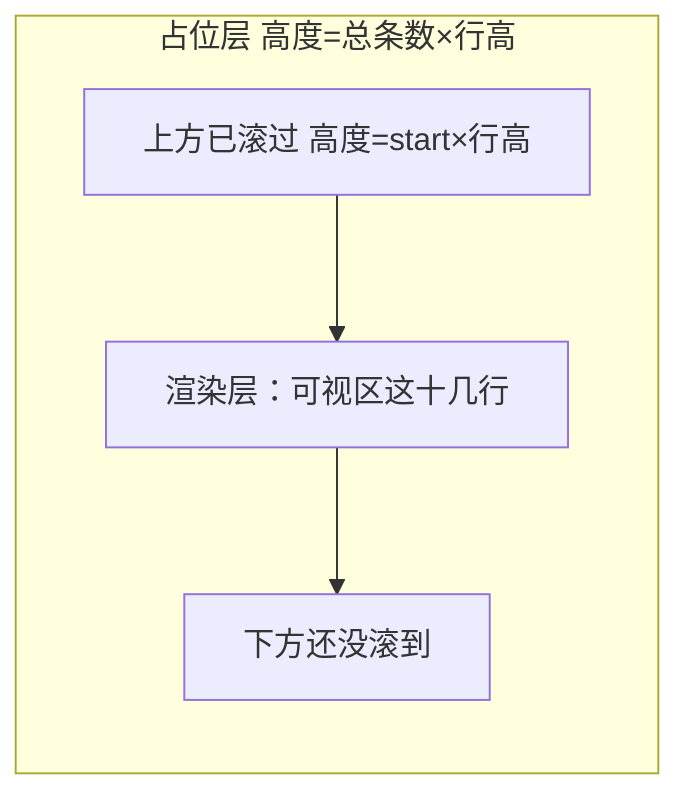

# 虚拟列表

一个上万条的长列表，全量渲染会生成上万个 DOM 节点——内存吃紧、首屏变慢、滚动卡成幻灯片。但屏幕一次只装得下十几行，渲染剩下的几千行纯属浪费。

虚拟列表的思路： **只渲染可视区内的那十几行，滚出去的回收、滚进来的补上** 。DOM 节点数恒定（约等于一屏），和数据总量无关——10 万条和 100 条渲染开销几乎一样。

记忆类比： **像坐高铁看窗外** 。窗外田野绵延上千公里，但你这扇车窗一次只框住眼前一小片；火车往前开，旧风景从窗左滑走、新风景从窗右补进来。你永远只「渲染」窗内这一片，却感觉看完了全程——窗框就是可视区，铁轨全长就是那条撑满的滚动条。

## 核心思路

定高场景（每行高度一致）只需三步：

1. **撑出真实滚动条** ——放一个占位元素，高度 = `总条数 × 行高` ，让滚动条长度和「假装全部渲染了」一致，滚动手感才对。
2. **算可视区间** ——用滚动距离 `scrollTop` 反推第一条可见的下标 `start` ，加上一屏能装下的行数得到 `end` 。
3. **只渲染 `[start, end)` 这段，并整体下移** ——不下移的话，这几行会贴在容器顶部，而不是它们本该在的位置。



## 定高实现

```jsx
const ROW_HEIGHT = 40; // 每行固定高度
const OVERSCAN = 3; // 上下各多渲染几行做缓冲

function VirtualList({ items }) {
  // 第一步：拿到滚动容器，并记录当前滚动距离和容器可视高度
  const containerRef = useRef(null);
  const [scrollTop, setScrollTop] = useState(0);
  const [viewportHeight, setViewportHeight] = useState(0);

  // 第二步：挂载后量一次容器高度（这扇「车窗」有多高）
  useEffect(() => {
    setViewportHeight(containerRef.current.clientHeight);
  }, []);

  // 第三步：算占位层总高度，用来撑出和「全部渲染」一样长的滚动条
  const total = items.length;
  const totalHeight = total * ROW_HEIGHT;

  // 第四步：用 scrollTop 反推可视区第一条下标，往上多留 OVERSCAN 行缓冲
  const start = Math.max(0, Math.floor(scrollTop / ROW_HEIGHT) - OVERSCAN);

  // 第五步：算一屏装得下多少行（上下各加 OVERSCAN），得到结束下标
  const visibleCount = Math.ceil(viewportHeight / ROW_HEIGHT) + OVERSCAN * 2;
  const end = Math.min(total, start + visibleCount);

  // 第六步：切出真正要渲染的这一段，并算出它该整体下移多少
  const visibleItems = items.slice(start, end);
  const offsetY = start * ROW_HEIGHT;

  return (
    <div
      ref={containerRef}
      // 第七步：监听滚动，刷新 scrollTop 触发重新计算
      onScroll={(e) => setScrollTop(e.currentTarget.scrollTop)}
      style={{ height: 400, overflowY: 'auto' }}
    >
      {/* 占位层：撑出和「全部渲染」一样长的滚动条 */}
      <div style={{ height: totalHeight, position: 'relative' }}>
        {/* 渲染层：只有可视区这几行，整体下移 offsetY 到它该在的位置 */}
        <div style={{ transform: `translateY(${offsetY}px)` }}>
          {visibleItems.map((item) => (
            <div key={item.id} style={{ height: ROW_HEIGHT }}>
              {item.text}
            </div>
          ))}
        </div>
      </div>
    </div>
  );
}
```

:::info
`translateY` 比 `position: absolute; top` 或 `margin-top` 更优：transform 只触发合成 (compositing)，不引起重排，滚动时一帧帧平移最顺滑。`key` 要用数据自身的稳定 id，不能用 `start + i` 这类随窗口变化的下标，否则滚动时 React 会错误复用 DOM。
:::

## 缓冲区 overscan

只渲染严格可视的行，快速滚动时会因为来不及计算和绘制而 **露白** ——下一行还没补上，先看到一条空白。解法是 `OVERSCAN` ：在可视区上下各多渲染几行，相当于提前把「即将进入视口」的内容备好（车窗外提前把下一片风景画好），滚动时直接顶上。代价是多渲染几个节点，换来无白屏。

## 不定高怎么办

行高不固定（比如带图文的动态内容）时，`start = scrollTop / ROW_HEIGHT` 这种除法就不成立了——你不知道滚到某个位置对应第几条。常规做法：

1. **预估高度** 先占位，让列表能先渲染出来。
2. 行渲染后 **测量真实高度** （`getBoundingClientRect`）并缓存，替换预估值。
3. 维护一张 **累积偏移表** （每条的 `top` = 前面所有行高之和，即前缀和），`scrollTop` 来了用 **二分查找** 在偏移表里定位 `start` 。

复杂度比定高高一截，生产里一般直接用成熟库（`react-window` 、 `react-virtualized` 、 `TanStack Virtual` ），它们把测量、缓存、二分都封装好了。

:::tip
虚拟列表和[无限滚动](./pagination-infinite-scroll.md)解决的是两件正交的事：无限滚动管「数据 **怎么来** 」（滚到底就分页拉下一批），虚拟列表管「数据 **怎么渲染** 」（不管来了多少，只画可视区那一屏）。海量列表通常两者叠加：边滚边加载，加载进来的再做虚拟渲染。
:::
